# Algorytmy
[`back to README.md`](../README.md)
## Podstawowe definicje

****Algorytm**** → precyzyjnie określony, jednoznaczny, skończony opis procesu przetworzenia danych wejściowych do pewnych danych wyjściowych.

******Algorytmika****** → dział informatyki zajmujący się poszukiwaniem, konstruowaniem i badaniem algorytmów (w kontekście przydatności do rozwiązywania problemów z wykorzystaniem komputerów)

**********Struktura danych********** → zaimplementowana realizacja danych w programie

## Programowanie dynamiczne

Polega na podziale rozwiązywanego problemu na podproblemy względem kilku parametrów, które cechuje nierozłączność (zależność) (w przeciwieństwie do strategii “dziel i zwyciężaj”).

### Strategia

- określenie parametrów cechujących problem
- określenie funkcji celu będącej funkcją parametrów
- znalezienie optymalnej funkcji celu poprzez rozwiązanie podproblemów od najprostszego do najbardziej złożonego

### Określanie parametrów

- parametrem może być np.
    - liczba elementów zbioru danych charakterystycznych dla problemu
    - wartość maksymalna lub minimalna, jaką mogą przyjąć elementy zbioru problemu
- wraz ze wzrostem l. parametrów, wzrasta zapotrzebowanie na pamięć i moc obliczeniową

<aside>
💡 Zaprojektowany algorytm ma postać równania rekurencyjnego, opisującego optymalną funkcję celu tego problemu.

</aside>

Wyznaczenie wartości funkcji celu dla ostatniego podproblemu jest zazwyczaj wynikiem rozwiązania całego zagadnienia.

### Przykłady

- algorytmy znajdujące najdłuższy wspólny podciąg
- algorytmy realizujące zagadnienia plecakowe
- obliczanie odległości Levenshteina (odległość między napisami)
- algorytm Floyda-Wrshalla (najkrótsze ścieżki w grafie ważonym)

## Algorytmy siłowe

Rozpatrują wszelkie możliwe rozwiązania, aż do znalezienia takiego, które może być zaakceptowane jako wynik.

### Strategia

1. Wyznaczenie zbioru możliwych rozwiązań.
2. Sprawdzenie kolejnych rozwiązań ze zbioru, aż do znalezienia wyniku.

### Uwagi

- Przy braku ograniczenia przestrzeni poszukiwań, czas wykonania może być nieakceptowalny.
- Dowolny algorytm można zastąpić poprzez jego odpowiednik siłowy.

### Możliwe modyfikacje

Ograniczenie przestrzeni poszukiwań:

- do pewnych obszarów możliwych rozwiązań - algorytm heurystyczny
- w sposób losowy - algorytm probabilistyczny

## Algorytmy probabilistyczne

Polegają na losowym przeszukiwaniu ******************************************przestrzeni rozwiązań******************************************, kolejne próby znalezienia rozwiązania są wykonywane na podstawie wskazań pseudolosowych.

### Strategia

1. Wylosuj próbkę do sprawdzenia.
2. Zweryfikuj potencjalne rozwiązanie.
3. Jeżeli uzyskany wynik nie jest akceptowalny, wróć do losowania próbki.

### Uwagi

- są to algorytmy niedeterministyczne

### Podział algorytmów probabilistycznych

- ******************Las Vegas****************** → zawsze zwracające poprawne wyniki w bliżej nieokreślonym czasie (randomizacja służy przyspieszeniu działania algorytmu, średnia złożoność nie ulega zmianie)
- ************************Monte Carlo************************ → kończące się w ustalonym czasie, ale bez gwarancji ustalenia wyniku (prawdopodobieństwo zwrócenia poprawnego wyniku ******************bliskie 1******************)

### Przykłady

- metoda Monte Carlo do obliczania pól figur
- RandomQuickSort

# Złożoność obliczeniowa

Jest to miara wyrażająca **ilość zasobów komputerowych** (****************************czas działania****************************, **************************************ilość wykorzystanej pamięci**************************************) potrzebnych do wykonania algorytmu.

## Złożoność pamięciowa

Jest to ilość pamięci jaką potrzebuje algorytm dla danych wejściowych o rozmiarze n.

<aside>
💡 Definicja rozmiaru danych wejściowych zależy od rozważanego problemu (sortowanie - liczba elementów do posortowania, mnożenie liczb całkowitych - liczba bitów potrzebnych do reprezentacji binarnej).
W praktyce do obliczania złożoności pamięciowej nie uwzględnia się pamięci do odczytu na dane wejściowe i do zapisu na dane wyjściowe.

</aside>

### Złożoność czasowa

Jest to **************************liczba kroków************************** (elementarnych operacji), po jakich algorytm zatrzymuje się dla danych wejściowych o rozmiarze **n**.

<aside>
💡 Jest to własność samego algorytmu, niezależna od komputera czy języka programowa.

</aside>

### Notacja O

Asymptotyczne ************************************ograniczenie górne************************************ danej funkcji → dana funkcja f(n) jest **************O(g(n))**************, jeżeli dla wszystkich wartości n > n_0, wartość funkcji f(n) jest nie większa niż cg(n).

### Notacja $\Omega$

Asymptotyczne ************************************ograniczenie dolne************************************ danej funkcji.

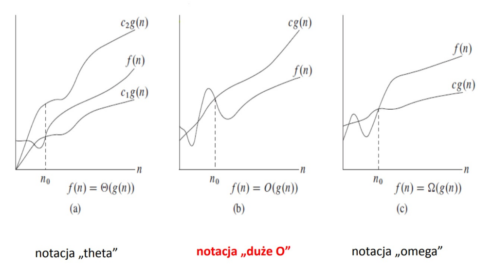

### Rodzaje złożoności

- pesymistyczna → maksymalna ilość zasobów potrzebynych przy (najgorszych) danych wejściowych o rozmiarze n
- oczekiwana → średnia ilość zasobów potrzebnych przy danych wejściowych o rozmiarze n (obliczana na podstawie rozkładu prawdopodobieństwa)
- zamortyzowana → określana dla wielokrotnie powtarzanych operacji, wykonywanych na strukturach danych (średnia bez rozkładu prawdopodobieństwa).

## Struktury danych

### Typy proste

- typ porządkowy → każdy element ma ściśle określoną kolejność w typie (operacje poprzedniego i następnego elementu)
- typ rzeczywisty

### Typy strukturalne

- typ tablicowy → ciągi danych tego samego typu statycznego o z góry określonej długości (dostęp bezpośredni i indeksowany)
- typ rekordowy → ciągi danych niekoniecznie tego samego typu statycznego (dostęp bezpośredni, przez identyfikator danej)
- typ plikowy - typ dynamiczny (zmienna liczba elementów) o elementach tego samego typu statycznego z sekwencyjnym trybem dostępu (dostęp do kolejnego elementu, możliwy po odczytaniu wcześniejszych)
- typ wskaźnikowy - obejmuje adresy danych w pamięci
- typ napisowy → operuje na ciągach znaków (w rzeczywistości implementowany z użyciem innych struktur)
- typ obiektowy → podobny do rekordowego, ale pozwalający obejmować nie tylko dane ale również metody

### Definicje

************Strukturą danych************ nazywamy sposób uporządkowania przechowywanych na komputerze danych.

********************Abstrakcyjnym typem danych******************** nazywamy formalną specyfikację przechowywania obiektów oraz zbiór dobrze opisanych operacji na tych obiektach.

<aside>
💡 Struktura danych jest implementacją konkretnej abstrakcyjnej struktury danych.

</aside>

### Przykłady stuktur

- Liniowe abstrakcyjne struktury danych
    - Stos
    - Kolejka
    - Listy (jedno/dwukierunkowe, cykliczne/niecykliczne)
- Tablice haszujące
- Drzewiaste struktury danych
    - Drzewa poszukiwań binarnych (binary search trees)
    - Koce
    - Drzewa AVL
    - Drzewa Czerwono-Czarne
- Grafy
# 18. Algorytmy sortowania.

## Definicje

**************************************Warunek stabilności************************************** → zachowanie początkowego ustawienia względem siebie elementów równych (rekordów o takich samych kluczach).

**************************************Operacja dominująca************************************** → porównanie elementów w ciągu.

************************************************************************Złożoność pamięciowa alg. sortowania************************************************************************ → ilość dodatkowej pamięci (oprócz n-miejsc pamięci dla elementów ciągu) potrzebnej do wykonania algorytmu.

## Typy algorytmów sortowania

### Sortowanie przez porównywanie elementów

- sortowanie przez selekcję (selection sort)
- sortowanie przez wstawianie (insertion sort)
- sortowanie bąbelkowe (bubble sort)
- sortowanie koktajlowe (cocktail sort)
- sortowanie Shella i Grzebieniowe (Shell and Comb sort)

### Sortowanie metodą dziel i zwyciężaj

- sortowanie przez scalanie (merge sort)
- sortowanie sybkie (quick sort)

### Inne

- sortowanie przez zliczanie (counting sort)
- sortowanie przez kopcowanie (heap sort)
- sortowanie pozycyjne (radix sort)

## Podział względem stabilności

### Algorytmy sortowania stabilnego

- przez wstawianie
- bąbelkowe
- koktajlowe
- pozycyjne
- przez scalanie
- przez zliczanie

### Algorytmy sortowania niestabilnego

- przez selekcję
- szybkie
- przez kopcowanie

## Sortowanie Bąbelkowe

### Zasada działania

1. Porównujemy kolejne pary sąsiadujących elementów n-elementowej tablicy.
2. Jeżeli nie są właściwie uporządkowane, zamieniamy je miejscami.
3. Powtarzamy procedurę n-razy za każdym razem przeglądając o jeden element mniej.

<aside>
💡 W i-tym przebiegu wyznaczamy i-ty najmniejszy/największy element zbioru oraz umieszczany jest na właściwej pozycji

</aside>

### Złożoność czasowa: O(N^2)

### Możliwe ulepszenia

- zapamiętywanie czy w trakcie przejścia dokonano zmian - jeżeli nie, algorytm kończy działanie
- zapamiętywanie pozycji ostatniej zmiany → wszystkie pary obiektów sąsiadujących powyżej (poniżej) tej pozycji, są już ustawione w odpowiedniej kolejności.

## Sortowanie koktailowe

Jest do ********************************************************************dwukierunkowe sortowanie bąbelkowe******************************************************************** → wersja bubble sorta, w której przejścia po tablicy odbywają się ze zmiennym kierunkiem (raz od prawej - malejąco, a potem od lewej - rosnąco).

Typowa złożoność czasowa jest klasy O(n^2), dla zbiorów w znacznym stopniu posortowanych, złożoność redukuje się do O(n).

## Sortowanie przez wstawianie (Insertion sort)

### Zasada działania

1. Elementy tablicy podzielone (umownie) na ciąg wynikowy i źródłowy.
2. W kroku **i** (począwszy od i = 2) posortowanych jest i-1 elementów tablicy, a element i-ty zostaje pomiędzy nie w miejsce, które zachowuje posortowanie ciągu.
3. W celu znalezienia odpowiedniego miejsca należy przeglądać posortowaną część tablicy, o ile to możliwe od razu przesuwając je i tworząc miejsce na nowy element.

### Złożoność czasowa: O(n^2)

### Możliwe ulepszenia

Ciąg wynikowy jest już uporządkowany → można zastosować metodę **przeszukiwania połówkowego (binary serach)**, w celu ustalenia miejsca wstawienia nowego obiektu.

Ulepszenie to zmniejsza tylko liczbę porównań, a nie liczbę potrzebnych przesunięć.

## Shell Sort - sortowanie metodą malejących przyrostów

### Zasada działania

1. Sortowany zbiór podziel na podzbiory, których elementy są odległe od siebie w sortowanym zbiorze o pewien odstęp h.
2. Każdy z tych podzbiorów posortuj algorytmem przez wstawianie.
3. Następnie odstęp zmniejsz, co powoduje powstanie nowych podzbiorów (będzie ich już mniej)
4. Sortowanie powtórz i zmniejsz odstęp, aż osiągnie on wartość 1. Wtedy cały zbiór sortujemy typowym Insertion Sortem.

<aside>
💡 Dzięki początkowym, dużym odstępom, elementy były przesuwane w zbiorze bardziej efektywnie - na duże odległości.

</aside>

### Złożoność czasowa

Shell Sort jest to najlepszy pod względem szybkości czasu wykonania algorytm sortujący w klasie ************O(n^2)************

## Sortowanie przez wybieranie (Selection sort)

### Zasada działania

1. W pierwszym kroku algorytmu znajduje największy element tablicy i zamienia go z ostatnim elementem.
2. W i-tym kroku sortowania n-elementowej tablicy algorytm znajduje największy element spośród pierwszych (n-i+1) elementów (nieposortowana część ciągu) i zamienia go miejscami (n-i+1) elementem tablicy (ostatnim w nieposortowanej części ciągu).
3. Sortowanie odbywa się w n-1 przebiegach.

### Złożoność czasowa

Czas pracy algorytmu jest niezależny od rodzaju danych wejściowych - złożoność ************O(n^2)************, nawet jeżeli tablica wejściowa jest posortowana.

# 19. Strategia „dziel i zwyciężaj” budowania algorytmów.

## Opis strategii

<aside>
💡 Problem należy podzielić rekurencyjnie na dwa lub więcej podproblemów ********tego samego lub podobnego typu********. Rozwiązania uzyskane po wykonaniu algorytmów częściowych należy **scalić** w celu uzyskania rozwiązania ostatecznego.

</aside>

<aside>
❗ W przeciwieństwie do programowania dynamicznego, podproblemy, na które dzielimy problem są od siebie niezależne - rozważane, podzielone przypadki nie mają wpływu na siebie nawzajem, do momentu scalenia.

</aside>

### Etapy pracy

1. Dziel → podział na podproblemy
2. Zwyciężaj → rekurencyjne rozwiązanie problemów
3. Scalaj → łączenie rozwiązań z podproblemów

### Uwagi

- na etapie **********zwyciężaj********** nie powinny pozostawać problemy wymagające dalszych podziałów
- nie stosuje się tej metody kiedy podział problemu o rozmiarze **n** powoduje uzyskanie podproblemu o rozmiarze zbliżonym do **n**

### Przykłady algorytmów

- sortowanie przez scalanie (MergeSort) → O(n log(n))
- sortowanie szybkie (QuickSort) → O(n log(n)) / O(n^2)
- wyszukiwanie binarne (Binary search) O(log_2 n)

## MergeSort (sortowanie przez scalanie)

### Zasada działania

1. Podział zestawu danych na dwie równe części
2. Zastosowanie sortowania przez scalanie dla każdej z nich oddzielnie (chyba, że pozostał tylko jeden element)
3. Połączenie posortowanych podciągów w jeden posortowany ciąg.

### Złożoność: O(n log n)

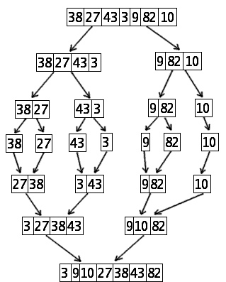

## QuickSort (sortowanie szybkie)

### Zasada działania

1. Wybieramy element rozdzielający
2. Dzielimy tablicę na dwa fragmenty
3. Do początkowego fragmentu przenosimy elementy nie większe od wybranego.
4. Do końcowego przenosimy wszystkie elementy większe.
5. Następnie osobno (rekurencyjnie) sortujemy poszczególne fragmenty tablicy. ← krok rekurencyjny
6. Sortowanie zostaje zakończone w momencie, gdy fragment tablicy uzyskany z podziału zawiera tylko jeden element.

### Złożoność

Zależna od wybranego elementu.

- Przypadek optymistyczny: n log_2 n (występuje jeżeli za każdym razem, wybranym elementem będzie mediana fragmentu)
- Przypadek pesymistyczny: n^2 (występuje jeżeli za każdym razem, wybranym elementem, będzie element o wartości skrajnej)

### Możliwe usprawnienia

- Wybór elementu w sposób losowy, metodą “*****************środkowy z trzech*****************” (wybór trzech elementów z rozpatrywanego fragmentu oraz prowadzenie dalszych operacji dla środkowego z nich), bądź z wykorzystaniem algorytmu poszukiwania przybliżonej mediany.
- Dla małych (kilka, kilkanaście elementów) fragmentów tablicy stosowanie sortowania z wykorzystaniem algorytmu InsertionSort (sortowanie przez wstawianie).

## Binary search (wyszukiwanie binarne)

Zwraca informację o tym, czy dany element istnieje w tablicy, oraz jeśli tak, to jaki jest jego indeks. W przypadku wykorzystania tego algorytmu, **********tablica musi być uporządkowana**********.

### Zasada działania

1. Wybieramy element środkowy przedziału c = (a + b) / 2 (a i b to skrajne indeksy)
2. Porównujemy poszukiwaną wartość z wartością w tablicy pod indeksem c. Jeżeli jest równa, to element został znaleziony. Jeżeli poszukiwana wartość jest mniejsza od wartości pod indeksem c, to kontynuujemy poszukiwania w przedziale [a, c], w przeciwnym wypadku poszukujemy wartości w przedziale [c+1, b].
3. Algorytm kończy się niepowodzeniem, jeżeli przedział będzie jednoelementowy (b = a), a pod indeksem a nie ma poszukiwanej wartości.

### Złożoność: O (log_2 n)
# 20. Algorytmy typu zachłannego.
Algorytm wyznacza rozwiązania w każdym kroku dokonując **zachłannego** (tj. **najlepszego w danej chwili**) wyboru rozwiązania częściowego.

### Strategia

1. wyznaczenie możliwych rozwiązań na danym etapie
2. wybranie **lokalnie optymalnego** rozwiązania dla tego etapu
3. kontynuowanie obliczeń na podstawie ostatnio dokonanego wyboru 

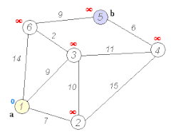

<aside>
❗ Brak spojrzenia w przyszłość powoduje, że algorytmy zachłanne mogą nie znajdować optymalnych rozwiązań

</aside>

### Przykłady

- minimalne drzewo spinające
- najkrótsza ścieżka w grafie (alg. Dijkstry)
- szeregowanie zadań
- wydawanie reszty najmniejszą liczbą monet

# 21. Algorytmy z nawrotami. 
Wyszukiwanie z nawrotami (************************backtracking************************) jest techniką wyszukiwania wszystkich rozwiązań problemu, która inkrementacyjnie buduje rozwiązanie częściowe, porzucając je, gdy dalsze budowanie nie prowadzi do dopuszczalnego rozwiązania, o czym decyduje stosunkowo prosty test.

### Cechy algorytmów z nawrotami

- wykorzystywane do rozwiązywania problemów, które z określonego zbioru wybierają sekwencję obiektów spełniających pewne kryteria
- są zmodyfikowanym przeszukiwaniem drzewa w głąb

### Schemat działania

- Buduj ciąg częściowych (coraz pełniejszych) rozwiązań, po każdym rozszerzeniu sprawdzając, czy to co otrzymano jest potencjalnym rozwiązaniem
- Jeżeli nie da się rozszerzyć danego rozwiązania, cofnij się i spróbuj innego rozszerzenia

### Przykłady wykorzystania

- Problem N hetmanów
# 22. Grafy, drzewa, kopce – charakterystyka i przykłady zastosowania.
### Definicje

- ************Grafem************ nazywamy parę zbiorów ******(V, E)******. Elementy zbioru **V** nazywamy wierzchołkami, a elementy zbioru **E** nazywamy krawędziami. Każda krawędź jest parą wierzchołków, 
tzn. $E \sube \{\{u,v\}: u, v \in V\}$
    
    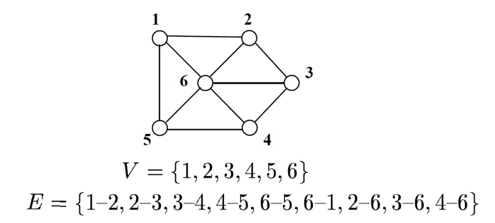
    
- ********Graf skierowany******** → graf, w którym każda krawędź jest ****************************************************************uporządkowaną parą wierzchołków****************************************************************
    
    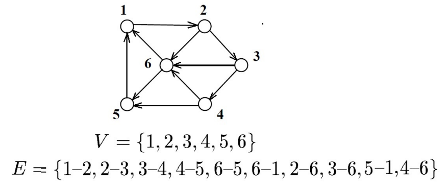
    
- Krawędzie **********************************łączą wierzchołki**********************************
- ******************************Droga (ścieżka)****************************** to dowolny ciąg wierzchołków taki, że występuje krawędź łącząca każdy wierzchołek z następnym (w grafie skierowanym dodatkowo te krawędzie muszą być skierowane w jedną stronę)
- ****************************Ścieżka prosta**************************** → ścieżka, na której nie powtarzają się wierzchołki
- ********Długość ścieżki******** → liczba krawędzi na ścieżce (w przypadku rozważania grafów, w których do krawędzi przypisane są wagi, długość ścieżki jest sumą wag krawędzi znajdujących się na niej)
- ********Cykl******** → ścieżka, na której początku i końcu występuje ten sam wierzchołek.
- **********************Cykl prosty********************** → cykl, w którym nie powtarzają się wierzchołki (poza pierwszym i ostatnim).
- Jeżeli graf posiada co najmniej jeden cykl, to mówimy, że jest ********grafem cyklicznym********, w przeciwnym wypadku jest to **graf acykliczny**.
    
    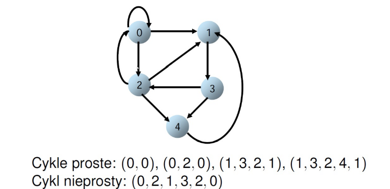
    
- ********Graf pełny******** → graf posiadający krawędzie pomiędzy każdą parą różnych wierzchołków
- Jeśli istnieje możliwość rozmieszczenia wierzchołków grafu nieskierowanego na płaszczyźnie tak, a następnie narysowania jego krawędzi jako linii ciągłych, które się nie przecinają to graf nazywamy ******************planarnym******************, w przeciwnym wypadku jest to graf ************************nieplanarny************************.
- ********************************Stopień wierzchołka (deg(v))******************************** → w grafie nieskierowanym to liczba incydentnych z nim krawędzi, w grafie skierowanym, to suma stopni wejściowego (l. kończących się w nim krawędzi) i wyjściowego (l. rozpoczynających się w nim krawędzi) danego wierzchołka.
- ****Graf regularny**** → graf, w którym każdy wierzchołek ma taki sam stopień.
- ************f-graf************ → graf z ograniczonym stopniem wierzchołka → jego stopień nie może być większy niż f.
- Graf (V’, E’) nazywamy ******************podgrafem****************** grafu (V, E) jeżeli $V' \sube V$ oraz $E' \sube E$.
- Graf jest ************spójny************, gdy istnieje ścieżka pomiędzy dowolnymi dwoma wierzchołkami (w przypadku jeśli graf jest skierowany i spójny to mówimy że jest **************************silnie spójny**************************).
- **************(Silnie) spójną składową************** grafu G nazywamy maksymalny (silnie) spójny podgraf F.

## Reprezentacja grafów

### Macierz sąsiedztwa

Graf G = (V, R) przedstawiony zostaje jako dwuwymiarowa tablica A o wymiarachc |V| x |V|, gdzie element A[i][j] ≠ 0 wttw, gdy istnieje w G krawędź z wierzchołka v_i do v_j. (Złożoność pamięciowa O(|V^2|)

Dla grafów nieskierowanych macierz sąsiedztwa jest symetryczna.

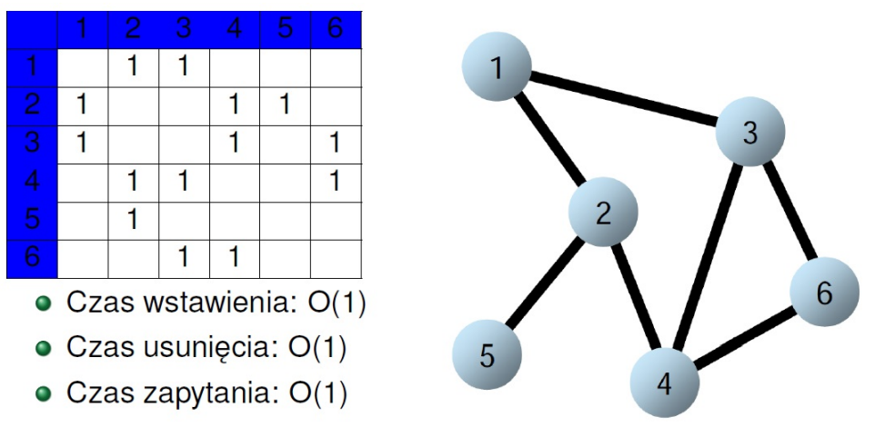

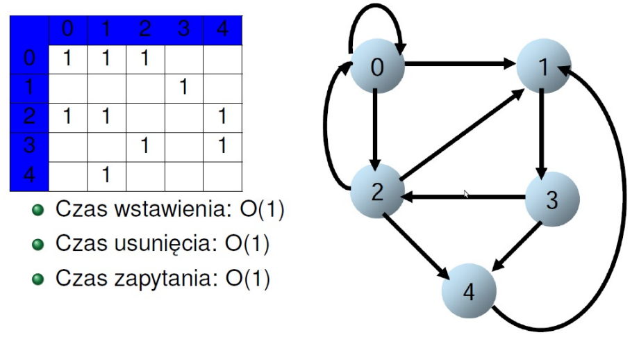

### Lista sąsiedztwa

Graf G = (V, R) przedstawiamy jako tablicę list taką, że lista tab[a] zawiera sąsiadów wierzchołka a. (Złożoność pamięciowa O(|V|, |E|).

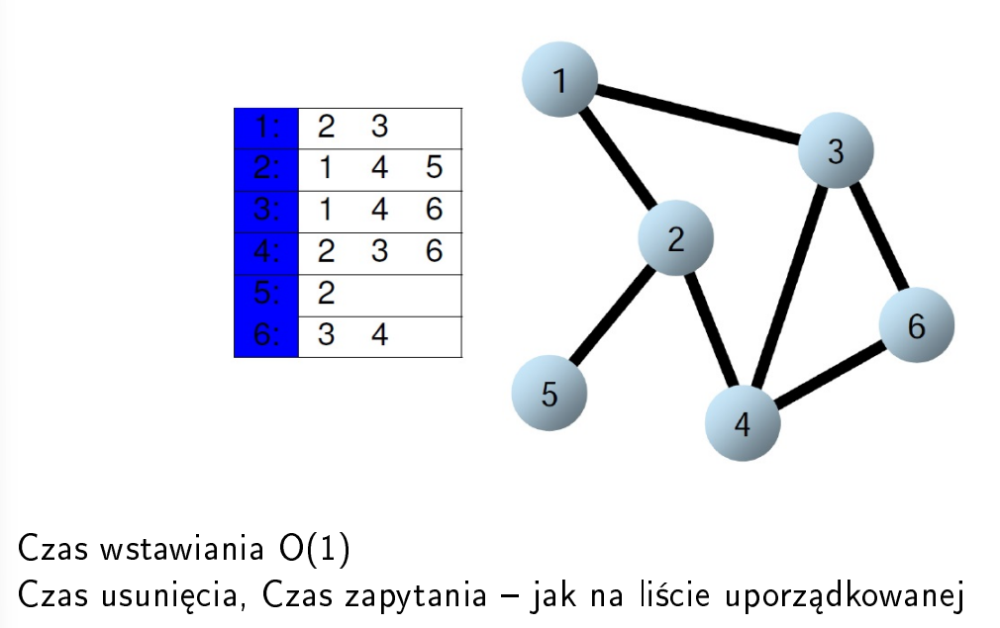

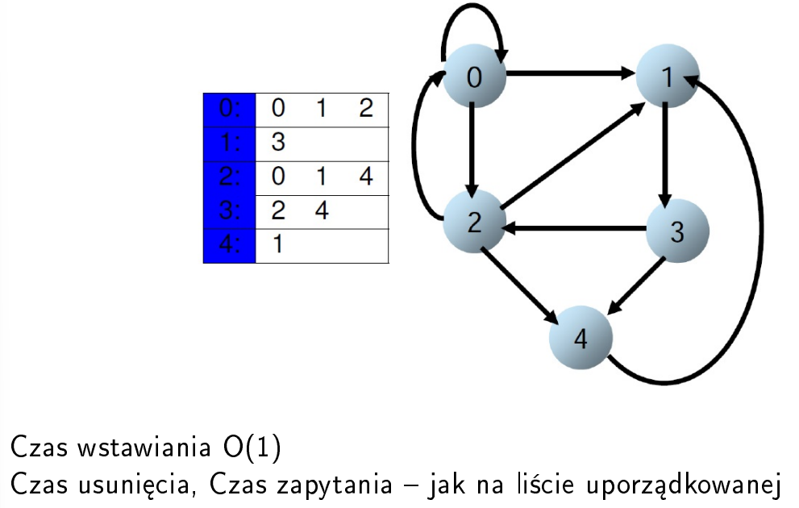

### Lista krawędzi

Lista, na której przechowujemy wszystkie krawędzie występujące w grafie (Złożoność pamięciowa O(|E|)

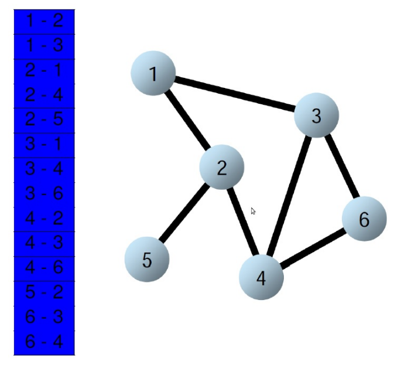

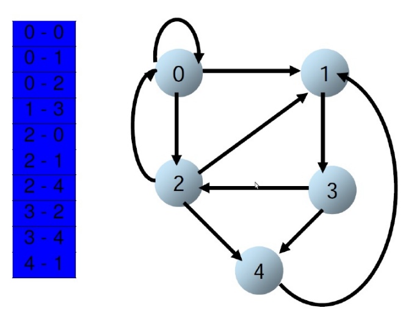

### Macierz incydencji

Macierz incydencji to tablica o rozmiarach |V| * |E|, taka że:

- krawędź wychodzi z danego wierzchołka → -1
- krawędź wchodzi do danego wierzchołka → +1
- wierzchołek nie należy do krawędzi → 0
- pętla własna → 2

Dla nieskierowanego 1 - wierzchołek należy do krawędzi, 0 - wierzchołek nie należy do krawędzi.

Złożoność pamięciowa O(|V| * |E|)

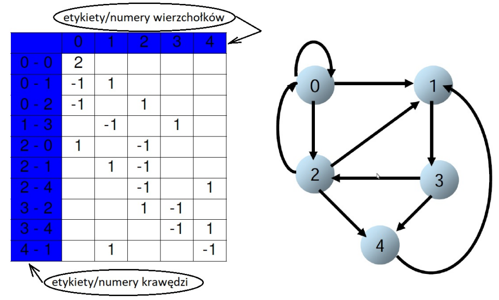

## Przeszukiwanie grafu

### DFS - Depth First Search - w głąb

1. Przechodzimy graf w głąb po krawędziach od wierzchołka do wierzchołka.
2. Kiedy dochodzimy do wierzchołka bez nieodwiedzonych sąsiadów, wracamy po śladach.
3. Jeżeli cofając się znajdziemy wierzchołek sąsiadujący z nieodwiedzonym wierzchołkiem, odwiedzamy go i powtarzamy procedurę.
4. Kontynuujemy dopóki nie odwiedzimy wszystkich wierzchołków.

<aside>
💡 Testowanie spójności grafu → jeżeli procedura wywołana dla pierwszego wierzchołka dotrze do wszystkich wierzchołków, to graf jest spójny.

</aside>

### BFS - Breadth First Search - w szerz

1. Graf przechodzimy warstwami
2. Najpierw odwiedzamy wierzchołek startowy.
3. Następie odwiedzamy wszystkich sąsiadów wierzchołka itd.
4. Każdy wierzchołek odwiedzamy dokładnie raz.

## Drzewa

********************Drzewem******************** nazywamy spójny (dowolne dwa wierzchołki połączone ścieżką) i acykliczny graf nieskierowany, w którym istnieje dokładnie jedna ścieżka do każdego wierzchołka.

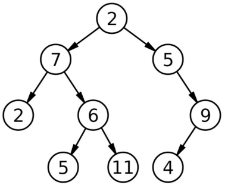

- Drzewo jest zbudowane z **węzłów** przechowujących dane (**********node**********)
- Węzły są powiązane w sposób hierarchiczny za pomocą krawędzi (strzałka oznacza hierarchię)
- Pierwszy, wyróżniony węzeł drzewa nazywamy ******************korzeniem******************, a “wyrastające” od niego węzły nazywamy synami
- Węzeł może mieć wielu synów, ale jest połączony z dokładnie jednym **ojcem**
- Synowie tego samego ojca nazywani są ************braćmi************
- Węzeł nie mający synów nazywamy **liściem**, w przeciwnym razie jest to ********************************węzeł wewnętrzny********************************
- **************Ścieżka************** → ciąg węzłów, w którym każde dwa sąsiednie węzły są połączone krawędzią.
- ******************Długość ścieżki****************** → liczba zawartych w niej krawędzi lub liczba zawartych w niej węzłów - 1.

### Parametry drzew

- ********głębokość wierzchołka →******** liczba wierzchołków, przez które należy przejść od korzenia
- ********************************************wysokość wierzchołka******************************************** → maksymalna liczba wierzchołków do liścia
- **************wysokość drzewa************** → maksymalna głębokość liścia - wysokość korzenia +1
- **************************stopień wierzchołka →************************** liczba jego synów
- ******************stopień drzewa****************** → maksymalny stopień wierzchołka
- ******drzewo k-arne****** → drzewo w którym każdy wierzchołek ma co najwyżej k-synów
- ************************drzewo pełne************************ → drzewo, w którym wszystkie liście leżą na tym samym poziomie, a wszystkie wierzchołki wewnętrzne mają po k-synów
- ********************drzewo zupełne (kompletne********************) → ma wszystkie poziomy prócz ostatniego całkowicie zapełnione, a ostatni jest zapełniony spójnie od lewej
- ****************************************drzewo uporządkowane**************************************** → dla każdego wierzchołka wszystkie dzieci mają przypisany pewien porządek liniowy

### Drzewo binarne

Jest do 2-arne drzewo uporządkowane, w którym jest określone, który syn jest lewy a który prawy.

Drzewo binarne jest ********************************************wyważone (zrównoważone********************************************), gdy wysokość lewego i prawego poddrzewa każdego wierzchołka nie różni się więcej niż o 1.

Drzewo jest **********************************************doskonale zrównoważone**********************************************, gdy wszystkie jego liście znajdują się na maksymalnie dwóch poziomach.

### Trawersowanie drzew

- PREorder → bieżący, lewy, prawy
- POSTorder → lewy, prawy bieżący
- INorder → lewy, bieżący, pracy