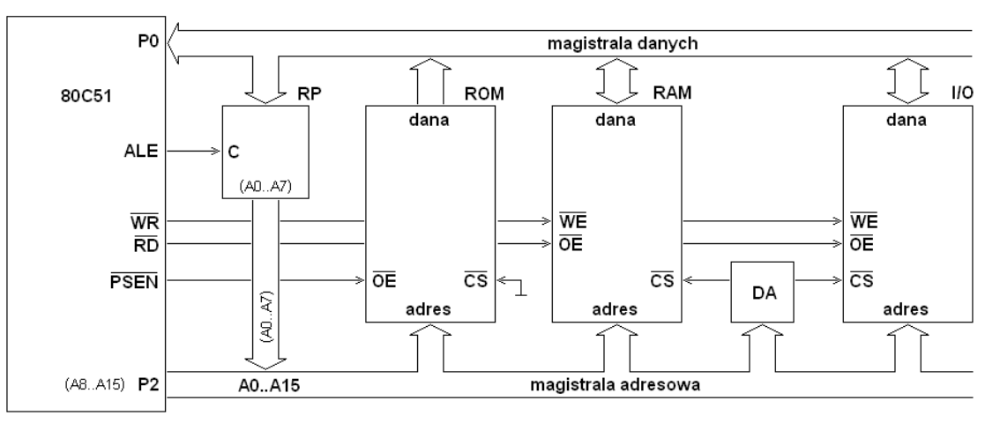
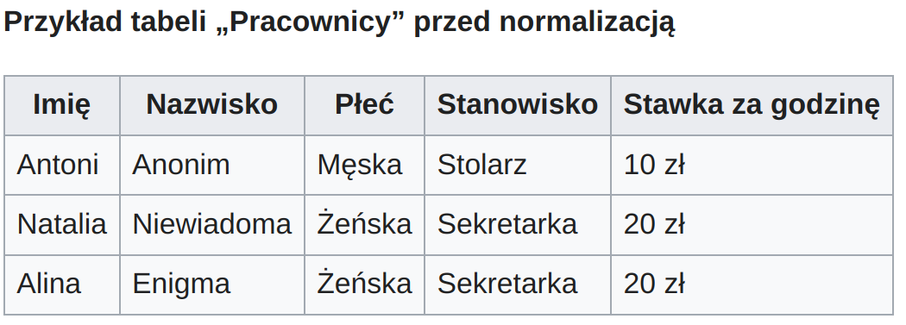
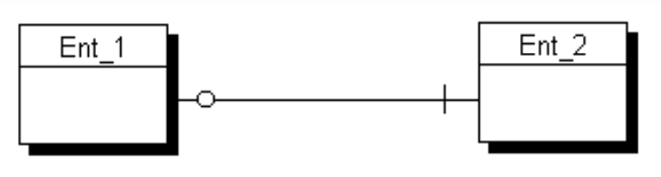

# Bazy danych
[`back to README.md`](../README.md)
## 34. Normalizacja baz danych – pierwsza, druga i trzecia postać normalna.
Postać normalna — postać relacji w bazie danych, w której nie występuje redundancja (nadmiarowość), czyli powtarzanie się tych samych informacji. Doprowadzenie relacji do postaci normalnej nazywa się normalizacją (lub dekompozycją) bazy danych. Wyróżnia się następujace postacie normalne 1NF, 2NF, 3NF, BCNF (Boyce’a-Codda), 4NF i 5NF. 4NF i 5NF w zasadzie wyłącznie w rozważaniach teoretycznych.
* Pierwsza postać normalna (1NF) 
    * relacja opisuje jeden obiekt
    * zdefiniowany klucze relacji
    * atrybuty niekluczowe są w zależności funkcyjnej od klucza
    * wartości atrybutów są elementarne (atomowe, niepodzielne) – każda kolumna jest wartością skalarną (atomową), a nie macierzą lub listą czy też czymkolwiek, co posiada własną strukturę
    * nie zawiera kolekcji (powtarzających się grup informacji)
    * kolejność wierszy może być dowolna (znaczenie danych nie zależy od kolejności wierszy)
    
    
    
* Druga postać normalna (2NF)
    * jest w 1 NF
    * żadna kolumna niekluczowa nie jest częściowo funkcyjnie zależna od jakiegokolwiek klucza potencjalnego
    * Przykład: klucz potencjalny składa się z dwóch pól: "Imię" oraz "Nazwisko". Przy założeniu, że każde imię ma przypisaną jedną płeć, czyli, że płeć zależy tylko od jednego z atrybutów klucza potencjalnego, tabela nie spełnia warunków na drugą postać normalną.

    
    
    
* Trzecia postać normalna (3NF)
    * jest w 2 NF
    * żaden atrybut niekluczowy nie jest zależny funkcyjnie od innych atrybutów niekluczowych
    * Przykład: Klucz potencjalny składa się tu z dwóch pól: "Imię" oraz "Nazwisko". Oba atrybuty niekluczowe: "Stanowisko" oraz "Stawka za godzinę" są zależne od całego klucza potencjalnego- tzn. dany pracownik ma przyporządkowane jedno stanowisko i jedną stawkę godzinową. Przy założeniu, że każde stanowisko jest tak samo płatne, to wartości w kolumnie „Stawka za godzinę” są zależne jedynie od pola „Stanowisko”, a tylko pośrednio od klucza potencjalnego. 
    
    
    
    
## 35. Modele baz danych (logiczny, relacyjny, fizyczny).
### Model logiczny
Model logiczny składa się ze zbioru encji  oraz ich atrybutów (wraz z określeniem typu danych, wymagalności,
ograniczeń) i klucze główne. Pomiędzy tak zdefiniowanymi zbiorami encji kreśli się relacje o określonych własnościach.

Związki pomiędzy encjami w modelu logicznym (CMD):
* jeden do jednego (1:1) (wymagany z jednej
strony)
  
* jeden do wielu (1:N) (nie wymagany z żadnej strony)
  
* wiele do jednego (N:1) (wymagany z jednej strony)
  
* wiele do wielu (N:M) (nie wymagany)
  
### Model relacyjny
### Model fizyczny
Model fizyczny (PDM) jest to model, który jest zależny od konkretnej implementacji bazy danych. W modelu fizycznym określa się typy danych, indeksy, klucze obce, ograniczenia, itp. Model fizyczny jest tworzony na podstawie modelu logicznego.

## 36. Rodzaje zapytań w języku SQL.
## 37. Funkcje w języku SQL.
## 38. Transakcje w bazach danych. 
Transakcja w bazie danych — seria jednej lub więcej operacji wykonywanych jako pojedyncza, atomowa jednostka pracy (albo wszystkie operacje w transakcji zostaną zakończone sukcesem, albo żadna z nich nie zostanie zastosowana w bazie danych). Transakcje są wykorzystywane do zapewnienia spójności i integralności danych poprzez zapewnienie, że baza danych pozostaje spójna nawet w przypadku awarii systemu lub błędów. Są niezbędne do umożliwienia współbieżnego dostępu, zapewnienia atomowości,  odzyskiwania danych oraz zapewnienia właściwości ACID.

Cechy transakcji zapewniające niezawodność bazy danych — Właściwości  ACID to zestaw właściwości, które zapewniają niezawodność transakcji bazodanowych:

* Atomowość: transakcja jest traktowana jako pojedyncza, niepodzielna jednostka pracy. Oznacza to, że albo wszystkie operacje w transakcji są zakończone sukcesem, albo żadna z nich nie jest stosowana w bazie danych. W przypadku niepowodzenia baza danych jest cofana do stanu sprzed transakcji, co pozwala zachować spójność.
* Spójność: baza danych pozostaje w spójnym stanie przez cały czas trwania transakcji. DBMS sprawdza ograniczenia integralności przed i po transakcji i zwija transakcję, jeśli któreś z ograniczeń zostanie naruszone.
* Izolacja: zmiany dokonane przez transakcję nie są widoczne dla innych transakcji, dopóki transakcja nie zostanie popełniona. Izolacja ta pomaga zapobiegać konfliktom pomiędzy współbieżnymi transakcjami.
* Trwałość: zmiany dokonane przez transakcję są trwałe i przetrwają wszelkie kolejne awarie. DBMS używa techniki zwanej logowaniem, aby zapewnić, że zmiany dokonane przez transakcję mogą być cofnięte w przypadku niepowodzenia.
Razem, właściwości te zapewniają, że baza danych pozostaje niezawodna i spójna pomimo współbieżnych transakcji i awarii systemu.

Działanie transakcji:

* Transakcja w bazie danych rozpoczyna się od wykonania pojedynczej operacji, takiej jak wstawienie danych do tabeli. Jeśli w ramach tej samej transakcji wykonywane są inne procedury, to wszystkie one są wykonywane jako pojedyncza jednostka atomowa. System zarządzania bazą danych (DBMS) wykorzystuje menedżera transakcji do śledzenia poszczególnych operacji transakcyjnych i zapewnienia, że są one wykonywane we właściwej kolejności.
* Kiedy transakcja jest uruchamiana, DBMS tworzy nowy kontekst transakcji i przypisuje go do bieżącego wątku wykonania. Wszelkie operacje na bazie danych, które są wykonywane w ramach tego kontekstu, są uważane za część transakcji.

* Dokładna składnia rozpoczęcia i zakończenia transakcji zależy od konkretnego systemu zarządzania bazą danych (DBMS). Na przykład w SQL możesz rozpocząć transakcję przy użyciu polecenia BEGIN TRANSACTION i zakończyć ją przy użyciu polecenia COMMIT lub ROLLBACK. W innych systemach DBMS podobne polecenia mogą mieć inną składnię. Po zakończeniu operacji, transakcja może zostać wykonana lub cofnięta. Jeśli transakcja zostanie zatwierdzona, DBMS stosuje wszystkie operacje w transakcji do bazy danych, czyniąc je trwałymi. Jeśli transakcja jest wycofana, DBMS cofa wszystkie operacje w transakcji, przywracając bazę danych do stanu sprzed rozpoczęcia transakcji.

Jakie przykłady operacji na bazie danych mogą być częścią transakcji?
* wstawianie
* aktualizacja lub usuwanie danych w tabeli 
* tworzenie lub modyfikacja tabeli
* tworzenie lub modyfikacja indeksu.

Transakcje są izolowane — zmiany dokonane przez transakcję nie są widoczne dla innych transakcji, dopóki transakcja nie zostanie popełniona. Izolacja ta pomaga zapobiegać konfliktom między współbieżnymi transakcjami. 

DBMS wykorzystuje technikę zwaną blokowaniem, aby zapewnić, że tylko jedna transakcja ma dostęp do określonego fragmentu danych w danym momencie. Zapobiega to modyfikowaniu tych samych danych przez inne transakcje, co mogłoby powodować konflikty.

