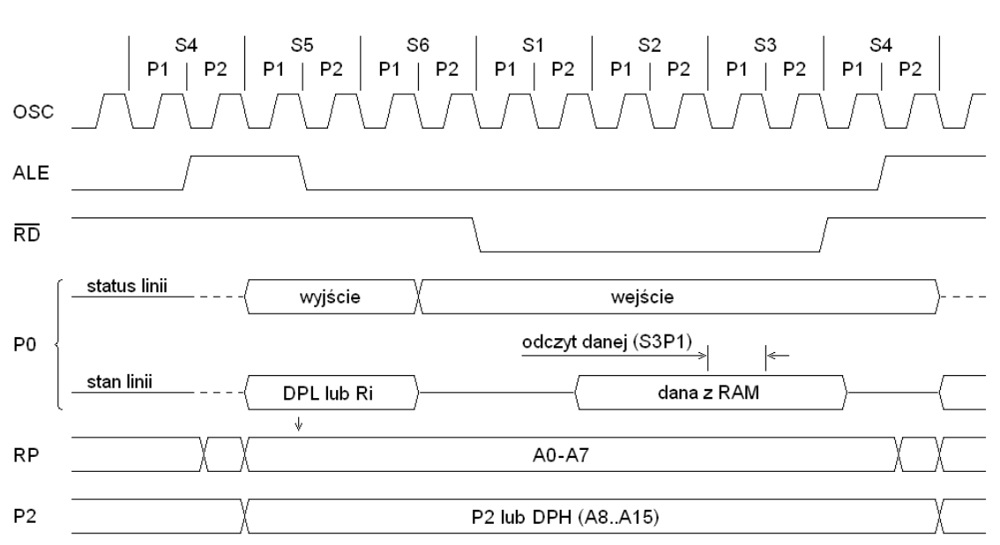
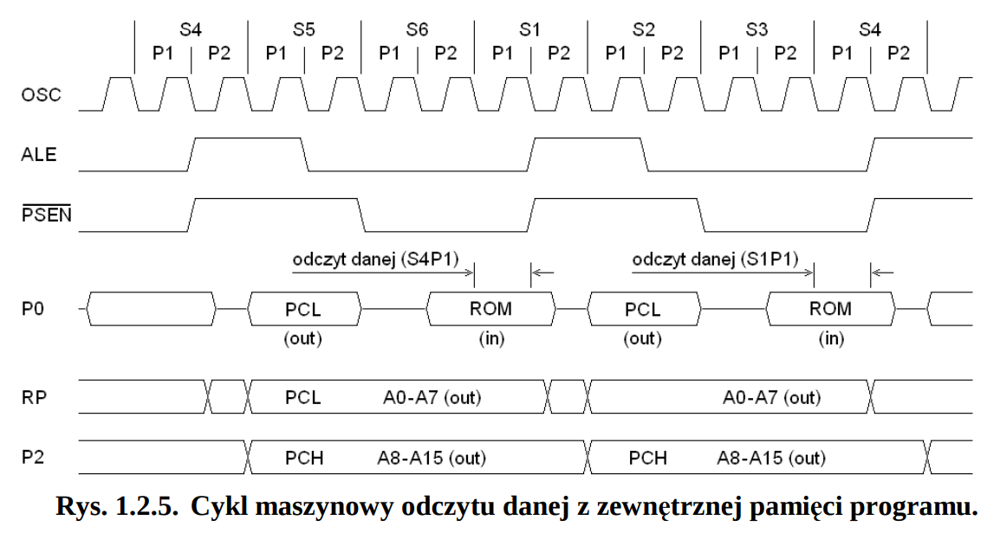
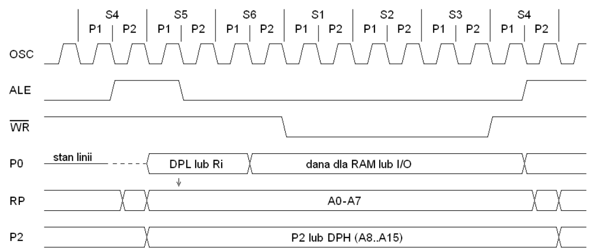
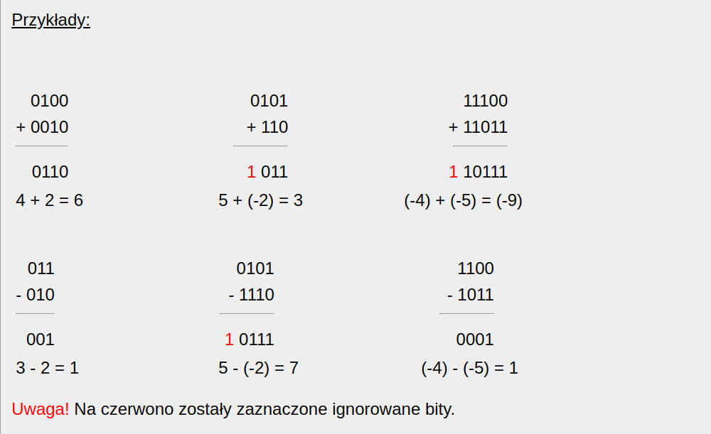
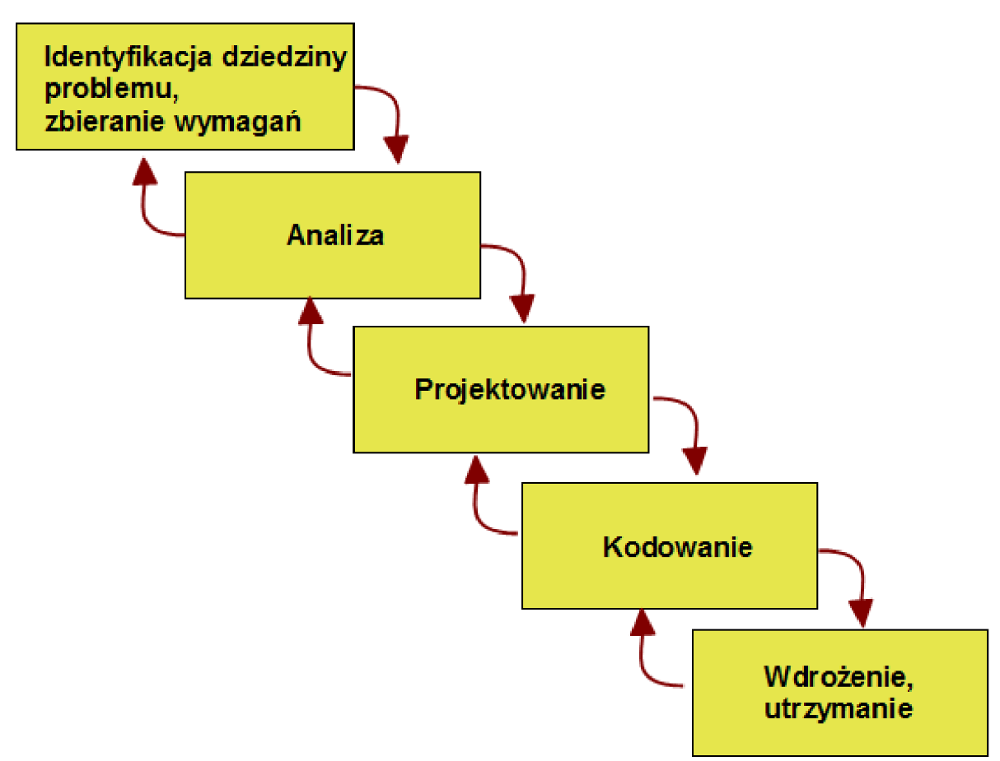
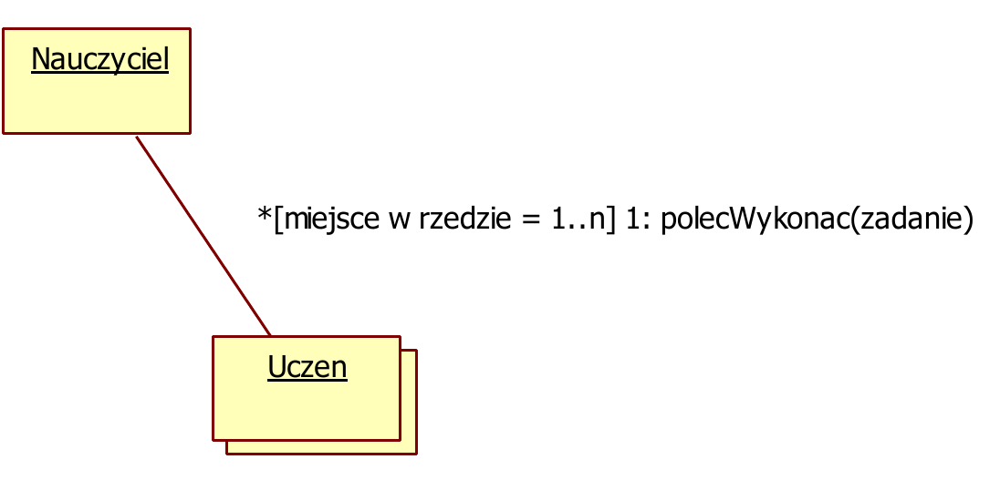

# AI
[`back to README.md`](../README.md)

## 30. Modele reprezentacji wiedzy.

### Podział 1:

* deklaratywne
  * wiedza  z danej dziedziny jest zbiorem specyficznych faktów
  * korzystanie z wiedzy — stosowanie do tego zbioru ogólnych procedur manipulacji faktami
  * wyraźne oddzielenie wiedzy z danej dziedziny od sposobu wykorzystania tej wiedzy w procesie wnioskowania
  * np.: reprezentacja logiczna
* proceduralne
  * przeważającą część wiedzy o świecie stanowią informacje o procesach i działaniach
  * "Wiedzieć" jest równoważne z "wiedzieć jak": znajomość danego pojęcia sprowadza się głównie do umiejętności manipulacji tym pojęciem
  * wiedza zawarta jest w procedurach (podprogramach), które wiedzą jak należy się zachować w określonej sytuacji

### Podział 2

* reprezentacje logiczne (rachunek zdań, rachunek predykatów, rachunek klauzul)
  * fakty zapisywane są w postaci formuł
  * wnioskowanie opiera się na uniwersalnych metodach dowodzenia twierdzeń np. rezolucji
* za pomocą reguł — reguły są to zdania postaci "jeśli ..., to ...", gdzie "..." to zdania logiczne, a "jeśli" i "to" to odpowiednio konkluzja i przesłanka reguły, (równoważne/podzbiorem reprezentacje logiczne??)
* za pomocą ram — stanowią połączenie metod deklaratywnych i proceduralnych; rama składa się ze szczelin (slots) opatrzonych nazwami, których zadaniem jest przechowywanie pewnej cząstki wiedzy o obiekcie reprezentowanym przez ramę (ze szczeliną mogą być związane również procedury);
* za pomocą sieci semantycznych — etykietowany graf skierowany, w którym wierzchołki reprezentują obiekty, pojęcia, wartości itd., natomiast krawędzie wyrażają relacje między wierzchołkami;
* stwierdzenia — kreprezentacje typu (obiekt, atrybut, wartość), w których pojedynczy fakt
zapisywany jest w postaci podanej trójki, a bazę wiedzy stanowi zbiór takich trójek
* ...

### Ontologia

Ontologia — dział filozofii odpowiadającym na pytania dotyczące struktury rzeczywistości

Ontologia wyższa:

* definiuje ogólne ramy dla koncepcji dotyczących reprezentacji świata
* definiuje i klasyfikuje w sposób hierarchiczny obiekty i zdarzenia występujące w świecie


Reprezentacja wiedzy i wnioskowania dla kategorii:

* sieci semantyczne
  * umożliwiają wizualizację bazy wiedzy;
  * zawierają efektywne algorytmy wnioskowania o własnościach elementów na podstawie ich przynależności do kategorii
  * ogólną postacią sieci semantycznych są ramy
* logika opisowa
  * używa języka formalnego do budowania i łączenia definicji kategorii;
  * dostarcza efektywnych algorytmów do wyznaczania relacji zawierania pomiędzy kategoriami
  * formalizacja sieci semantycznych
  * zadania
    * Subsumpcja — sprawdzanie czy dana kategoria jest podzbiorem innej kategorii poprzez porównanie ich definicji
    * Klasyfikacja: sprawdzanie czy dany obiekt należy do kategorii.
    * Badanie zgodności: czy kryteria przynależności do kategorii są logiczne spełnialne.

## 31. Mechanizmy wnioskowań.


Wnioskowanie może być przeprowadzone

* bez hipotezy — generowanie nowych faktów tak długo, aż zostaną odpalone wszystkie możliwe reguły; Pytanie „Co wynika z X?”
* z hipotezą - weryfikacja (udowodnienie) konkretnej hipotezy na podstawie faktów zawartych w bazie wiedzy; Pytanie „Czy jest prawdą, że Y?

### Rodzaje

* wnioskowanie w przód (progresywne) — wnioskowanie od faktów do wniosków
  * wnioskowania z hipotezą lub bez
  * Pierwszym krokiem do opisu mechanizmu wnioskowania w przód jest zdefiniowanie założeń oraz celu wnioskowania.
  * Założenia  
    * System ma zdefiniowaną bazę wiedzy, czyli zbiór reguł oraz, ewentualnie, zadeklarowane fakty
    * System ma zdefiniowaną bazę wiedzy, czyli zbiór reguł oraz, ewentualnie, zadeklarowane fakty
  * Cel wnioskowania: znalezienie wszystkich możliwych do osiągnięcia wniosków.
* wnioskowanie w tył/wstecz (regresywne) — wnioskowanie od wniosków do faktów
* tylko wnioskowania z hipotezą.
  * cel: sprawdzenie, czy jeden, konkretny fakt (hipoteza) jest prawdziwy.
* mieszane — rodzaj wnioskowania przełączany w zależności od reguły

### Systemy ekspertowe

**Systemy ekspertowe** (eksperckie, z bazą wiedzy) — programy wspomagające korzystanie z wiedzy i ułatwiające podejmowanie decyzji; może być uważany za model ekspertyzy złożony z bazy wiedzy i procedury wnioskowania logicznego.

Cechy systemy ekspertowych:

* są wąsko wyspecjalizowane,
* mogą wspomagać lub nawet zastępować ekspertów w danej dziedzinie,
* mogą dostarczać rad, zaleceń i diagnoz dotyczących problemów z określonej dziedziny


## 32. Metody uczenia maszynowego.

**Uczenie maszynowe** —  obszar sztucznej inteligencji poświęcony algorytmom, które poprawiają się automatycznie poprzez doświadczenie, czyli ekspozycję na dane. Algorytmy uczenia maszynowego budują model matematyczny na podstawie przykładowych danych, zwanych zbiorem uczącym, w celu prognozowania lub podejmowania decyzji bez bycia zaprogramowanym explicite przez człowieka do tego celu.

Metody maszynowego uczenia się

* uczenie nadzorowane (supervised learning) — zakłada obecność ludzkiego nadzoru nad tworzeniem funkcji odwzorowującej wejście systemu na jego wyjście
  * Nadzór polega na stworzeniu zestawu danych uczących się
    * wejściowy obiekt uczący się np. wektor
    * pożądana przez nadzorcę (nauczyciela) odpowiedź (np. jakaś konkretna wartość liczbowa)
* uczenie nienadzorowane (unsupervised learning)
  * jego zadaniem odkrywanie w zbiorze danych wzorców bez wcześniej istniejących etykiet i przy minimalnej ingerencji człowieka
  * zakłada brak oczekiwanego wyjścia w danych uczących
  * umożliwia modelowanie gęstości prawdopodobieństwa danych wejściowych
  * metody
    * analiza składowych głównych (PCA) — wykorzystuje się do zmniejszanie wymiarowości danych poprzez odkrywanie i odrzucanie cech które niosą ze sobą najmniej informacji
    * analiza skupień (clustering)
      * grupowanie lub segmentowanie zestawów danych ze wspólnymi atrybutami w celu ekstrapolacji występujących w nich zależności
      * identyfikuje podobieństwa w danych
      * pozwala na grupowanie danych, które nie zostały oznaczone, sklasyfikowane ani skategoryzowane
      * może być wykorzystana aby wykryć nietypowe dane
* uczenie przez wzmacnianie (reinforcement learning)
  * jego zadaniem jest interakcja ze środowiskiem za pomocą polityki na podstawie zebranych przez nią informacji
  * brak danych uczących, jes za to środowisko, z którego model będzie zbierał dane automatycznie
  * model uczy się na podstawie nagród, celem zmaksymalizowanie nagrody
  * większość algorytmów uczenia przez wzmacnianie polega na przygotowaniu polityki, zebraniu za jej pomocą danych o środowisku do bufora, wytrenowaniu jej na ich podstawie i powtarzania tego procesu do osiągnięcia zamierzonego skutku
  
  Schemat przedstawiający uczenie przez wzmacnianie. Agent zwraca akcje na podstawie obserwacji, środowisko zwraca obserwacje i nagrody na podstawie akcji, bufor kolekcjonuje akcje, obserwacje i nagrody, agent uczy się na podstawie danych w buforze.

  Uczenie przez wzmacnianie najczęściej składa się z dwóch etapów: wstępnego zbierania danych oraz pętli uczenia. Pętla uczenia z kolei składa się ze zbierania danych oraz uczenia agenta na ich podstawie
  * elementy
    * agent —  element, który wchodzi w interakcję ze środowiskiem
    * środowisko — otoczenie, w którym agent się uczy (zadanie lub symulacja, z którym agent wchodzi w interakcję)
      * Cechy środowiska
        * stan środowiska — opisuje on stan środowiska w danym momencie
        * krok — najczęściej funkcja, która na podstawie podanej akcji aktualizuje stan środowiska i zwraca nagrodę oraz obserwację
        * epizod — zbiór kroków, po którym resetowany jest stan środowiska
        * nagroda — zmienna zwracana przez środowisko po wykonaniu kroku, która obrazuje jak korzystny był dany krok
        * obserwacja —  skalar, wektor lub macierz zwracana przez krok, mająca opisać obecny stan środowiska
      * powszechnie 2 środowiska — do trenowania i do testowania
    *bufor — to kontener danych przechowujący informacje zebrane przez agenta podczas uczenia. Informacji tych używa się do późniejszego wytrenowania agenta. Bufor jest używany tylko w niektórych algorytmach uczenia przez wzmacnianie
* uczenie częściowo nadzorowane (semi-supervised)
  * dane wejściowe zarówno oznaczone (zawierające odpowiadające im dane wyjściowe, konkretne przykłady), jak i nieoznaczone (wymagające przyporządkowania do danych wyjściowych, znalezienia odpowiedzi)
  * wykorzystywany, gdy organizacja dysponuje zbyt dużą ilością danych lub gdy informacje są na tyle zróżnicowane, że nie sposób przyporządkować odpowiedzi do każdej z nich
  * system sam proponuje odpowiedzi i jest w stanie stworzyć ogólne wzorce.

## 33. Budowa sieci neuronowych.

**Sieć neuronowa** – system przeznaczony do przetwarzania informacji, którego budowa i zasada działania są w pewnym stopniu wzorowane na funkcjonowaniu fragmentów rzeczywistego (biologicznego) systemu nerwowego.

Budowa sieci neuronowej:
* **warstwa wejściowa** — warstwa, która przyjmuje dane wejściowe
* **warstwy ukryte** — warstwy, które przetwarzają dane wejściowe
* **warstwa wyjściowa** — warstwa, która zwraca wynik
  
  
Cechy sieci neuronowych:
* na strukturę składają się neurony połączone ze sobą synapsami. Z synapsami związane są wagi, których interpretacja zależy od modelu.


**Propagacja wsteczna** — metoda uczenia nadzorowanego wielowarstwowych sieci neuronowych. Polega na propagacji błędu popełnionego przez sieć w trakcie uczenia się wstecz, od warstwy wyjściowej do warstwy wejściowej. Wagi połączeń są aktualizowane w kierunku przeciwnym do propagacji sygnału. Tempo modyfikacji wag określone jest natomiast za pomocą współczynnika uczenia (learning rate).

# Algorytmy
[`back to README.md`](../README.md)
## Podstawowe definicje

****Algorytm**** — precyzyjnie określony, jednoznaczny, skończony opis procesu przetworzenia danych wejściowych do pewnych danych wyjściowych.

******Algorytmika****** — dział informatyki zajmujący się poszukiwaniem, konstruowaniem i badaniem algorytmów (w kontekście przydatności do rozwiązywania problemów z wykorzystaniem komputerów)

**********Struktura danych********** — zaimplementowana realizacja danych w programie

## Programowanie dynamiczne

Polega na podziale rozwiązywanego problemu na podproblemy względem kilku parametrów, które cechuje nierozłączność (zależność) (w przeciwieństwie do strategii “dziel i zwyciężaj”).

### Strategia

- określenie parametrów cechujących problem
- określenie funkcji celu będącej funkcją parametrów
- znalezienie optymalnej funkcji celu poprzez rozwiązanie podproblemów od najprostszego do najbardziej złożonego

### Określanie parametrów

- parametrem może być np.
    - liczba elementów zbioru danych charakterystycznych dla problemu
    - wartość maksymalna lub minimalna, jaką mogą przyjąć elementy zbioru problemu
- wraz ze wzrostem l. parametrów, wzrasta zapotrzebowanie na pamięć i moc obliczeniową

<!-- <aside> -->
> 💡 Zaprojektowany algorytm ma postać równania rekurencyjnego, opisującego optymalną funkcję celu tego problemu.

<!-- </aside> -->

Wyznaczenie wartości funkcji celu dla ostatniego podproblemu jest zazwyczaj wynikiem rozwiązania całego zagadnienia.

### Przykłady

- algorytmy znajdujące najdłuższy wspólny podciąg
- algorytmy realizujące zagadnienia plecakowe
- obliczanie odległości Levenshteina (odległość między napisami)
- algorytm Floyda-Wrshalla (najkrótsze ścieżki w grafie ważonym)

## Algorytmy siłowe

Rozpatrują wszelkie możliwe rozwiązania, aż do znalezienia takiego, które może być zaakceptowane jako wynik.

### Strategia

1. Wyznaczenie zbioru możliwych rozwiązań.
2. Sprawdzenie kolejnych rozwiązań ze zbioru, aż do znalezienia wyniku.

### Uwagi

- Przy braku ograniczenia przestrzeni poszukiwań, czas wykonania może być nieakceptowalny.
- Dowolny algorytm można zastąpić poprzez jego odpowiednik siłowy.

### Możliwe modyfikacje

Ograniczenie przestrzeni poszukiwań:

- do pewnych obszarów możliwych rozwiązań - algorytm heurystyczny
- w sposób losowy - algorytm probabilistyczny

## Algorytmy probabilistyczne

Polegają na losowym przeszukiwaniu ******************************************przestrzeni rozwiązań******************************************, kolejne próby znalezienia rozwiązania są wykonywane na podstawie wskazań pseudolosowych.

### Strategia

1. Wylosuj próbkę do sprawdzenia.
2. Zweryfikuj potencjalne rozwiązanie.
3. Jeżeli uzyskany wynik nie jest akceptowalny, wróć do losowania próbki.

### Uwagi

- są to algorytmy niedeterministyczne

### Podział algorytmów probabilistycznych

- ******************Las Vegas****************** — zawsze zwracające poprawne wyniki w bliżej nieokreślonym czasie (randomizacja służy przyspieszeniu działania algorytmu, średnia złożoność nie ulega zmianie)
- ************************Monte Carlo************************ — kończące się w ustalonym czasie, ale bez gwarancji ustalenia wyniku (prawdopodobieństwo zwrócenia poprawnego wyniku ******************bliskie 1******************)

### Przykłady

- metoda Monte Carlo do obliczania pól figur
- RandomQuickSort

# Złożoność obliczeniowa

Jest to miara wyrażająca **ilość zasobów komputerowych** (****************************czas działania****************************, **************************************ilość wykorzystanej pamięci**************************************) potrzebnych do wykonania algorytmu.

## Złożoność pamięciowa

Jest to ilość pamięci jaką potrzebuje algorytm dla danych wejściowych o rozmiarze n.

<!-- <aside> -->
> 💡 Definicja rozmiaru danych wejściowych zależy od rozważanego problemu (sortowanie - liczba elementów do posortowania, mnożenie liczb całkowitych - liczba bitów potrzebnych do reprezentacji binarnej).
W praktyce do obliczania złożoności pamięciowej nie uwzględnia się pamięci do odczytu na dane wejściowe i do zapisu na dane wyjściowe.

<!-- </aside> -->

### Złożoność czasowa

Jest to **************************liczba kroków************************** (elementarnych operacji), po jakich algorytm zatrzymuje się dla danych wejściowych o rozmiarze **n**.

<!-- <aside> -->
> 💡 Jest to własność samego algorytmu, niezależna od komputera czy języka programowa.

<!-- </aside> -->

### Notacja O

Asymptotyczne ************************************ograniczenie górne************************************ danej funkcji — dana funkcja f(n) jest **************O(g(n))**************, jeżeli dla wszystkich wartości n > n_0, wartość funkcji f(n) jest nie większa niż cg(n).

### Notacja $\Omega$

Asymptotyczne ************************************ograniczenie dolne************************************ danej funkcji.


### Rodzaje złożoności

- pesymistyczna — maksymalna ilość zasobów potrzebynych przy (najgorszych) danych wejściowych o rozmiarze n
- oczekiwana — średnia ilość zasobów potrzebnych przy danych wejściowych o rozmiarze n (obliczana na podstawie rozkładu prawdopodobieństwa)
- zamortyzowana — określana dla wielokrotnie powtarzanych operacji, wykonywanych na strukturach danych (średnia bez rozkładu prawdopodobieństwa).

## Struktury danych

### Typy proste

- typ porządkowy — każdy element ma ściśle określoną kolejność w typie (operacje poprzedniego i następnego elementu)
- typ rzeczywisty

### Typy strukturalne

- typ tablicowy — ciągi danych tego samego typu statycznego o z góry określonej długości (dostęp bezpośredni i indeksowany)
- typ rekordowy — ciągi danych niekoniecznie tego samego typu statycznego (dostęp bezpośredni, przez identyfikator danej)
- typ plikowy - typ dynamiczny (zmienna liczba elementów) o elementach tego samego typu statycznego z sekwencyjnym trybem dostępu (dostęp do kolejnego elementu, możliwy po odczytaniu wcześniejszych)
- typ wskaźnikowy - obejmuje adresy danych w pamięci
- typ napisowy — operuje na ciągach znaków (w rzeczywistości implementowany z użyciem innych struktur)
- typ obiektowy — podobny do rekordowego, ale pozwalający obejmować nie tylko dane ale również metody

### Definicje

************Strukturą danych************ nazywamy sposób uporządkowania przechowywanych na komputerze danych.

********************Abstrakcyjnym typem danych******************** nazywamy formalną specyfikację przechowywania obiektów oraz zbiór dobrze opisanych operacji na tych obiektach.

<!-- <aside> -->
> 💡 Struktura danych jest implementacją konkretnej abstrakcyjnej struktury danych.

<!-- </aside> -->

### Przykłady stuktur

- Liniowe abstrakcyjne struktury danych
    - Stos
    - Kolejka
    - Listy (jedno/dwukierunkowe, cykliczne/niecykliczne)
- Tablice haszujące
- Drzewiaste struktury danych
    - Drzewa poszukiwań binarnych (binary search trees)
    - Koce
    - Drzewa AVL
    - Drzewa Czerwono-Czarne
- Grafy
# 18. Algorytmy sortowania.

## Definicje

**************************************Warunek stabilności************************************** — zachowanie początkowego ustawienia względem siebie elementów równych (rekordów o takich samych kluczach).

**************************************Operacja dominująca************************************** — porównanie elementów w ciągu.

************************************************************************Złożoność pamięciowa alg. sortowania************************************************************************ — ilość dodatkowej pamięci (oprócz n-miejsc pamięci dla elementów ciągu) potrzebnej do wykonania algorytmu.

## Typy algorytmów sortowania

### Sortowanie przez porównywanie elementów

- sortowanie przez selekcję (selection sort)
- sortowanie przez wstawianie (insertion sort)
- sortowanie bąbelkowe (bubble sort)
- sortowanie koktajlowe (cocktail sort)
- sortowanie Shella i Grzebieniowe (Shell and Comb sort)

### Sortowanie metodą dziel i zwyciężaj

- sortowanie przez scalanie (merge sort)
- sortowanie sybkie (quick sort)

### Inne

- sortowanie przez zliczanie (counting sort)
- sortowanie przez kopcowanie (heap sort)
- sortowanie pozycyjne (radix sort)

## Podział względem stabilności

### Algorytmy sortowania stabilnego

- przez wstawianie
- bąbelkowe
- koktajlowe
- pozycyjne
- przez scalanie
- przez zliczanie

### Algorytmy sortowania niestabilnego

- przez selekcję
- szybkie
- przez kopcowanie

## Sortowanie Bąbelkowe

### Zasada działania

1. Porównujemy kolejne pary sąsiadujących elementów n-elementowej tablicy.
2. Jeżeli nie są właściwie uporządkowane, zamieniamy je miejscami.
3. Powtarzamy procedurę n-razy za każdym razem przeglądając o jeden element mniej.


<!-- <aside> -->
> 💡 W i-tym przebiegu wyznaczamy i-ty najmniejszy/największy element zbioru oraz umieszczany jest na właściwej pozycji

<!-- </aside> -->

### Złożoność czasowa: O(N^2)

### Możliwe ulepszenia

- zapamiętywanie czy w trakcie przejścia dokonano zmian - jeżeli nie, algorytm kończy działanie
- zapamiętywanie pozycji ostatniej zmiany — wszystkie pary obiektów sąsiadujących powyżej (poniżej) tej pozycji, są już ustawione w odpowiedniej kolejności.

## Sortowanie koktailowe

Jest do ********************************************************************dwukierunkowe sortowanie bąbelkowe******************************************************************** — wersja bubble sorta, w której przejścia po tablicy odbywają się ze zmiennym kierunkiem (raz od prawej - malejąco, a potem od lewej - rosnąco).

Typowa złożoność czasowa jest klasy O(n^2), dla zbiorów w znacznym stopniu posortowanych, złożoność redukuje się do O(n).

## Sortowanie przez wstawianie (Insertion sort)

### Zasada działania

1. Elementy tablicy podzielone (umownie) na ciąg wynikowy i źródłowy.
2. W kroku **i** (począwszy od i = 2) posortowanych jest i-1 elementów tablicy, a element i-ty zostaje pomiędzy nie w miejsce, które zachowuje posortowanie ciągu.
3. W celu znalezienia odpowiedniego miejsca należy przeglądać posortowaną część tablicy, o ile to możliwe od razu przesuwając je i tworząc miejsce na nowy element.

### Złożoność czasowa: O(n^2)

### Możliwe ulepszenia

Ciąg wynikowy jest już uporządkowany — można zastosować metodę **przeszukiwania połówkowego (binary serach)**, w celu ustalenia miejsca wstawienia nowego obiektu.

Ulepszenie to zmniejsza tylko liczbę porównań, a nie liczbę potrzebnych przesunięć.

## Shell Sort - sortowanie metodą malejących przyrostów

### Zasada działania

1. Sortowany zbiór podziel na podzbiory, których elementy są odległe od siebie w sortowanym zbiorze o pewien odstęp h.
2. Każdy z tych podzbiorów posortuj algorytmem przez wstawianie.
3. Następnie odstęp zmniejsz, co powoduje powstanie nowych podzbiorów (będzie ich już mniej)
4. Sortowanie powtórz i zmniejsz odstęp, aż osiągnie on wartość 1. Wtedy cały zbiór sortujemy typowym Insertion Sortem.

<!-- <aside> -->
> 💡 Dzięki początkowym, dużym odstępom, elementy były przesuwane w zbiorze bardziej efektywnie - na duże odległości.

<!-- </aside> -->

### Złożoność czasowa

Shell Sort jest to najlepszy pod względem szybkości czasu wykonania algorytm sortujący w klasie ************O(n^2)************

## Sortowanie przez wybieranie (Selection sort)

### Zasada działania

1. W pierwszym kroku algorytmu znajduje największy element tablicy i zamienia go z ostatnim elementem.
2. W i-tym kroku sortowania n-elementowej tablicy algorytm znajduje największy element spośród pierwszych (n-i+1) elementów (nieposortowana część ciągu) i zamienia go miejscami (n-i+1) elementem tablicy (ostatnim w nieposortowanej części ciągu).
3. Sortowanie odbywa się w n-1 przebiegach.

### Złożoność czasowa

Czas pracy algorytmu jest niezależny od rodzaju danych wejściowych - złożoność ************O(n^2)************, nawet jeżeli tablica wejściowa jest posortowana.


# 19. Strategia „dziel i zwyciężaj” budowania algorytmów.

## Opis strategii

<!-- <aside> -->
> 💡 Problem należy podzielić rekurencyjnie na dwa lub więcej podproblemów ********tego samego lub podobnego typu********. Rozwiązania uzyskane po wykonaniu algorytmów częściowych należy **scalić** w celu uzyskania rozwiązania ostatecznego.

<!-- </aside> -->

<!-- <aside> -->
❗ W przeciwieństwie do programowania dynamicznego, podproblemy, na które dzielimy problem są od siebie niezależne - rozważane, podzielone przypadki nie mają wpływu na siebie nawzajem, do momentu scalenia.

<!-- </aside> -->

### Etapy pracy

1. Dziel — podział na podproblemy
2. Zwyciężaj — rekurencyjne rozwiązanie problemów
3. Scalaj — łączenie rozwiązań z podproblemów

### Uwagi

- na etapie **********zwyciężaj********** nie powinny pozostawać problemy wymagające dalszych podziałów
- nie stosuje się tej metody kiedy podział problemu o rozmiarze **n** powoduje uzyskanie podproblemu o rozmiarze zbliżonym do **n**

### Przykłady algorytmów

- sortowanie przez scalanie (MergeSort) — O(n log(n))
- sortowanie szybkie (QuickSort) — O(n log(n)) / O(n^2)
- wyszukiwanie binarne (Binary search) O(log_2 n)

## MergeSort (sortowanie przez scalanie)

### Zasada działania

1. Podział zestawu danych na dwie równe części
2. Zastosowanie sortowania przez scalanie dla każdej z nich oddzielnie (chyba, że pozostał tylko jeden element)
3. Połączenie posortowanych podciągów w jeden posortowany ciąg.

### Złożoność: O(n log n)


## QuickSort (sortowanie szybkie)

### Zasada działania

1. Wybieramy element rozdzielający
2. Dzielimy tablicę na dwa fragmenty
3. Do początkowego fragmentu przenosimy elementy nie większe od wybranego.
4. Do końcowego przenosimy wszystkie elementy większe.
5. Następnie osobno (rekurencyjnie) sortujemy poszczególne fragmenty tablicy. ← krok rekurencyjny
6. Sortowanie zostaje zakończone w momencie, gdy fragment tablicy uzyskany z podziału zawiera tylko jeden element.


### Złożoność

Zależna od wybranego elementu.

- Przypadek optymistyczny: n log_2 n (występuje jeżeli za każdym razem, wybranym elementem będzie mediana fragmentu)
- Przypadek pesymistyczny: n^2 (występuje jeżeli za każdym razem, wybranym elementem, będzie element o wartości skrajnej)

### Możliwe usprawnienia

- Wybór elementu w sposób losowy, metodą “*****************środkowy z trzech*****************” (wybór trzech elementów z rozpatrywanego fragmentu oraz prowadzenie dalszych operacji dla środkowego z nich), bądź z wykorzystaniem algorytmu poszukiwania przybliżonej mediany.
- Dla małych (kilka, kilkanaście elementów) fragmentów tablicy stosowanie sortowania z wykorzystaniem algorytmu InsertionSort (sortowanie przez wstawianie).

## Binary search (wyszukiwanie binarne)

Zwraca informację o tym, czy dany element istnieje w tablicy, oraz jeśli tak, to jaki jest jego indeks. W przypadku wykorzystania tego algorytmu, **********tablica musi być uporządkowana**********.

### Zasada działania

1. Wybieramy element środkowy przedziału c = (a + b) / 2 (a i b to skrajne indeksy)
2. Porównujemy poszukiwaną wartość z wartością w tablicy pod indeksem c. Jeżeli jest równa, to element został znaleziony. Jeżeli poszukiwana wartość jest mniejsza od wartości pod indeksem c, to kontynuujemy poszukiwania w przedziale [a, c], w przeciwnym wypadku poszukujemy wartości w przedziale [c+1, b].
3. Algorytm kończy się niepowodzeniem, jeżeli przedział będzie jednoelementowy (b = a), a pod indeksem a nie ma poszukiwanej wartości.

### Złożoność: O (log_2 n)
# 20. Algorytmy typu zachłannego.
Algorytm wyznacza rozwiązania w każdym kroku dokonując **zachłannego** (tj. **najlepszego w danej chwili**) wyboru rozwiązania częściowego.

### Strategia

1. wyznaczenie możliwych rozwiązań na danym etapie
2. wybranie **lokalnie optymalnego** rozwiązania dla tego etapu
3. kontynuowanie obliczeń na podstawie ostatnio dokonanego wyboru 


<!-- <aside> -->
❗ Brak spojrzenia w przyszłość powoduje, że algorytmy zachłanne mogą nie znajdować optymalnych rozwiązań

<!-- </aside> -->

### Przykłady

- minimalne drzewo spinające
- najkrótsza ścieżka w grafie (alg. Dijkstry)
- szeregowanie zadań
- wydawanie reszty najmniejszą liczbą monet (za kazdym razem wydaje najpierw największy nominał)

# 21. Algorytmy z nawrotami. 
Wyszukiwanie z nawrotami (************************backtracking************************) jest techniką wyszukiwania wszystkich rozwiązań problemu, która inkrementacyjnie buduje rozwiązanie częściowe, porzucając je, gdy dalsze budowanie nie prowadzi do dopuszczalnego rozwiązania, o czym decyduje stosunkowo prosty test.

### Cechy algorytmów z nawrotami

- wykorzystywane do rozwiązywania problemów, które z określonego zbioru wybierają sekwencję obiektów spełniających pewne kryteria
- są zmodyfikowanym przeszukiwaniem drzewa w głąb

### Schemat działania

- Buduj ciąg częściowych (coraz pełniejszych) rozwiązań, po każdym rozszerzeniu sprawdzając, czy to co otrzymano jest potencjalnym rozwiązaniem
- Jeżeli nie da się rozszerzyć danego rozwiązania, cofnij się i spróbuj innego rozszerzenia

### Przykłady wykorzystania

- Problem N hetmanów
# 22. Grafy, drzewa, kopce – charakterystyka i przykłady zastosowania.
### Definicje

- ************Grafem************ nazywamy parę zbiorów ******(V, E)******. Elementy zbioru **V** nazywamy wierzchołkami, a elementy zbioru **E** nazywamy krawędziami. Każda krawędź jest parą wierzchołków, 
tzn. $E \sube \{\{u,v\}: u, v \in V\}$
    
    
    
- ********Graf skierowany******** — graf, w którym każda krawędź jest ****************************************************************uporządkowaną parą wierzchołków****************************************************************
    
    
    
- Krawędzie **********************************łączą wierzchołki**********************************
- ******************************Droga (ścieżka)****************************** to dowolny ciąg wierzchołków taki, że występuje krawędź łącząca każdy wierzchołek z następnym (w grafie skierowanym dodatkowo te krawędzie muszą być skierowane w jedną stronę)
- ****************************Ścieżka prosta**************************** — ścieżka, na której nie powtarzają się wierzchołki
- ********Długość ścieżki******** — liczba krawędzi na ścieżce (w przypadku rozważania grafów, w których do krawędzi przypisane są wagi, długość ścieżki jest sumą wag krawędzi znajdujących się na niej)
- ********Cykl******** — ścieżka, na której początku i końcu występuje ten sam wierzchołek.
- **********************Cykl prosty********************** — cykl, w którym nie powtarzają się wierzchołki (poza pierwszym i ostatnim).
- Jeżeli graf posiada co najmniej jeden cykl, to mówimy, że jest ********grafem cyklicznym********, w przeciwnym wypadku jest to **graf acykliczny**.
    
    
    
- ********Graf pełny******** — graf posiadający krawędzie pomiędzy każdą parą różnych wierzchołków
- Jeśli istnieje możliwość rozmieszczenia wierzchołków grafu nieskierowanego na płaszczyźnie tak, a następnie narysowania jego krawędzi jako linii ciągłych, które się nie przecinają to graf nazywamy ******************planarnym******************, w przeciwnym wypadku jest to graf ************************nieplanarny************************.
- ********************************Stopień wierzchołka (deg(v))******************************** — w grafie nieskierowanym to liczba incydentnych z nim krawędzi, w grafie skierowanym, to suma stopni wejściowego (l. kończących się w nim krawędzi) i wyjściowego (l. rozpoczynających się w nim krawędzi) danego wierzchołka.
- ****Graf regularny**** — graf, w którym każdy wierzchołek ma taki sam stopień.
- ************f-graf************ — graf z ograniczonym stopniem wierzchołka — jego stopień nie może być większy niż f.
- Graf (V’, E’) nazywamy ******************podgrafem****************** grafu (V, E) jeżeli $V' \sube V$ oraz $E' \sube E$.
- Graf jest ************spójny************, gdy istnieje ścieżka pomiędzy dowolnymi dwoma wierzchołkami (w przypadku jeśli graf jest skierowany i spójny to mówimy że jest **************************silnie spójny**************************).
- **************(Silnie) spójną składową************** grafu G nazywamy maksymalny (silnie) spójny podgraf F.

## Reprezentacja grafów

### Macierz sąsiedztwa

Graf G = (V, R) przedstawiony zostaje jako dwuwymiarowa tablica A o wymiarachc |V| x |V|, gdzie element A[i][j] ≠ 0 wttw, gdy istnieje w G krawędź z wierzchołka v_i do v_j. (Złożoność pamięciowa O(|V^2|)

Dla grafów nieskierowanych macierz sąsiedztwa jest symetryczna.


### Lista sąsiedztwa

Graf G = (V, R) przedstawiamy jako tablicę list taką, że lista tab[a] zawiera sąsiadów wierzchołka a. (Złożoność pamięciowa O(|V|, |E|).


### Lista krawędzi

Lista, na której przechowujemy wszystkie krawędzie występujące w grafie (Złożoność pamięciowa O(|E|)


### Macierz incydencji

Macierz incydencji to tablica o rozmiarach |V| * |E|, taka że:

- krawędź wychodzi z danego wierzchołka — -1
- krawędź wchodzi do danego wierzchołka — +1
- wierzchołek nie należy do krawędzi — 0
- pętla własna — 2

Dla nieskierowanego 1 - wierzchołek należy do krawędzi, 0 - wierzchołek nie należy do krawędzi.

Złożoność pamięciowa O(|V| * |E|)


## Przeszukiwanie grafu

### DFS - Depth First Search - w głąb

1. Przechodzimy graf w głąb po krawędziach od wierzchołka do wierzchołka.
2. Kiedy dochodzimy do wierzchołka bez nieodwiedzonych sąsiadów, wracamy po śladach.
3. Jeżeli cofając się znajdziemy wierzchołek sąsiadujący z nieodwiedzonym wierzchołkiem, odwiedzamy go i powtarzamy procedurę.
4. Kontynuujemy dopóki nie odwiedzimy wszystkich wierzchołków.

<!-- <aside> -->
> 💡 Testowanie spójności grafu — jeżeli procedura wywołana dla pierwszego wierzchołka dotrze do wszystkich wierzchołków, to graf jest spójny.

<!-- </aside> -->

### BFS - Breadth First Search - w szerz

1. Graf przechodzimy warstwami
2. Najpierw odwiedzamy wierzchołek startowy.
3. Następie odwiedzamy wszystkich sąsiadów wierzchołka itd.
4. Każdy wierzchołek odwiedzamy dokładnie raz.

## Drzewa

********************Drzewem******************** nazywamy spójny (dowolne dwa wierzchołki połączone ścieżką) i acykliczny graf nieskierowany, w którym istnieje dokładnie jedna ścieżka do każdego wierzchołka.


- Drzewo jest zbudowane z **węzłów** przechowujących dane (**********node**********)
- Węzły są powiązane w sposób hierarchiczny za pomocą krawędzi (strzałka oznacza hierarchię)
- Pierwszy, wyróżniony węzeł drzewa nazywamy ******************korzeniem******************, a “wyrastające” od niego węzły nazywamy synami
- Węzeł może mieć wielu synów, ale jest połączony z dokładnie jednym **ojcem**
- Synowie tego samego ojca nazywani są ************braćmi************
- Węzeł nie mający synów nazywamy **liściem**, w przeciwnym razie jest to ********************************węzeł wewnętrzny********************************
- **************Ścieżka************** — ciąg węzłów, w którym każde dwa sąsiednie węzły są połączone krawędzią.
- ******************Długość ścieżki****************** — liczba zawartych w niej krawędzi lub liczba zawartych w niej węzłów - 1.

### Parametry drzew

- ********głębokość wierzchołka —******** liczba wierzchołków, przez które należy przejść od korzenia
- ********************************************wysokość wierzchołka******************************************** — maksymalna liczba wierzchołków do liścia
- **************wysokość drzewa************** — maksymalna głębokość liścia - wysokość korzenia +1
- **************************stopień wierzchołka —************************** liczba jego synów
- ******************stopień drzewa****************** — maksymalny stopień wierzchołka
- ******drzewo k-arne****** — drzewo w którym każdy wierzchołek ma co najwyżej k-synów
- ************************drzewo pełne************************ — drzewo, w którym wszystkie liście leżą na tym samym poziomie, a wszystkie wierzchołki wewnętrzne mają po k-synów
- ********************drzewo zupełne (kompletne********************) — ma wszystkie poziomy prócz ostatniego całkowicie zapełnione, a ostatni jest zapełniony spójnie od lewej
- ****************************************drzewo uporządkowane**************************************** — dla każdego wierzchołka wszystkie dzieci mają przypisany pewien porządek liniowy

### Drzewo binarne

Jest do 2-arne drzewo uporządkowane, w którym jest określone, który syn jest lewy a który prawy.

Drzewo binarne jest ********************************************wyważone (zrównoważone********************************************), gdy wysokość lewego i prawego poddrzewa każdego wierzchołka nie różni się więcej niż o 1.

Drzewo jest **********************************************doskonale zrównoważone**********************************************, gdy wszystkie jego liście znajdują się na maksymalnie dwóch poziomach.

### Trawersowanie drzew

  

- PREorder — bieżący, lewy, prawy (F, B, A, D, C, E, G, I, H)
- POSTorder — lewy, prawy bieżący (A, C, E, D, B, H, I, G, F)
- INorder — lewy, bieżący, pracy (A, B, C, D, E, F, G, H, I)

# Asyko i systemy wbudowane

[`back to README.md`](../README.md)

## 28. Różnice pomiędzy obsługą zdarzeń w przerwaniach sprzętowych a obsługą zdarzeń w pętli programowej

### Przerwania sprzętowe

**Przerwanie** — sygnał wysyłany przez urządzenie do procesora, który powoduje wstrzymanie wykonywania programu i przejście do obsługi przerwania. Po zakończeniu obsługi przerwania procesor wraca do wykonywania przerwanego programu. (Zmienia przepływ sterowania)

Rodzaje przerwań sprzętowych:

* **Zewnętrzne** — generowane przez urządzenia zewnętrzne (np. klawiatura, mysz, karta sieciowa, itp.), podłączenie urządzenia do procesora odbywa się za pomocą linii przerwań (IRQ).
* **Wewnętrzne** — generowane przez wewnętrzne układy procesora (np. błąd, przepełnienie, itp.).


### Obsługa zdarzeń w pętli programowej

**Obsługa zdarzeń w pętli programowej** — w pętli programowej sprawdzamy czy wystąpiło zdarzenie, jeśli tak to wykonujemy odpowiednią akcję.

## 29. Powody i przykłady stosowania mikrokontrolerów zamiast typowych komputerów

### Powody stosowania mikrokontrolerów

* **Niski pobór mocy** — mikrokontrolery są zaprojektowane tak, aby pobierać jak najmniej energii elektrycznej. Wiele z nich ma tryb uśpienia, w którym pobór mocy jest bardzo niski.
* **Niski koszt** — mikrokontrolery są zaprojektowane tak, aby były jak najtańsze. Wiele z nich jest produkowanych w bardzo dużych ilościach, co pozwala na obniżenie kosztów produkcji, szczególnie urządzeń masowych.
* **Małe rozmiary** — mikrokontrolery są zaprojektowane tak, aby były jak najmniejsze. Wiele z nich jest produkowanych w bardzo dużych ilościach, co pozwala na obniżenie kosztów produkcji, szczególnie urządzeń masowych.
  
### Przykłady zastosowań mikrokontrolerów

* **Automatyka domowa** — sterowanie oświetleniem, ogrzewaniem, klimatyzacją, roletami, itp.
* **Automatyka przemysłowa** — sterowanie maszynami, robotami, itp.
* **Elektronika użytkowa** — myszki, klawiatury, piloty, głośniki, itp.
* **Drukarki 3D** — sterowanie silnikami, czujnikami, itp.
* **Klimatyzacja** — sterowanie wentylatorami, silnikami, czujnikami, itp.
* **Urządzenia pomiarowe** — czujniki temperatury, wilgotności, ciśnienia, itp.

---

## 54. Podstawowe układy systemu mikroprocesorowego i sposób wymiany informacji pomiędzy nimi

### Podstawowe układy systemu mikroprocesorowego

* **Mikroprocesor** — (CPU) wykonuje instrukcje programu, pobiera dane z pamięci i zapisuje wyniki do pamięci.
  * **Jednostka arytmetyczno-logiczna** — (ALU) wykonuje operacje arytmetyczne i logiczne.
  * **Jednostka sterująca** — (CU) pobiera instrukcje z pamięci i steruje pracą mikroprocesora.
  * **Timer** — (TMR) służy do odmierzania czasu i generowania przerwań.
* **Pamięć RAM** — (Random Access Memory) przechowuje dane używane w czasie wykonywania programu.
* **Pamięć ROM** — (Read Only Memory) przechowuje program, który jest wykonywany przez mikroprocesor. (Nowoczesne mikrokontrolery mają pamięć Flash, która jest programowalna)
* **Układ wejścia/wyjścia** — (I/O) służy do wymiany informacji pomiędzy mikroprocesorem a urządzeniami zewnętrznymi (w 8051 są to porty uniwersalne P0, P1, P2, P3, a w Arduino są to piny cyfrowe i analogowe jak i szyny komunikacyjne jak np. I2C, SPI, UART)
* **Rezonator kwarcowy** — (OSC)(oscylator) generuje sygnał zegarowy, który synchronizuje pracę mikroprocesora.
* **Układ zasilania** — (PSU) dostarcza energię elektryczną do wszystkich układów systemu mikroprocesorowego.
* **Magistrala danych** — (DB) służy do przesyłania danych pomiędzy mikroprocesorem a pamięcią RAM.
* **Magistrala adresowa** — (AB) służy do przesyłania adresów pamięci RAM.

Ogólna architektura mikroprocesora z pamięcią RAM i ROM i I/O:


Przykładowa architektura mikroprocesorowa Z80:


### Sposób wymiany informacji pomiędzy układami systemu mikroprocesorowego

<!-- TODO: W przyszłości naklezy rozpisać to dokładniej  -->

> na podstawie procesora 8051 i [strony *asyko*](http://liza.umcs.lublin.pl/~skotyra/)
>
> Dokładny opis znajduje się [tutaj](http://informatyka.umcs.lublin.pl/files/kotlinski.pdf), na stronie *18*

#### Komunikacja z pamięcią RAM i ROM

##### Legenda

* **OSC** — (Oscillator) rezonator kwarcowy, który generuje sygnał zegarowy, który synchronizuje pracę mikroprocesora.
* **ALE** — (Address Latch Enable) sygnał zegarowy, który informuje pamięć o tym, że na magistrali adresowej znajduje się nowy adres.
* **RD** — (Read) sygnał zegarowy, który informuje pamięć o tym, że mikroprocesor chce odczytać dane z pamięci.
* **PSEN** — (Program Store Enable) sygnał zegarowy, który informuje pamięć o tym, że mikroprocesor chce odczytać kod programu z pamięci.
* **WR** — (Write) sygnał zegarowy, który informuje pamięć o tym, że mikroprocesor chce zapisać dane do pamięci.
* **P0** — (Port 0) port uniwersalny, który służy do wymiany informacji pomiędzy mikroprocesorem a urządzeniami zewnętrznymi. W tym wypadku to szyna danych.
* **RP** — (Read/Program) sygnał zegarowy, który informuje pamięć o tym, że mikroprocesor chce odczytać dane z pamięci lub kod programu z pamięci.
* **P2** — (Port 2) port uniwersalny, który służy do wymiany informacji pomiędzy mikroprocesorem a urządzeniami zewnętrznymi. W tym wypadku to szyna adresowa.

* **DA** — dekoder adresów, który wybiera pamięć RAM lub ROM na podstawie adresu.
* **RP** — ???
  
##### Odczyt

* **RAM**:



* **ROM** (Pobieranie kody programu):



##### Zapis

* **RAM** i **I/O**:



## 55. Dekoder, multiplekser i demultiplekser: budowa, zasada, działania, przeznaczenie, zastosowanie

### Dekoder

**Dekoder** — układ kombinacyjny, który zamienia kod wejściowy na kod wyjściowy. Posiada $n$ wejść i $k=2^n$ wyjść. Zamienia naturalny kod binarny (o długości $n$) na kod 1 z $k$. Używany jest na przykład do:

* **Wybierania urządzeń** — dekoder z $n$ wejściami i $k$ wyjściami może wybrać jedno z $k$ urządzeń.
* **Wybierania pamięci** — dekoder z $n$ wejściami i $k$ wyjściami może wybrać jedną z $k$ komórek pamięci.
* **Wyświetlanie na 7-segmentowym wyświetlaczu** — dekoder z $n=4$ wejściami i $k=16$ wyjściami może wyświetlić jedną z $16$ cyfr.


### Multiplekser

**Multiplekser** — (MUX) układ kombinacyjny, który wybiera jeden z sygnałów wejściowych i przekazuje go na wyjście. Posiada $n$ wejść adresowych (*sel1*, *sel2*), zazwyczaj $k=2^n$ sygnałów wejściowych (*$I_0$*, *$I_1$*, ...) i jedno wyjście. Używany jest na przykład, gdy potrzeba więcej wyjść niż jest dostępnych w mikrokontrolerze.


### Demultiplekser

**Demultiplekser** — (DEMUX) odwrotność multipleksera. Posiada $n$ wejść adresowych (*sel1*, *sel2*), jedno wejście i $k=2^n$ wyjść.


## 56. Kodowanie liczb ze znakiem w systemie U2, generowanie liczby ze znakiem przeciwnym, dodawanie i odejmowanie

### Kodowanie liczb ze znakiem w systemie U2

> Zobacz [6. Sposoby cyfrowej reprezentacji liczby całkowitej i rzeczywistej](podstawowe-informacje-o-programowaniu.md#6-sposoby-cyfrowej-reprezentacji-liczby-całkowitej-i-rzeczywistej)

### Generowanie liczby ze znakiem przeciwnym

> Zobacz [6. Sposoby cyfrowej reprezentacji liczby całkowitej i rzeczywistej](podstawowe-informacje-o-programowaniu.md#6-sposoby-cyfrowej-reprezentacji-liczby-całkowitej-i-rzeczywistej)
> Dokładnie *zmiana liczby U2 na przeciwną*

### Dodawanie i odejmowanie z U2

Dodawanie i odejmowanie z U2 jest takie samo jak dodawanie i odejmowanie w systemie dziesiętnym, z tą różnicą, że ignoruje się przeniesienie poza bit znaku (najbardziej znaczący bit).

> zobacz [tutaj](http://lidia-js.kis.p.lodz.pl/Systemy_Liczbowe/cwiczenia/u2_arytmetyka.php)



## 57. Budowa i zasada działania generatora obrazu w systemie mikroprocesorowym

### Budowa generatora obrazu

> Jest o tym mało materiałów w internecie, więc to jest chatGPT

* Bufor klatki (Frame Buffer): Jest to obszar pamięci, w którym przechowywane są dane pikseli obrazu. Bufor klatki jest zwykle organizowany w postaci dwuwymiarowej tablicy, z każdym elementem reprezentującym kolor piksela.
* Kontroler wyświetlania (Display Controller): Odpowiada za generowanie sygnałów wideo i sterowanie wyświetlaniem obrazu na ekranie. Kontroler wyświetlania może obsługiwać różne tryby wyświetlania, rozdzielczości, odświeżania i inne parametry.
* Interfejs wyjściowy: Kontroler wyświetlania łączy się z interfejsem wyjściowym, który może być odpowiedni do danego rodzaju ekranu, na przykład interfejs LVDS (Low Voltage Differential Signaling) dla paneli LCD.

### Zasada działania generatora obrazu

* Inicjalizacja: Mikroprocesor inicjalizuje generator obrazu, ustawiając parametry wyświetlania, takie jak rozdzielczość, tryb koloru itp.
* Przesyłanie danych: Mikroprocesor przekazuje dane obrazu do bufora klatki, czyli tablicy pikseli, zawierającej informacje o kolorze każdego piksela. Dane te są zazwyczaj przekazywane w formacie RGB (czerwony, zielony, niebieski).
* Synchronizacja: Generator obrazu generuje sygnały synchronizacji, takie jak sygnał synchronizacji poziomej (*HSYNC*) i sygnał synchronizacji pionowej (*VSYNC*). Sygnały te synchronizują wyświetlanie obrazu na ekranie poprzez informowanie monitora o początku nowej linii i nowej klatki.
* Przetwarzanie obrazu: Generator obrazu może również wykonywać różne operacje na obrazie, takie jak skalowanie, obracanie, nakładanie warstw, obsługa alfa kanalów itp. w zależności od możliwości kontrolera grafiki.
* Wyjście wideo: Kontroler wyświetlania generuje sygnały wideo, które są przesyłane przez interfejs wyjściowy do ekranu. Sygnały te obejmują dane koloru (RGB) oraz sygnały synchronizacji (*HSYNC*, *VSYNC*) niezbędne do synchronizacji i wyświetlania obrazu.

> Wygląda nie najgorzej, ale nie wiem czy to jest dobre

# Bazy danych
[`back to README.md`](../README.md)
## 34. Normalizacja baz danych – pierwsza, druga i trzecia postać normalna.
Postać normalna — postać relacji w bazie danych, w której nie występuje redundancja (nadmiarowość), czyli powtarzanie się tych samych informacji. Doprowadzenie relacji do postaci normalnej nazywa się normalizacją (lub dekompozycją) bazy danych. Wyróżnia się następujace postacie normalne 1NF, 2NF, 3NF, BCNF (Boyce’a-Codda), 4NF i 5NF. 4NF i 5NF w zasadzie wyłącznie w rozważaniach teoretycznych.
* Pierwsza postać normalna (1NF) 
    * relacja opisuje jeden obiekt
    * zdefiniowane klucze relacji (*Klucz główny* – wybrany minimalny zestaw atrybutów relacji, jednoznacznie identyfikujący każdy rekord tej relacji)
    * atrybuty niekluczowe są w zależności funkcyjnej od klucza
    * wartości atrybutów są elementarne (atomowe, niepodzielne) – każda kolumna jest wartością skalarną (atomową), a nie macierzą lub listą czy też czymkolwiek, co posiada własną strukturę
    * nie zawiera kolekcji (powtarzających się grup informacji)
    * kolejność wierszy może być dowolna (znaczenie danych nie zależy od kolejności wierszy)
    
    

    
* Druga postać normalna (2NF)
    * spełnia założenia 1NF
    * żadna kolumna niekluczowa nie jest częściowo funkcyjnie zależna od jakiegokolwiek klucza potencjalnego
    * Przykład: klucz potencjalny składa się z dwóch pól: "Imię" oraz "Nazwisko". Przy założeniu, że każde imię ma przypisaną jedną płeć, czyli, że płeć zależy tylko od jednego z atrybutów klucza potencjalnego, tabela nie spełnia warunków na drugą postać normalną.

    

    

    

* Trzecia postać normalna (3NF)
    * spałnia założenia 2NF
    * żaden atrybut niekluczowy nie jest zależny funkcyjnie od innych atrybutów niekluczowych
    * Przykład: Klucz potencjalny składa się tu z dwóch pól: "Imię" oraz "Nazwisko". Oba atrybuty niekluczowe: "Stanowisko" oraz "Stawka za godzinę" są zależne od całego klucza potencjalnego- tzn. dany pracownik ma przyporządkowane jedno stanowisko i jedną stawkę godzinową. Przy założeniu, że każde stanowisko jest tak samo płatne, to wartości w kolumnie „Stawka za godzinę” są zależne jedynie od pola „Stanowisko”, a tylko pośrednio od klucza potencjalnego. 
    
    

    

    
    
## 35. Modele baz danych (logiczny, relacyjny, fizyczny).
### Model logiczny
Model logiczny składa się ze zbioru encji  oraz ich atrybutów (wraz z określeniem typu danych, wymagalności,
ograniczeń) i klucze główne. Pomiędzy tak zdefiniowanymi zbiorami encji kreśli się relacje o określonych własnościach.

Związki pomiędzy encjami w modelu logicznym (CMD):
* jeden do jednego (1:1) (związek wymagany z jednej
strony)
  
* jeden do wielu (1:N) (związek nie wymagany z żadnej strony)
  
* wiele do jednego (N:1) (związek wymagany z jednej strony)
  
* wiele do wielu (N:M) (związek nie wymagany)
  
### Model relacyjny
Model relacyjny jest oparty na matematycznym pojęciu relacji, która jest reprezentowana
fizycznie jako tabela. W modelu tym, strukturą danych jest relacja.

Model ten wprowadził:
* Solidne podstawy matematyczne (rachunek relacji) pozwalający rozwiązywać problemy
semantyki, spójności i redundancji danych.
* Umożliwienie przy wykorzystaniu algebry relacji rozwoju języków przetwarzania
danych opartych na przetwarzaniu zbiorów

Relacja posiada następujące cechy:
* każdy atrybut relacji ma unikalną nazwę,
* porządek atrybutów w relacji nie jest istotny,
* porządek krotek w relacji nie jest istotny i nie jest elementem definicji relacji,
* wartości atrybutów są atomowe (elementarne),
* relacja nie zawiera rekordów (krotek) powtarzających się.

Relacyjna baza danych:
* Baza danych jest zbiorem powiązanych relacji.
* Schemat relacji jest zbiorem {atrybut, dziedzina, [ograniczenia integralnościowe]}.
* Schemat bazy danych jest zbiorem schematów relacji.
* Relacja jest zbiorem krotek.
* Krotka jest listą wartości atomowych.
* Klucz główny relacji - atrybut lub grupa atrybutów jednoznacznie znakująca wszystkie możliwe krotki (unikalność wartości klucza).
* Klucz prosty - klucz składający się z jednego atrybutu
* Klucz złożony - klucz składający się z grupy atrybutów.
* Klucz naturalny - klucz składający się z atrybutów występujących naturalnie w projektowanej relacji, np. PESEL pracownika.
* Klucz sztuczny - wprowadzony sztucznie atrybut, zaprojektowany z myślą o pełnieniu funkcji klucza głównego, np. ID_PRAC typu liczby rzeczywistej,wzrastającej automatycznie przy wprowadzaniu nowej krotki.

### Model fizyczny
Model fizyczny (PDM) jest to model, który jest zależny od konkretnej implementacji bazy danych. W modelu fizycznym określa się typy danych, indeksy, klucze obce, ograniczenia, itp. Model fizyczny jest tworzony na podstawie modelu logicznego.


## 36. Rodzaje zapytań w języku SQL.
Zapytania zaliczamy do jednej z czterech  kategorii:
* SQL DML (ang. Data Manipulation Language – "język manipulacji danymi") — do wykonywania operacji na danych; (dane tekstowe muszą być zawsze ujęte w znaki pojedynczego cudzysłowu (')):
  * `INSERT`
    * `INSERT INTO pracownicy
    (imie, nazwisko, pensja, staz) VALUES ('Jan', 'Kowalski', 5500, 1);`
  * `UPDATE`
    * `UPDATE pracownicy SET pensja = pensja * 1.1 WHERE staz > 2;`
  * `DELETE`
    * `DELETE FROM pracownicy WHERE imie = 'Jan' AND nazwisko = 'Kowalski';`
* SQL DDL (ang. Data Definition Language – "język definicji danych") — operacje na strukturach, w których przechowywane są dane:
  * `CREATE` (np. `CREATE TABLE`, `CREATE DATABASE`) — utworzenie struktury (np, bazy, tablei, indeksu, itp.)
    * `CREATE TABLE pracownicy
(
    imie varchar(255), 
    nazwisko varchar(255), 
    pensja float,
    staz int
);`
  * `DROP` — usunięcie struktury
    * `DROP TABLE pracownicy;`
  * `ALTER` (np. `ALTER TABLE ADD COLUMN ...`)— zmiana struktury (dodanie kolumny, zmiana typu danych) 
    * `ALTER TABLE pracownicy
    ADD dzial varchar(255);`
* SQL DCL (ang. Data Control Language – "język kontroli nad danymi") — do nadawania uprawnień do obiektów bazodanowych:
  * `GRANT` — nadanie uprawnień do pojedynczych obiektów lub globalnie konkretnemu użytkownikowi (np. `GRANT ALL PRIVILEGES ON EMPLOYEE TO PIOTR WITH GRANT OPTION` – przyznanie wszystkich praw do tabeli EMPLOYEE użytkownikowi PIOTR z opcją pozwalającą mu nadawać prawa do tej tabeli)
  * `REVOKE` — odebranie uprawnień (np. `REVOKE ALL PRIVILEGES ON EMPLOYEE FROM PIOTR` - odebranie użytkownikowi wszystkich praw do tabeli EMPLOYEE)
  * `DENY` — odmowa uprawnień
* SQL DQL (ang. Data Query Language – "język definiowania zapytań") — formułowanie zapytań do bazy danych:
  * `SELECT` — często traktuje się jako część języka DML, ale to podejście nie wydaje się właściwe, ponieważ DML z definicji służy do manipulowania danymi - ich tworzenia, usuwania i uaktualniania.
    * `SELECT * FROM emp WHERE salary > 1000 order by seniority DESC;` — DESC malejąco, ASC rosnąco
  * `SELECT INTO` — dodatkowo modyfikuje (przepisuje, tworzy) dane; na pograniczu DML i DQL


Instrukcje SQL w obrębie zapytań tradycyjnie zapisywane są wielkimi literami, jednak nie jest to wymóg. Każde zapytanie w SQL-u musi kończyć się znakiem średnika (;).
## 37. Funkcje w języku SQL.

* Oracle — https://drive.google.com/drive/folders/1_lTvQF-mQFe5d8FA3U_od7YRN-xQ_C7d
  * funkcje numeryczne np.:
    * `ABS(n)`
    * `CEIL(n)`
    * `COS(n)`
    * `EXP(n)`
    * `LN(n)`
    * `ROUND(n)`
    * `SQRT(n)`
    * `TRUNC(n [, m])`
  * funkcje znakowe zwracające wartości znakowe np.:
    * `CONCAT(s1, s2)`
    * `INITCAP(s)` — pierwsza litera wielka, pozostałe małe
    * `LOWER(s)`
    * `LPAD(s, n [, c])` — dopełnienie z lewej strony
    * `REPLACE(s, s1, s2)` — zamiana s1 na s2 w s
    * `RPAD(s, n [, c])` — dopełnienie z prawej strony
    * `SUBSTR(s, n [, m])` — podciąg od n do m
  * funkcje znakowe zwracające wartości liczbowe
    * `ASCII(s)` — kod ASCII pierwszego znaku s
    * `INSTR(s1, s2 [, n [, m]])` — pozycja podciągu s2 w s1 od n do m
    * `LENGTH(s)`
  * funkcje operujące na datach np.:
    * `ADD_MONTHS(data, n)`
    * `EXTRACT(element FROM data)`
    * `LAST_DAY(data)` — ostatni dzień miesiąca daty
    * `MONTHS_BETWEEN(data1, data2)` — LICZBA MIESIĘCY POMIĘDZY DATAMI
    * `NEXT_DAY(data, dzień tyg)` — data następnego dnia tygodnia
    * `ROUND(data [, fmt])` — zaokrąglenie daty do jednostki określonej przez fmt
    * `SYSDATE`
    * `TO_CHAR(data [, fmt[, nlsparams]])`
  * funkcje konwertujące
    * `TO_CHAR(n [, fmt])`
    * `TO_DATE(s [, fmt])`
    * `TO_NUMBER(s [, fmt])`
  * inne np.:
    * `COALESCE(e1, e2, ..., en)` — zwraca pierwszy niepusty argument, gdy wszystkie są puste zwraca NULL
    * `DECODE(wyr, s1, r1, s2,r2,...[, domyślna])`
    * `CASE WHEN war1 THEN r1 WHEN war2 THEN r2 ... [ELSE p] END`
    * `GREATEST(e1, e2, ..., en)`
    * `LEAST(e1, e2, ..., en)`
    * `NVL(e1, e2)` — zwraca e1, jeśli nie jest NULL, w przeciwnym razie zwraca e2
    * `NVL2(e1, e2, e3)` — zwraca e2, jeśli e1 nie jest NULL, w przeciwnym razie zwraca e3
* funkcja agregująca (wcześniej znana jako funkcja kolumnowa) — funkcja, która zwraca pojedynczą wartość skalarną (wynik podsumiwujący), która jest wynikiem obliczeń na zestawie danych
  * `AVG(e)`
  * `COUNT(e)`
  * `MAX(e)`
  * `MIN(e)`
  * `SUM(e)`
  * `First(e)`
  * `Last(e)`
  * `MEDIAN(e)`
  * `STDDEV(e)` — odchylenie standardowe
  * `VARIANCE(e)` w MYSQL — wariancja
* `GROUP BY` — klauzula umożliwiająca grupowanie wyników zapytania
  * `GROUP BY` musi wystąpić po `WHERE`
  * W `SELECT` mogą wystąpić tylko kolumny z `GROUP BY`, funkcje agregujące lub wyrażenia stałe
  
  `SELECT dept_id, SUM(salary), `

  `FROM emp`

  `WHERE title = 'Warehouse Manager'`

  `GROUP BY dept_id;`

* `HAVING` — klauzula umożliwiająca filtrowanie wyników zapytania po grupowaniu
  * `HAVING` musi wystąpić po `GROUP BY`
  
  `SELECT title, SUM(salary)`

  `FROM emp`

  `GROUP BY title`

  `HAVING SUM(salary) > 10000;`

* `ORDER BY` — klauzula umożliwiająca sortowanie wyników zapytania

### Złączenia tabel

* `CROSS JOIN` — iloczyn kartezjański, każdy z każdym, liczba rekordów wyniku to iloczyn liczby rekordów w tabelach

  `SELECT E.name, D.lastname`

  `FROM emp E, dept D;`

* `INNER JOIN` (Equi Join) — złączenie równościowe, użycie kolumny wiążącej
  
    `SELECT E.name, D.lastname`
  
    `FROM emp E, dept D`
  
    `WHERE E.dept_id = D.dept_id;`

* `THETA JOIN` — złączenia nierównościowe, złączenie releacji, które nie mają kolumny wiążącej
  
    `SELECT E.name, D.lastname`
  
    `FROM emp E, dept D`
  
    `WHERE E.salary BETWEEN D.salary_min AND D.salary_max;`


* `SELF-JOIN` — złączenie zwrotne
  
    `SELECT E1.name, E2.lastname`
  
    `FROM emp E1, emp E2`
  
    `WHERE E1.manager_id = ED.id;`

    wyświetla imię pracownika i nazwisko jego menadżera

* `FULL OUTER JOIN` — złączenie zewnętrzne

    `SELECT D.id, D.name, E.first_name, E.last_name`
    
    `FROM dept D`
    
    `FULL OUTER JOIN emp E on D.id = E.dept_id`


    wyświetla działy, które mają pracowników i przypisanch do nich pracowników, a także wszystkie działy bez pracowników oraz pracowników nieprzypisanych do działu

    * `LEFT JOIN`

    `SELECT D.id, D.name, E.first_name, E.last_name`
    
    `FROM dept D`
    
    `LEFT OUTER JOIN emp E on D.id = E.dept_id`

    
    Wyświetla wszystkie działy (nawet nie mających pracowników) i przypisanych do nich pracowników lub null

    
    * `RIGHT JOIN`

  
    `SELECT D.id, D.name, E.first_name, E.last_name`
    
    `FROM dept D`
    
    `RIGHT OUTER JOIN emp E on D.id = E.dept_id`

    Wyświetla działy, które mają przypisanych pracowników i wszystkich pracowników, niezależnie czy są przypisani do działu


* `UNION` — złącza dwie table, bez powtórzeń

    `SELECT name FROM emp`
    
    `UNION`
    
    `SELECT name FROM dept;`

* `UNION ALL` — złącza dwie table, z powtórzeniami
  
      `SELECT name FROM emp`
      
      `UNION ALL`
      
      `SELECT name FROM dept;`

* `INTERSECT` — zwraca powtarzające się rekordy z dwóch tabel

    `SELECT name FROM emp`
    
    `INTERSECT`
    
    `SELECT name FROM dept;`

* `EXISTS` — sprawdza czy podzapytanie zwraca jakieś rekordy

    `SELECT name FROM emp`
    
    `WHERE EXISTS (SELECT * FROM dept WHERE dept.id = emp.dept_id);`

* `NOT EXISTS` — sprawdza czy podzapytanie nie zwraca żadnych rekordów

    `SELECT name FROM emp`
    
    `WHERE NOT EXISTS (SELECT * FROM dept WHERE dept.id = emp.dept_id);`

* `ANY` — sprawdza czy wartość jest np. większa od jakiejkolwiek wartości z podzapytania, musi być połączone z jakimś operatorem porównania

    `SELECT name FROM emp`
    
    `WHERE salary > ANY (SELECT salary FROM dept);`

* `ALL` — sprawdza czy wartość jest np. większa od wszystkich wartości z podzapytania, musi być połączone z jakimś operatorem porównania

    `SELECT name FROM emp`
    
    `WHERE salary > ALL (SELECT salary FROM dept);`

## 38. Transakcje w bazach danych. 
Transakcja w bazie danych — seria jednej lub więcej operacji wykonywanych jako pojedyncza, atomowa jednostka pracy (albo wszystkie operacje w transakcji zostaną zakończone sukcesem, albo żadna z nich nie zostanie zastosowana w bazie danych). Transakcje są wykorzystywane do zapewnienia spójności i integralności danych poprzez zapewnienie, że baza danych pozostaje spójna nawet w przypadku awarii systemu lub błędów. Są niezbędne do umożliwienia współbieżnego dostępu, zapewnienia atomowości,  odzyskiwania danych oraz zapewnienia właściwości ACID.


Cechy transakcji zapewniające niezawodność bazy danych — Właściwości  ACID to zestaw właściwości, które zapewniają niezawodność transakcji bazodanowych:

* Atomowość: transakcja jest traktowana jako pojedyncza, niepodzielna jednostka pracy. Oznacza to, że albo wszystkie operacje w transakcji są zakończone sukcesem, albo żadna z nich nie jest stosowana w bazie danych. W przypadku niepowodzenia baza danych jest cofana do stanu sprzed transakcji, co pozwala zachować spójność.
* Spójność: baza danych pozostaje w spójnym stanie przez cały czas trwania transakcji. DBMS sprawdza ograniczenia integralności przed i po transakcji i zwija transakcję, jeśli któreś z ograniczeń zostanie naruszone.
* Izolacja: zmiany dokonane przez transakcję nie są widoczne dla innych transakcji, dopóki transakcja nie zostanie popełniona. Izolacja ta pomaga zapobiegać konfliktom pomiędzy współbieżnymi transakcjami.
* Trwałość: zmiany dokonane przez transakcję są trwałe i przetrwają wszelkie kolejne awarie. DBMS używa techniki zwanej logowaniem, aby zapewnić, że zmiany dokonane przez transakcję mogą być cofnięte w przypadku niepowodzenia.
Razem, właściwości te zapewniają, że baza danych pozostaje niezawodna i spójna pomimo współbieżnych transakcji i awarii systemu.

Działanie transakcji:

* Transakcja w bazie danych rozpoczyna się od wykonania pojedynczej operacji, takiej jak wstawienie danych do tabeli. Jeśli w ramach tej samej transakcji wykonywane są inne procedury, to wszystkie one są wykonywane jako pojedyncza jednostka atomowa. System zarządzania bazą danych (DBMS) wykorzystuje menedżera transakcji do śledzenia poszczególnych operacji transakcyjnych i zapewnienia, że są one wykonywane we właściwej kolejności.
* Kiedy transakcja jest uruchamiana, DBMS tworzy nowy kontekst transakcji i przypisuje go do bieżącego wątku wykonania. Wszelkie operacje na bazie danych, które są wykonywane w ramach tego kontekstu, są uważane za część transakcji.


* Dokładna składnia rozpoczęcia i zakończenia transakcji zależy od konkretnego systemu zarządzania bazą danych (DBMS). Na przykład w SQL możesz rozpocząć transakcję przy użyciu polecenia BEGIN TRANSACTION i zakończyć ją przy użyciu polecenia COMMIT lub ROLLBACK. W innych systemach DBMS podobne polecenia mogą mieć inną składnię. Po zakończeniu operacji, transakcja może zostać wykonana lub cofnięta. Jeśli transakcja zostanie zatwierdzona, DBMS stosuje wszystkie operacje w transakcji do bazy danych, czyniąc je trwałymi. Jeśli transakcja jest wycofana, DBMS cofa wszystkie operacje w transakcji, przywracając bazę danych do stanu sprzed rozpoczęcia transakcji.

Jakie przykłady operacji na bazie danych mogą być częścią transakcji?
* wstawianie
* aktualizacja lub usuwanie danych w tabeli 
* tworzenie lub modyfikacja tabeli
* tworzenie lub modyfikacja indeksu.


Transakcje są izolowane — zmiany dokonane przez transakcję nie są widoczne dla innych transakcji, dopóki transakcja nie zostanie popełniona. Izolacja ta pomaga zapobiegać konfliktom między współbieżnymi transakcjami. 

DBMS wykorzystuje technikę zwaną blokowaniem, aby zapewnić, że tylko jedna transakcja ma dostęp do określonego fragmentu danych w danym momencie. Zapobiega to modyfikowaniu tych samych danych przez inne transakcje, co mogłoby powodować konflikty.

# Bezpieczeństwo systemów informatycznych

[`back to README.md`](../README.md)

## 63. Atrybuty bezpieczeństwa informacji

### Zgodnie z normą **ISO 27001**, atrybuty bezpieczeństwa informacji to (tzw. *CIA triad*):

- **Confidentiality** (poufność) — zapewnienie, dostęp do informacji tylko dla uprawnionych osób, ze względu na zakres obowiązków służbowych lub umowę. Osoby które mają dostęp do informacji, nie mogą jej ujawnić osobom nieuprawnionym. Na przykład, żeby nie została ujawniona konkurencji, lub osobom nieuprawnionym, które nie mają do niej dostępu.
- **Integrity** (integralność) — zapewnienie, że informacja nie została zmieniona przez nieuprawnione osoby, w nieuprawniony sposób. Na przykład, żeby nie została zmieniona przez wirusy, lub przez osoby nieuprawnione, które nie mają do niej dostępu.
- **Availability** (dostępność) — zapewnienie, że informacja jest dostępna dla uprawnionych osób w odpowiednim czasie i określony sposób. Na przykład dla pracowników firmy, którzy muszą mieć dostęp do informacji w celu wykonywania obowiązków służbowych związanych z tymi danymi, w godzinach pracy.

### Dodatkowe atrybuty bezpieczeństwa informacji to:

- **Authenticity** (autentyczność) — zapewnienie, że informacja jest autentyczna, czyli pochodzi od osoby, która jest jej rzeczywistym autorem. Dotyczy to zarówno komunikacji jak i operacji na danych. Chodzi o osoby, procesy, systemy czy instytucje.
- **Accountability** (rozliczalność) — zapewnienie, że da się zweryfikować kto i kiedy wykonał daną operację na danych.
- **Non-repudiation** (niezaprzeczalność) — zapewnienie, że osoba, która uczestniczyła w komunikacji nie może zaprzeczyć, że tego nie robiła. Jest to również ochrona przed *fałszywym* zaprzeczeniem.
- **Reliability** (niezawodność) — zapewnienie, że system jest niezawodny, czyli taki który działa bezbłędnie.
- **Identification** (identyfikacja) — możliwość rozróżnienia użytkowników, np po UID.
- **Authentication** (uwierzytelnianie) — możliwość weryfikacji tożsamości użytkownika, najczęściej opiera się na:
  - co użytkownik wie (hasło, PIN, ...) (knowledge factor)
  - co użytkownik ma (owership factor)
  - kim lub jakim jest użytkownik (inherence factor)
- **Authorization** (autoryzacja) — process przyznawania użytkownikowi dostępu do zasobów systemu, na podstawie jego tożsamości i uprawnień.
- **Access control** (kontrola dostępu) — zapewnienie, że użytkownik ma dostęp tylko do zasobów, do których ma uprawnienia. Jest to również system składający się z urządzeń, aplikacji i procedur, które kontrolują dostęp do zasobów systemu.

## 64. Modele dystrybucji kluczy kryptograficznych

### Są różne modele dystrybucji kluczy kryptograficznych, takie jak:

- **Oparty o klucz publiczny** — klucz publiczny jest dostępny dla wszystkich, a klucz prywatny jest znany tylko właścicielowi. W tym modelu, klucz publiczny jest używany do szyfrowania, a klucz prywatny do deszyfrowania.

    

- **Oparty o protokół Diffiego-Hellmana** — klucz jest ustalany wspólnie przez dwie strony, które nie muszą się znać, na podstawie wybranych przez siebie publicznych parametrów (np. modulo liczby pierwszej) i na obliczeniach matematycznych (liczba pierwsza jest tajna, a operacja na niej nie). Prowadzi to do wygenerowania wspólnego klucza, który jest znany tylko tym dwóm stronom. Zaletą tego rozwiązania jest odporność na podsłuchiwanie
  
    

- **Oparty o zaufaną stronę trzecią (TTP)** — zaufana trzecia strona to strona, która jest zaufana przez dwie strony, które chcą się wymieniać kluczami. Zaufana trzecia strona przechowuje klucz każdej ze stron, który został jej przekazany, np osobiście. Zostaje on udostępniony stronom komunikacji gdy każda ze stron ufa 3 stronie. Wadą tego rozwiązania jest to, że zaufana trzecia strona musi być dostępna, aby dwie strony mogły się wymieniać kluczami. Zaufanie oznacza tutaj, że trzecia strona może reprezentować interesy danej strony. Model ten jest używany w PKI (Public Key Infrastructure), gdzie zaufana trzecia strona jest CA (Certificate Authority).

Inne pojęcia:

- **PKI (Public Key Infrastructure)** jest to zbiór polityk, procedur i systemów komputerowych, niezbędnych do uwierzytelniania, szyfrowania, integralności i niezaprzeczalnosc. Jest to pewnego rodzaju *kryptosystem*, w skład którego wchodzą:
  - **CA** — urzędy certyfikacji, które wydają certyfikaty cyfrowe, które zawierają klucz publiczny i dane użytkownika, również certyfikuje inne CA
  - **RA** — urzędy rejestracji, które weryfikują tożsamość użytkownika i zbiera wnioski o certyfikaty
  - **użytkownicy** — osoby/systemy, które chcą uzyskać certyfikat cyfrowy
    
  System ten jest używany w protokołach takich jak:
  - SSL/TLS
  - SSH
  - S/MIME

- **Web of Trust (sieć zaufania)** — zdecentralizowana metoda uwierzytelniania osób i kluczy publicznych. Każdy użytkownik może podpisać klucz publiczny innego użytkownika, aby potwierdzić jego autentyczność. W ten sposób, każdy użytkownik może zweryfikować klucz publiczny innego użytkownika, jeśli ma podpis od innego użytkownika, któremu ufa. Siłą zaufania do danego użytkownika jest suma zaufania do wszystkich użytkowników, którzy podpisali jego klucz publiczny.
  
    

## 65. Rodzaje zagrożeń oraz ochrona aplikacji sieciowych

### Zagrożenia, ataki, złośliwe oprogramowanie

- Adware — reklama połączona z oprogramowaniem, czasami niechciana.
- Attack kit — zestaw narzędzi do ataków, np. na stronę internetową. na przykład do generowania Malware.
- Auto—rooter — złośliwe oprogramowanie, które automatycznie atakuje inne komputery.
- Backdoor — ukryte wejście do systemu, które pozwala na obejście zabezpieczeń.
- Downloader — złośliwe oprogramowanie, które pobiera i instaluje inne złośliwe oprogramowanie.
- Drive-by-download — atak z użyciem kodu na opanowanej stronie internetowej, który automatycznie pobiera i instaluje złośliwe oprogramowanie, podczas gdy użytkownik przegląda stronę.
- Exploit — kod, który wykorzystuje konkretną podatność w oprogramowaniu/systemie, aby uzyskać dostęp do systemu.
- Keylogger — złośliwe oprogramowanie, które rejestruje wszystkie naciśnięte klawisze, w celu uzyskania poufnych informacji, takich jak hasła.
- Flooders — złośliwe oprogramowanie, które wysyła duże ilości danych do serwera, aby go przeciążyć (DoS/DDoS — (Distributed) Denial of Service).
- Logic-bomb — złośliwe oprogramowanie, które jest aktywowane w określonym czasie lub po spełnieniu określonych warunków. Zostaje wstawiony do malware.
- Macro virus — złośliwe oprogramowanie, które jest napisane w języku makr, takim jak VBA (Visual Basic for Applications). Zostaje wstawiony do dokumentów. Uaktywnia się po otwarciu dokumentu.
- Mobile code — oprogramowanie które może działać na wielu platformach, np ARM, x86, ...
- Rootkit — Zestaw narzędzi, które pozwalają na dostęp do komputera/systemu, zazwyczaj pozwalają na ukrycie obecności złośliwego oprogramowania na komputerze (od Root — korzeń)
- Spyware — złośliwe oprogramowanie, które zbiera informacje o użytkowniku, takie jak hasła, adresy e-mail, odwiedzone strony internetowe, itp.
- Trojan — złośliwe oprogramowanie, które wygląda na nieszkodliwe (nawet jest przydatne), ale w rzeczywistości może być złośliwe.
- Virus — złośliwe oprogramowanie, które może się replikować i rozprzestrzeniać, zazwyczaj poprzez podłączenie zainfekowanego urządzenia do innego urządzenia (USB, ...).
- Worm — złośliwe oprogramowanie, które może się replikować i rozprzestrzeniać, zazwyczaj poprzez sieć (np. mail).
- Zombie — komputer, który został zainfekowany przez złośliwe oprogramowanie, które pozwala na zdalne sterowanie komputerem przez atakującego, na przykład w celu przeprowadzenia ataku DDoS.

### W celu ochrony aplikacji sieciowych, można:

- Używać HTTPS zamiast HTTP, aby zapewnić poufność i integralność danych.
- autoryzować użytkowników, aby zapewnić poufność i integralność danych.
- sesje użytkowników, aby zapewnić poufność i integralność danych.
- walidaować dane, aby zapobiec atakom typu SQL injection, XSS, ...
- ograniczać dostęp do zasobów
- firewall do zapobiegania atakom typu DoS/DDoS
- ograniczenie limitu zapytań do serwera, aby zapobiec atakom typu brute-force na hasła
- monitorowanie
- skanowanie przed wirusami
- detakcja włamań

## 66. Charakterystyka kryptografii symetrycznej oraz asymetrycznej

### Kryptografia symetryczna

Kryptografia symetryczna to kryptografia, w której do szyfrowania i deszyfrowania używany jest ten sam klucz. Jest to szybsze niż kryptografia asymetryczna, ale wymaga bezpiecznego kanału do przekazania klucza. Przykłady algorytmów to DES, 3DES, AES, Blowfish, Twofish, RC4, RC5, RC6, IDEA, CAST5, CAST6, SEED, ...


Wyróżniamy dwa rodzaje algorytmów:

- algorytmy strumieniowe — szyfruje pojedyncze bity, np. RC4, A5/1, ...
- algorytmy blokowe — szyfruje bloki bitów, np. DES, 3DES, AES, Blowfish, Twofish, RC5, RC6, IDEA, CAST5, CAST6, SEED, ...

### Kryptografia asymetryczna

Kryptografia asymetryczna to kryptografia, w której do szyfrowania i deszyfrowania używane są dwa różne klucze, klucz publiczny i klucz prywatny. Klucz publiczny jest dostępny dla wszystkich, a klucz prywatny jest znany tylko właścicielowi. Jest to wolniejsze niż kryptografia symetryczna, ale nie wymaga bezpiecznego kanału do przekazania klucza. Przykłady algorytmów to RSA, DSA, ElGamal, ECC, ...


Klucz publiczny jest używany do szyfrowania, a klucz prywatny do deszyfrowania. Tylko w przypadku podpisu cyfrowego, klucz publiczny jest używany do weryfikacji, a klucz prywatny do podpisania.

Klucz publiczny jest wygenerowany na podstawie klucza prywatnego, ale nie jest możliwe wygenerowanie klucza prywatnego na podstawie klucza publicznego.

Metoda ta polega na operacjach matematycznych, które są łatwe do wykonania w jedną stronę, ale trudne do wykonania w drugą stronę. Przykładem takiej operacji jest mnożenie dużych liczb pierwszych. Polega również na wykorzystaniu liczb pierwszych, które są łatwe do wygenerowania, ale trudne do rozłożenia na czynniki pierwsze.

# Inżynieria oprogramowania
[`back to README.md`](../README.md)
## 39. Standardowe metodyki procesu wytwórczego oprogramowania

Metodyka jest ustandaryzowanym dla wybranego obszaru wiedzy/nauki podejściem do rozwiązywania właściwych problemów. Metodyki abstrahują od merytorycznego kontekstu danego obszaru, a skupiają się na metodach realizacji zadań związanych z zarządzaniem projektem informatycznym.

### SDLC (Software Development Life Cycle) 
Ustandaryzowany zbiór procedur i procesów stosowany podczas rozwiązywania problemów wynikłych w trakcie projektowania i wdrażania oprogramowania traktowanego jako nieodłączna część określonego systemu informatycznego nazywamy metodyką rozwoju oprogramowania SDM (ang. Software Development Methodology) albo cyklem rozwoju systemów informatycznych SDLC (ang. System Development Life
Cycle).


### Model (proces) kaskadowy

W modelu kaskadowym fazy rozwoju oprogramowania następują sekwencyjnie, aby przejść do następnej poprzenia musi zostać zakończona. Nie ma możliwości powrotu do poprzedniej fazy — interpretacja ścisła (w interpretacji ogólnej na początku fazy $n+1$ można dokonać modyfikcaji na elementach fazy $n$).

* łatwo zarządza się projektem, ustala harmonogram, koszty i tworzy dokumentację
* wysoki koszt błędów, długa przerwa w kontakcie z klientem (między rozpoczęciem a oddaniem produktu)
 

### Model (proces) iteracyjny

* projektowaniei implementacja jedyne części pełnego produktu
* kroki procesu na przemian powtarzane — wiele razy przechodzimy przez każdy z tych etapów


* koncepcja początkowa — wizja w formie zwięzłego opisu
* analiza — szczegółowy opis wymagań, zrozumienie dziedziny problemu
* projektowanie — przekształcenie wymagań w model, który może zostać zaimplementowany
* implementacja — tworzenie kodu
* testowanie — sprawdzenie czy produkt spełnia wymagania
* wdrożenie — dostarczenie produktu do klienta

### Model V

* każdy etap kończy się stworzenien danych wejścioych dla następnej fazy oraz odpowiadającej fazy testowania
* zaleca jak najwcześniejsze rozpoczęcie procesu tworzenia planów testów, specyfikacji testowej i samego testowania


### Realizacja iteracyjna i przyrostowa

* wybierany jest fragment funkcjonalności, który zostanie zaimplementowany, następuje projekt, implementacja i testowanie i w ten sposób powstaje część produktu, proces ten powtarzano aż do uzyskania pełnej funkcjonalności produktu


### Programowanie odkrywcze

* budowa systemu zaraz po określeniu wymagań
* jeżeli system nie działa poprawnie, budowana jest nowa wersja


### Prototypowanie

* gdy prototyp niewydolny to realizacja modelem kaskadowym
* ułatwia zrozumienie wymagań klienta
* wykrywa nieporozumienia z klientem, brakujące funkcje systemu, trudności w implementacji, braki w specyfiakcji wymagań
* możńa prowadzić szkolenie zanim zostanie stworzony pełny system
* budowanie prototypu jest dość kosztowne


### GRAPPLE


* GRAPPLE (Guidlines for Rapid Application Engineering) 
* wykorzystano w niej wiele wcześniejszych idei projektowania aplikacji
* często utożsamiene z metodologią RAD (Rapid Application Development), co nie jest dość ścisłe



### Metodyka spiralna

* proces tworzenia oprogramowania ma postać spirali, której każda pętla reprezentuje jedną iterację procesu
* najbardziej wewnętrzna pętla przedstawia początkowe etapy projektowania, np. studium wykonalności, kolejna definicji wymagań systemowych, itd.


## 40. Metodyki zwinne – SCRUM

**Programowanie zwinne** (ang. agile software development) – zbiór metodologii tworzenia oprogramowania, które opierają się na iteracyjno-przyrostowym rozwoju produktu.

### SCRUM

**SCRUM** — iteracyjne i przyrostowe ramy zarządzania procesem produkcyjnym (ang. framework) zgodne ze Scrum Guide. Ramy postępowania (framework), nie ma "dwóch" zespołów pracujących w identycznym scrumie.

* może mieć zastowowani w realizacji procesów produkcyjnych w oparciu o metodyki zwinne

* fundamenty SCRUM:
    * **inspection** — inspekcja, uważne przyglądanie się rzeczywistości, np. potrzebom klienta
    * **adaptation** — adaptacja, na podstawie obserwacji podejmowane odpowiednie działania
    * **transparency** — przejrzystość, dzięki niej można podejmować decyzje na podstawie faktów (rzeczywistego a nie zafałszowanego obrazu rzeczywistości), a nie domysłów
* **Scrum Team**
    * samozarządzający sie zespół — organizacja stawia cel, zespół sam decyduje jak go osiągnąć
    * role w zespole:
        * **Product Owner** — właściciel produktu, osoba odpowiedzialna za wizję, wartość produktu i decyzje o kierunku rozwoju, odpowiada, żeby produkt był zgodny z wymaganiami klienta
        * **Scrum Master** — osoba odpowiedzialna za to, żeby zespół pracował produktywnie, pomaga zespołowi osiągnąć lepsze rezultaty
        * wykonawcy — osoby, które tworzą produkt
* działanie
    * zespól pracuje w **Sprintach** (iteracjach) o określonej długości (zwykle od 1 do 4 tygodni, zaleca się stosowanie sprintów stałej długości); zmiany w każdym Sprintcie powinny wnosić zauważalną nową wartość funkcjonalną 
    * na początku wszystko co jest do zrobienia jest umieszczane w **Product Backlog** (aktualizaowany i porządkowany przez Product Ownera)
    * następnie zespół planuje **Sprint** (planowanie podczas **Sprint Planning**, plan działania jest umieszczany w **Sprint Backlog**, do którego wszyscy mają dostęp — transparencja)
    * **Daily Scrum** — krótkie, codzinne spotkania zespołu,na których sprawdzane jest czy plan ciągle aktualny i jeśli trzeba to podejowane są działania (inspekcja i adaptacja)
    * **Sprint Review** — spotkanie zespołu na koniec Sprintu, przedstawienie efektów pracy zainteresowanym osobom i na podstawie feedbacku podejmowane decyzje o dalszych etapach prac (inspekcja i adaptacja) 
    * **Sprint Retrospective** — spotkanie zespołu po Sprint Review, na którym zespół analizuje swoją pracę i podejmuje decyzje o poprawie procesu (inspekcja i adaptacja sposobu pracy); pomaga w tym Scrum Master

    
    

### Inne metodyki zwinne

* XP (Extreme Programming)
    * programista w centrum
    * korzystanie z wzorców 
    * programowanie w parach
    
    
* Test-driven development (TDD)
    * najpierwt testy, potem implementacja, potem refaktoryzacja

    

## 41. Testowanie oprogramowania

**Testowanie** — ma na celu weryfikację i walidację oprogramowania.

**Weryfikacja** — czy produkt zgodny z wytycznymi zasad programowania, z zastosowaniem odpowiednich narzędzi i technik; dokonywana podczas testów systemowych i integracyjnych.
    * statyczna — inspekcja kody, przed skompilowaniem
    * dynamiczna — testowanie kodu, po skompilowaniu, z danymi wejściowymi

**Walidacja** — czy produkt spełnia oczekiwania klienta; dokonywana podczas testów akceptacyjnych, ważna też analiza dokumentacji.

### Rodzaje testów ze względu na fazę

* testy jednostkowe — testowanie pojedynczych klas, metod, funkcji
    * test białej skrzynki — testy z uwzględnieniem wiedzy o testowanym kodzie
    * w funkcjach sprawdza się ścieżki przepływu czynności, gdy pętla to:
        * boundaty test — działania w pętli nie wykonywane lub działania w każdej pętli są wykonywane raz dodatkowo wszystkie ścieżki wewnątrz pętli są raz wykonane
        * interior test — działania we wnętrzu pętli uważa się za przetestowane, jeśli zostały wykonane wszystkie ścieżki, które są możliwe przy dwukrotnym powtórzeniu pętli
* testy integracyjne — testowanie integracji komponentów
    * model wielkiego wybuchu (*big-bang testing*) — testowane są wszystkie moduły na raz
    * integracja z dołu (*bottom-up testing*) — testowane są najpierw moduły od najniższego poziomu do wyższych; używa się tzw. *driverów* (komponentów, które symulują wywołania modułów wyższego poziomu) 
    * integracja z góry (*top-down testing*) — testowane są najpierw moduły od najwyższego poziomu do wyższych; używa się tzw. *zaślepek* (komponentów, które symulują wywołania modułów niższego poziomu)
* testy funkcjonalne — ocena spełnienia określonych wymagań 
    * testy czarnej skrzynki — testy bez uwzględnienia wiedzy o testowanym kodzie, nie jest brany pod uwagę mechanizm działania funkcjonlaności
* testy systemowe — testowanie całego systemu, sprawdzenie zgodności z założeniami; testowanie na rzeczywistym środowisku
* testy akceptacyjne — testowanie systemu przez klienta
    * testy alfa — testy przeprowadzane przez testerów, którzy są częścią zespołu tworzącego oprogramowanie
    * testy beta — testy przeprowadzane przez użytkowników

### Podział testów ze względu na rodzaj

* testy regresji — sprawdzenie czy zmiany w kodzie nie spowodowały błędów w dotychczas działających funkcjonalnościach
* testy wydajnościowe — sprawdzenie wydajności systemu
* testy statyczne —  badanie niezawodności systemu na podstawie miar takich, jak: prawdopodobieństwo wystąpienia błędu, częstotliwość występowanie błędu, czas dostępności systemu
* testy bezpieczeństwa (penetracyjne) — symulowanie ataków na system
* testy białej skrzynki — testy z uwzględnieniem wiedzy o działaniu komponentów systemu
* testy czarnej skrzynki — testy bez uwzględnienia wiedzy o działaniu komponentów systemu, bierze się pod uwagę wynik test i stan lub działania początkowe
* testy end-to-end — wykonywanie pełnych scenariuszy przypadków użycia od początku do końca
* testy dostępności — sprawdzenie czy system jest dostępny dla osób niepełnosprawnych
* testy eksploracyjne — testowanie bez wcześniejszego planowania, oparte na doświadczeniu testera, nieplanowane
* testy dymu — yp testów regresji, polegający na wstępnych, powierzchownych testach ujawniających niepowodzenia na tyle kluczowe, aby odrzucić testowaną wersję oprogramowania
* testy poczytalności – typ testów regresji, które są bardziej rozbudowane od testów dymu i sprawdzają szerszy zakres funkcjonalności, ale wciąż są płytsze niż typowe testy regresji – mają za zadanie sprawdzić czy warto poświęcać zasoby na dogłębne testowanie (np. przed wyborem wersji kandydującej do wydania),
* fuzz testing – technika, w której dostarcza się nieprawidłowe lub losowe dane wejściowe i monitoruje pojawianie błędów, testy są zautomatyzowane


* testy automatyczne – testy oprogramowania zaprojektowane i wdrożone w taki sposób, aby powtarzalne procedury testujące były wykonywane bez udziału testera
* testy półautomatyczne — tester
używa narzędzi pomocniczych do testowania aplikacji

## 42. Diagramy UML

### Perspektywy w UML

* perspektywa przypadków użycia — opisuje funkcjonalność systemu z punktu widzenia użytkownika, analityków i osób wykonujących testy
    * diagram przypadków użycia, przebiegu, kooperacji, stanów i czynności
* perspektywa projektowa — opisy klas, interfejsów, sekwensji, kooperacji
    * diagram klas, obiektów,  interakcji, stanów i czynności
* perspektywa procesowa — opisuje procesy, które zachodzą w systemie — jak kreowane wątki i procesy
    * diagramy klas, obiektów, interakcji, stanów i czynności
* perspektywa implementacyjna — opisuje komponenty i artefakty, które są użyte do scalenia i fizycznego wdrożenia systemu
    * diagram komponentów, artefaktów
* perspektywa wdrożeniowa — opisuje sprzęt, na którym będzie dział system
    * diagram wdrożenia

### Diagramy UML — podział

* diagramy struktury statycznej modelu
    * diagram klas
    * diagram obiektów
    * diagram komponentów
    * elemntów zawierających strukturę wewnętrzną
    * diagram pakietów
    * diagram profili
    * diagram wdrożenia
* diagramy struktury dynamicznej modelu
    * diagram czynności
    * diagram przypadków użycia
    * diagram stanów
    * diagram sekwencji
    * diagram przeglądu interakcji
    * diagram harmonogramowania
    * diagram komunikacji

### Diagram przypadków użycia

* przypadek użycia — interakcja między aktorem a systemem* definiowanie przypadków użycia
    * aktorzy
        * osoba wchodząca w interakcję z systemem
        * system zewnętrzny
        * część systemu, które mają wpływ na funkcjonowanie systemu, ale same przez ten system nie mogą być zmieniane np. zegar systemowy
    * przypadki użycia
    * relacje między aktorami i przypadkami użycia


* dziedziczenie przypadku użycia — p2 dziedziczy po p1

* przebieg podstawowy — p1 zawsze używa p2

* przebieg opcjonalny — p2 może rozszerzyć p1


### Diagram klas

* klasa — wzorzec obiektu
* diagram klas — graficzna reprezentacja klas i ich powiązań
* ikona klasy — składa się z
    * nazwa klasy
    * atrybuty (pola)
    * operacje (metody — realizacja operacji)
    * opcjonalnie zobowązania (*class responsibilities*)


**Rodzaje klas:**

* klasa konkretna — wszytskie wywoływane operacja zaimplementowane
* klasa polimoorficzna — min. jedna operacja wirtualna (*operacja wirtualna  kursywą*)
* klasa abstrakcyjna — nie może być instancjonowana (*nazwa klasy kursywą*)
* metaklasa — ma zestaw metod, które odpowiadają podstawowym operacjom klasy, takim jak: sposób tworzenia obiektów, destrukcja obiektów, wywoływanie metod, stosowanie mechanizmów dziedziczenia, przypisywanie wartości atrybutom, uzyskiwanie dostępu do atrybutów, mechanizmy posługiwania się wskaźnikami `this(self)`
* klasy aktywne — mogą być źródłem procesu lub wątku


**Inne**

* interfejs — operacje bez implementacji, niekoniecznie wszystkie


* struktury i typ wyliczeniowy


* wzorzec klas (szablon klas)


**Związki między klasami:**

* generalizacja — relacja dziedziczenia (dziedziczenie to implementacja generalizacji)


* zależność —  obiekty jednego
typu są funkcyjnie zależne od obiektów innego typu, zależność np. gdy inna klasa jako argument funkcji, w ciele funkcji


* zależność klas zaprzyjaźnionych — dostęp do prywatnych składowych klasy 


* powiązanie (asocjacja) —  obiekty  jednego typu są połączone z obiektami innego typu poprzez atrybuty danych klas


* klasa powiązania — forma przejściowa między powiązaniem a klasą, pozwalająca na dodanie właściwości do powiązania


* powiązanie kwalifikowane — powiązanie z możliwością określenia kwalifikatora (atrybutu decydującego o związku między klasami)


* agregacja prosta — związek rodzaju *całość-część*


* agregacja całkowita (kompozycja) — związek rodzaju *całość-część*, w których części są tworzone i zarządzane przez obiekt reprezentujący całość. Ani całość, ani części nie mogą istnieć bez siebie, dlatego czasy ich istnienia są bardzo ściśle ze sobą związane i pokrywają się: w momencie usunięcie obiektu całości obiekty części są również usuwane.


* liczbebność powiązań


### Diagram czynności

* wykorzystywane podczas aporządzania analizy systemu
* do modelowania przepłuwu sterowania między wykonywanymi czynnościami

* ogólny diagram czynności


* przykład szczegółowego diagramu czynności


* wyjątki


* ścieżki współbieżne


* zakres odpowiedzialności


### Diagram obiektów

* **obiekt** — instancja klasy


* nazwa obiektu: nazwa klasy (podkreślone)
* obiekt anonimowy — bez nazwy
* obiekt aktywny — inicjuje działanie innych obiektów, implementacyjnie odwzorowany jako osobny wątek lub proces
* obiekty wielokrotne


### Diagramy stanów

* obrazują sposób zmiany stanów obiektu w czasie w odpowiedzi na zdarzenia i interakcje


Ogólny diagram stanów systemu budowanego kontrolera temperatury


Podstany współbieżne


Przejścia alternatywne


### Diagramy sekwencji (przebiegu)

* obrazują interakcje między obiektami w czasie
* składa się z:
    * obiektów
    * komunikatów
        * streotypy `<<create>>`, `<<destroy>>`
        * rodzaje
            * synchroniczny — oczekuje na zakończenie wykonania żądania

            
            
            * zwrotny — jako jeden z parametrów adres obiektu wywołującego, aby w trakcie lub po wykonaniu żądania mógł komunikować się z obiektem wywołującym

            

            * asynchroniczny — sterowanie wraca natychmiast po wywołaniu, często realizowane jako metody typu `callback()`

            

    * osi czasu (lini życia)


Rekurencja


Przykład


Przykład z operatorami interakcji (np. loop, alt, opt, seq)


### Diagramy komunikacji (kooperacji)

* pozwalają wymodelować interacje między obiektami lub/i pomiędzy użytkownikiem systemu i obiektami
* nie w czasie


* obiekty wielokrotne
    * komunikat do wszystkich obiektów


    * komunikat do wszystkich — ważna kolejność



### Diagram współpracy

* pozwalają na modelowanie interakcji między obiektami w otoczeniu i pojakazują ogólną organizację obiektów uczestniczących w interakcji


### Komponenty

* **komponent** — grupa klas pozostających ze sobą w dobrze zdefiniowanych relacjach (dziedziczenie, powiązania, zależności), i służących jednemu, konkretnemu celowi


* komunikują się ze sobą za pomocą interfejsów


Przykładowa struktura komponentów


### Pakiety

* **pakiet** — służy do grupowania i systematyzowania składników modelu o podobnym przeznaczeniu we wspólnej przestrzeni nazw


### Diagram wdrożenia

* służy do zobrazowania fizycznej architektury projektowanego systemu
* podstawowym elementem diagramu wdrożenia jest węzeł


### Diagram harmonogramowania

* opisują interakcje obiektu stworzonego na bazie klasy w aspekcie czasu trwania sekwencji zmian wartości w czasie (stanu), jaki obiekt może przyjmować

Przykład dla obiektu anonimowego


### Relacje wyrażanie (manifest) elementów logicznych przez elementy fizyczne

* standardowo klasa powinna mieć swój pplik nagłówkowy i jeśli to konieczne plik źródłowy


## 43. Wzorce projektowe programowania obiektowego

*Każdy wzorzec opisuje
problem, który ciągle pojawia się w naszej dziedzinie, a następnie określa
zasadniczą część jego rozwiązania w taki sposób, by można było zastosować je
nawet milion razy za każdym razem w nieco inny sposób.* — Alexander, Ishikawa, Silverstein 1977

**Wzorce projektowe programowania obiektowego** (ang. *design patterns*) 

* typowe rozwiązania często pojawiających się problemów podczas projektowania oprogramowania
*umiejscowione na poziomie interakcji między klasami programu
* wzorce pośredniego poziomu
* określają strukturę i zachowanie komponentów i zestawów klas systemu

### Podział wzorców projektowych

* wzorce konstrukcyjne (kreacyjne, *creational design patterns*) — opisują mechanizmy tworzenia obiektów
    * budowniczy (*builder*)
    * metoda wytwórcza (*factory method*)
    * prototyp (*prototype*)
    * singleton (*singleton*)
    * fabryka abstrakcyjna (*abstract factory*)
* wzorce strukturalne (*structural design patterns*) _ opisują jak składać obiekty i klasy w większe struktury
    * adapter (*adapter*)
    * dekorator (*decorator*)
    * fasada (*facade*)
    * kompozyt (*composite*)
    * most (*bridge*)
    * pełnomocnik (*proxy*)
    * pyłek (*flyweight*)
* wzorce operacyjne (behawioralne, 
*behavioral design patterns*) — dotyczą algorytmów, rozdzielania odpowiedzialności między obiektami i przepływu danych w programie
    * łańcuch odpowiedzialności (*chain of responsibility*)
    * polecenie (*command*)
    * interpreter (*interpreter*)
    * iterator (*iterator*)
    * mediator (*mediator*)
    * memento (*memento*)
    * obserwator (*observer*)
    * stan (*state*)
    * strategia (*strategy*)
    * metoda szablonu (*template method*)
    * wizytator (*visitor*)
> zobacz [wzorce](refactoring.guru/pl/design-patterns)

# Matematyka

[`back to README.md`](../README.md)

## 1. Wektory i macierze – definicje i podstawowe operacje.

### Wektor

Obiekt matematyczny opisywany za pomocą wielkości:

* modułu (nazywanego też – zdaniem niektórych niepoprawnie – długością lub wartością),
* kierunku,
* zwrotu (określającym orientację wzdłuż danego kierunku)
  

Przestrzeń euklidesowa — przestrzeń opisywana przez geomotrię euklidesową. Jednowymiarową przestrzeń euklidesową nazywa się prostą euklidesową, a dwuwymiarową – płaszczyzną euklidesową. Przestrzenie euklidesowe nazywa się również afinicznymi przestrzeniami euklidesowymi, w odróżnieniu od liniowych przestrzeni euklidesowych, nazywanych też przestrzeniami unitarnymi.

W przestrzeni euklidesowej wektory można rozumieć dwojako:

* wektory zaczepione — dowolne odcinki (kierunek i moduł) z wyróżnioną kolejnością punktów końcowych (zwrot);
* wektory swobodne — sam kierunek wraz ze zwrotem oraz modułem, przy czym punkt początkowy (zaczepienia) nie jest istotny.

#### Własności wektorów w układzie współrzędnych kartezjańskich z wektorami bazowymi $\vec{e}_1=(1,0,0),\ \vec{e}_2=(0,1,0),\ \vec{e}_3=(0,0,1)$

$a= \alpha_1 \vec{e}_1 + \alpha_2 \vec{e}_2 + \alpha_3 \vec{e}_3$

* równość — dwa wektory są równe, jeżeli mają równe wartości i kierunki (wraz ze zwrotami); odpowiadające współrzędne tych wektorów będą równe:

  Wektor $\vec{a}=(a_1,b_1,c_1)$ jest równy wektorowi $\vec{b}=(a_2,b_2,c_2)$, jeżeli $a_1=a_2$, $b_1=b_2$ i $c_1=c_2$.

* suma:
  
  $\vec{a}=(a_1,b_1,c_1)$ i $\vec{b}=(a_2,b_2,c_2)$ jest równa wektorowi $\vec{c}=(a_1+a_2,b_1+b_2,c_1+c_2)$
* różnica:
  
 $\vec{a}=(a_1,b_1,c_1)$ i $\vec{b}=(a_2,b_2,c_2)$ jest równa wektorowi $\vec{c}=(a_1-a_2,b_1-b_2,c_1-c_2)$

* mnożenie przez skalar:
  
  $\vec{a}=(a_1,b_1,c_1)$ i $\alpha$ jest równa wektorowi $\vec{c}=(\alpha a_1,\alpha b_1,\alpha c_1)$
* długość, moduł, norma $||\vec{a}||$ — długość wektora $\vec{a}$, równa pierwiastkowi kwadratowemu sumy kwadratów jego współrzędnych:
  
  $||\vec{a}|| = \sqrt{a_1^2 + a_2^2 + a_3^2}$
  
  lub pierwiastkowi kwadratowemu z iloczynu skalarnego wektora przez siebie:

  $||\vec{a}|| = \sqrt{\vec{a} \circ \vec{a}}$
* iloczyn skalarny (iloczyn wewnętrzny) — wynikiem skalar

  $\vec{a} \circ \vec{b} = ||\vec{a}|| \cdot ||\vec{b}|| \cdot cos \theta$

  gdzie $\theta$ jest kątem między wektorami $\vec{a}$ i $\vec{b}$.
* iloczyn wektorowy (iloczyn zewnętrzny) — ma sens jedynie w 3 wymiarach; wynikiem wektor
  
  $\vec{a} \times \vec{b} = ||\vec{a}||||\vec{b}||sin\theta\ \vec{n}$

  gdzie $\vec{n}$ jest wektorem jednostkowym prostopadłym do płaszczyzny wyznaczonej przez wektory $\vec{a}$ i $\vec{b}$, który uzupełnia układ prawoskrętny (reguła prawj dłoni).
  
  $\vec{a} \times \vec{b}=(a_2b_3-a_3b_2)e_1+(a_3b_1-a_1b_3)e_2+(a_1b_2-a_2b_1)e_3$
  * jeżeli wektory $\vec{a}$ i $\vec{b}$ są współliniowe, to ich iloczyn wektorowy jest równy zerowemu wektorowi
  * własności
    * antyprzemienność: $\vec{a} \times \vec{b} = -\vec{b} \times \vec{a}$
    * rozdzielność względem dodawania: $\vec{a} \times (\vec{b} + \vec{c}) = \vec{a} \times \vec{b} + \vec{a} \times \vec{c}$
    * zgodność z mnożeniem przez skalar: $(\alpha \vec{a}) \times \vec{b} = \alpha (\vec{a} \times \vec{b}) = \vec{a} \times (\alpha \vec{b})$
  
* wektor jednostkowy, wersor — wektor o długości 1, wskazujący kierunek i zwrot wektora $\vec{a}$, (normalizacja — przekształcenie wektora $\vec{a}$ w wektor jednostkowy):

  $\vec{e}=\frac{\vec{a}}{||\vec{a}||}$
* wektor zerowy — o długości 0

### Macierz

W matematyce macierz to układ liczb, symboli lub wyrażeń zapisanych w postaci prostokątnej tablicy.

W algebrze liniowej macierze wprowadza się często jako sposób skondensowanego zapisu układów równań liniowych, co ma na celu wyeliminowanie powtarzających się elementów standardowej notacji układów równań tego rodzaju z wieloma niewiadomymi.


Macierz składająca się elementów rozmieszczonych w $m$ poziomych wierszach i $n$ pionowych kolumnach: element w drugim wierszu i pierwszej kolumnie macierzy oznaczony jest symbolem $a_{21}$.

Dane wpisane w macierz nazywa się jej elementami, współczynnikami lub wyrazami; każdy element można jednoznacznie zidentyfikować, podając jego wskaźniki lub indeksy – zwykle w tej kolejności: numer wiersza i kolumny macierzy, w której stoi. Para złożona z liczby wierszy i kolumn nazywana jest typem macierzy – często liczby te oddziela się znakiem $\times$.

#### Rodzaje macierzy:

* kwadratowa – macierz, której liczba wierszy jest równa liczbie kolumn ($n\times n$); w macierzy kwadratowej:
  * stopień macierzy — ilczba wierszy (kolumn)
  * główna przekątna (główną diagonalą lub często po prostu przekątną bądź diagonalą) — ciąg elementów o równych wskaźnikach wiersza i kolumny ($a_{11}, a_{22}, \dots, a_{nn}$)
  * przekątne leżące nad lub pod główną przekątną nazywa się odpowiednio nadprzekątną lub podprzekątną macierzy
  * przekątną, której wiersz rośnie od pierwszego do ostatniego, a kolumna maleje od ostatniej do pierwszej nazywa czasem przeciwprzekątną lub antyprzekątną ($a_{1n}, a_{2,n-1}, \dots, a_{n1}$)
* prostokątne – macierz, której liczba wierszy jest różna od liczby kolumn ($m\times n$).

#### Oznaczenia macierzy:

* podmacierz macierzy — dowolny zbiór elementów macierzy powstały po skreśleniu pewnej liczby wierszy i/lub kolumn
  * podmacierze główne — są to podmacierze kwadratowe zawierające pewną liczbę początkowych wyrazów głównej przekątnej
* Macierz klatkowa to macierz, w której wprowadzono podział elementów na grupy kolejnych wierszy i kolumn – obrazowo czyni się to, prowadząc poziome i pionowe linie między wierszami i kolumnami macierzy, dzieląc ją na podmacierze nazywane klatkami

  

#### Operacje na macierzach: 

* równość macierzy – macierze są równe, gdy mają takie same wymiary (ten sam typ) i odpowiadające sobie elementy są równe
  $$A = B \Leftrightarrow a_{ij} = b_{ij}\ \forall{i,j}$$ 
  przy założeniu, że typy obu macierzy są takie same
* dodawanie macierzy — macierze muszą być tego samego typu
  $$A+B = C \Leftrightarrow c_{ij} = a_{ij} + b_{ij}\ \forall{i,j}$$
  przy założeniu, że typy obu macierzy są takie same
* mnożenie przez skalar
  $$cA=B \Leftrightarrow b_{ij} = ca_{ij}\ \forall{i,j}$$
   przy założeniu, że typy obu macierzy są takie same
* mnożenie macierzy (iloczyn Cauchy’ego)
  * dla $A$ typu $m\times n$\, i $B$ typu $n\times p$ iloczynem $AB$ jest macierz $C$ typu $m\times p$ o elementach $c_{ij}$ zdefiniowanych wzorem:
  $$AB = C \Leftrightarrow c_{ij} = \sum_{k=1}^n a_{ik}b_{kj}\ \forall{i,j}$$
  * mnożenie jest  łączne, ale nie przemienne
  * obustronnie rozdzielne względem dodawania
  * zgodne z mnożeniem przez skalar
  
* przestawienie/transpozycja macierzy – zamiana jej kolumn i wierszy miejscami (z zachowaniem kolejności)
  * $(AB)^T=A^TB^T$
  * ${(A^T)}^T = A$
* operacje elementarne:
  * zamiana miejscami dwóch wierszy
  * przemnożenie jednego wiersza przez skalar różny od 0
  * dodanie do jednego wiersza innego wiersza macierzy
  * **Macierz elementarna** to macierz powstała z macierzy jednostkowej przez wykonanie jednej z operacji elementarnych. 
  * Podobnie definiuje się operacje elementarne na kolumnach macierzy.

Macierz jednostkowa:


#### Macierze kwadratowe

* macierz diagonalna – macierz kwadratowa, której wszystkie elementy poza główną przekątną są zerami; często zapisuje się jako $diag(a_{11}, a_{22}, \dots, a_{nn})$, gdzie $n$ to stopień macierzy
* macierz dolnotrójkątna (górnotrójkątna) – macierz kwadratowa, której wszystkie elementy nad (pod) główną przekątną są zerami
* macierz trójkątna – macierz dolnotrójkątna lub górnotrójkątna
* macierz unitrójkątna (jednostkowa)— macierz trójkątna, której elementy na głównej przekątnej są równe 1
* macierz symetryczna – macierz kwadratowa, której elementy spełniają warunek $a_{ij} = a_{ji}\ \forall{i,j}$
* macierz skalarna – macierz diagonalna, której wszystkie elementy na głównej przekątnej są równe $diag(a,a,a,\dots,a)$
  * I = $diag(1,1,1,\dots,1)$ — macierz jednostkowa
  * $AB=BA=I$ — $B$ jest macierzą odwrotną do $A$ i oznacza się ją $A^{-1}$, o macierzy $A$ mówi się wtedy, że jest odwracalna
* wyznacznik macierzy
  * $det(A)$ — wyznacznik macierzy $A$
  * gdy $det(A)=0$ to macierz $A$ jest osobliwa (nieodwracalna)
  * macierz jest odwracalna wtedy i tylko wtedy,
    * gdy jej wyznacznik jest różny od zera — czyli jest nieosobliwa
    * rząd macierzy jest maksymalny czyli równy stopniowi macierzy
  * $det(AB)=det(A)det(B)$
  * oblicznie
    * macierz 2 stopnia 
    * macierz 3 stopnia — reguła Sarrusa 
    * macierz $n \geq 2$ stopnia — rozwinięcie Laplace’a — pozwala sprowadzić oblicznie wyznacznika stopnia $n$ do obliczenia $n$ wyznaczników stopnia $n-1$. Rozwijać można względem dowolnego wiersza lub kolumny.
      * Niech $A=[a_{ij}] \in M_{n}(K)$ wtedy
        * $det A =\sum_{i=0}^{n}(-1)^{i+j}a_{ij}M{ij}$ — rozwienięcie względem j-tej kolumny
        * $det A =\sum_{j=0}^{n}(-1)^{i+j}a_{ij}M{ij}$ — rozwienięcie względem i-tego wiersza
  
        gdzie $M_{ij}$ jest minorem macierzy $A$ odpowiadającym elementowi $a_{ij}$ , tj. wyznacznikiem macierzy stopnia $n − 1$ powstaaej z macierzy $A$ w wyniku wykreślenia i-tego wiersza i j-tej kolumny.

## 2.  Funkcje skrótu (mieszające) i ich zastosowania.

Funkcja skrótu, funkcja mieszająca lub funkcja haszująca – funkcja przyporządkowująca dowolnie dużej liczbie krótką wartość o stałym rozmiarze, tzw. skrót nieodwracalny.

### Zastosowania

* weryfikacja integralności/spójności danych
* większość algorytmów podpisu cyfrowego działa na zasadzie wygenerowania skrótu wiadomości
* do weryfikacji haseł
* identyfikacja plików — systemy kontorli wersji takie jak Git czy Mercurial używają funkcji skrótu SHA do identyfikacji różnego rodzaju zawartości
* do ustalenia krótkich i łatwych do weryfikacji sygnatur dla dowolnie dużych zbiorów danych. Sygnatury mogą:
  * chronić przed przypadkowymi lub celowo wprowadzonymi modyfikacjami danych (sumy kontrolne),
  * przy optymalizacji dostępu do struktur danych w programach komputerowych (tablice mieszające/z haszowaniem).

### Kryteria kryptograficznej funkcji skrótu w zależności od zastosowania

* odporność na kolizje — brak praktycznej możliwości wygenerowania dwóch dowolnych wiadomości o takim samym skrócie
* odporność na kolizje konkretnych wiadomości pierwszego i drugiego rzedu — brak praktycznej możliwości wygenerowania wiadomości o takim samym skrócie jak wskazana wiadomość
* jednokierunkowość —  brak możliwości wnioskowania o wiadomości wejściowej na podstawie wartości skrótu

Dodatkowo w niektórych zastosowaniach wymagane:

* pseudolosowość
* uwierzytelnienia wiadomości
* niemożności odróżnienia od losowej wyroczni – uczynienie niemożliwym do znalezienia dla przeciwnika dwóch wiadomości, dla których wartości funkcji skrótu nieznacznie się różnią

### Przykładowe funkcje i algorytmy

* SHA
* MD5
  
## 3. Problemy rekurencyjne i ich rozwiązywanie.

**Rekurencja, rekursja** — odwoływanie się funkcji lub definicji do samej siebie.

**Rekurencja ogonowa** — rodzaj rekurencji, w której ostatnia operacja wykonywana przez funkcję to rekurencyjne wywołanie samej siebie lub zwrócenie końcowego wyniku

### Przykłady

* ciąg Fibonacciego

$$
F_n=
\begin{cases}
0 & \quad \text{dla  }n=0\\
1 & \quad \text{dla  }n=1\\
F_{n-2}+F_{n-1} & \quad \text{dla }n>1
\end{cases}
$$

* definicja silni

$$
F_n=
\begin{cases}
1 & \quad \text{dla  }n=0\\
nF_{n-1} & \quad \text{dla }n\geq1
\end{cases}
$$

* funkcja Ackermanna

$$
A(m,n)=
\begin{cases}
n+1 & \quad \text{dla  }m=0\\
A(m-1,1) & \quad \text{dla  }m>0\ i\ n=1\\
A(m-1,A(m,n-1)) & \quad \text{dla }m>0\ i\ n>0
\end{cases}
$$

## 4. Podstawowe charakterystyki statystyki opisowej i matematycznej.

### Statystyka opisowa

Dział statystyki zajmujący się metodami opisu danych statystycznych uzyskanych podczas badania statystycznego. Celem stosowania metod statystyki opisowej jest podsumowanie zbioru danych i wyciągnięcie pewnych podstawowych wniosków i uogólnień na temat zbioru.

#### Techniki stystyki opisowej

* opis tabelaryczny — dane w postaci tabel, różnego rodzaju podsumowania np. szereg rozdzielny
* graficzna reprezentacja wyników — np. w formie 
  * histogram, wielobok liczebności i krzywa liczebności — na podstawie danych z szeregu rozdzielczego
  * wykres Lorenza — koncentracja wartości cechu
* wyznaczanie miar rozkładu
  * miary położenie, np. kwantyl
    * w tym miery tendencji centralnej
      * średnia arytmetyczna
      * średnia geometryczna
      * średnia harmoniczna
      * średnia kwadratowa — pozwala oszacować rząd wielkości serii danych liczbowych lub funkcji ciągłej, użyteczny zwłaszcza w przypadku, gdy wielkości różnią się znakiem
      $$M2=\sqrt{\frac{a_1^2+\dots+a_n^2}{n}}$$
      * mediana — wartość środkowa
      * moda/dominanta — wskazuje na wartość o największym prawdopodobieństwie wystąpienia, lub wartość najczęściej występująca w próbie
  * miary zróżnicowania
    * odchylenie standardowe — miara zróżnicowania; jak szeroko watrości jakiejść wielkości rozrzucone wokół jej średniej; pierwiastek z wariancji
    * wariancja — miara zmienności zmiennej losowej będąca kwadratem różnicy wartości zmiennej losowej X i jej wartości oczekiwanej; W statystyce opisowej obliczana jest jako średnia arytmetyczna kwadratów odchyleń (różnic) poszczególnych wartości cechy od średniej
    * średnie odchylenie bezwzględne
    * współczynnik zamienności
  * miary asymertii
    * współczynnik skośności
    * współczynnik asymetrii
  * miary koncentracji
    * współczynnik Ginieg
    * kurtoza

### Statystyka matematyczna

Dział statystyki, używający teorii prawdopodobieństwa i innych działów matematyki do rozwijania statystyki z czysto matematycznego punktu widzenia. Zajmuje się metodami wnioskowania statystycznego, które polegają na tym, że na podstawie wyników uzyskanych z próby formułujemy wnioski o całej zbiorowości (populacji).

* Estymacja — szacowanie parametrów rozkładu zmiennej losowej w populacji. Inaczej mówiąc w czasie estymacji dochodzi do określenia niektórych wartości dla całej badanej populacji na podstawie próby badawczej. Mogą to być odpowiednio średnia, wariancja, odchylenie standardowe czy liczba osób badanych – ich odsetek, procent czy częstość.
  * parametryczna — szacowanie wartości parametrów rozkładu populacji generalnej
    * estymacja punktowa — służąca do punktowego oszacowania wartości szukanego parametru rozkładu
    * estymacja przedziałowa — określany jest przedział liczbowy, gdzie z danym prawdopodobieństwem zawiera się wartość szacowanego parametru.
  * nieparametryczna — metody znajdowania postaci rozkładu populacji
* Weryfikacja hipotez — sprawdzanie sądów o populacji przez badanie jej wycinka
  * wnioskowanie częstościowe, z użyciem P-wartości 
    * P-wartość — narzędzie do podstawowej kontroli błędów; prawdopodobieństwo, że zależność jaką zaobserwowano w losowej próbie z populacji mogła wystąpić przypadkowo, wskutek losowej zmienności prób, choć w populacji wcale nie występuje
  * iloraz wiarygodności – służące do rozstrzygnięcia, w jakiej proporcji dane świadczą na rzecz dwóch porównywanych hipotez; 
  * wnioskowanie bayesowskie, z użyciem czynnika Bayesa – służące do wyrażenia subiektywnej pewności, jaką można, na podstawie danych i wcześniejszych oczekiwań, przypisać danej hipotezie
    * twierdzenie Bayesa opisuje zależność między prawdopodobieństwem warunkowym zdarzeń $A|B$ i $B|A$ 
    $$P(H|E)=\frac{P(E|H)\cdot P(H)}{P(E)}$$ 
    czyli prawdopodobieństwo hipotezy H w świetle danych E, odpowiada prawdopodobieństwu danych E przy założeniu hipotezy H, pomnożonemu przez dotychczasowe prawdopodobieństwo hipotezy H, i podzielonemu przez prawdopodobieństwo danych E.
    Wnioskowanie bayesowskie korzysta z tego twierdzenia do aktualizowania prawdopodobieństwa subiektywnego hipotez w oparciu o dotychczasowe prawdopodobieństwo oraz nowe dane.

# Paradygmaty programowania
[`back to README.md`](../README.md)
## 48. Główne paradygmaty programowania – charakterystyka i przykłady

**Paradygmat** — przyjęty sposób widzenia rzeczywistości w danej dziedzinie, doktrynie

**Paradygmat programowania** — wzorzec, teoria, metodologia; na początku determinowany przez architekturę komputera, później przez kompilator

### Podstawowy podział

* imperatywny
  * ściśle opary na architekturze von Neumanna
  * zmiana stanu programu wraz z kolejnymi krokami
  * struktury kontrolne programu określają kolejność wywołań instrukcji
  * programy przypominają instrukcję obsługi, czyli musimy znać metodę osiągnięcia celu (algorytm prowadzący od danych do wyniku)
    * strukturalny
      * bazuje na strukturze kodu (bloki)
      * brak instrukcji skoku `goto`
      * kod jest czystszy i łatwiejszy do analizy
      * program wykonywany po kolei (za wyjątkiem pętli)
    * proceduralny — odmiana strukturalnego
      * część kodu zestawiana w podprogramy (procedury, funkcje)
      * podprogramy mogą być wywoływane wielokrotnie z głównego programu lub innych podprogramów
    * obiektowy
      * definiuje się metody działania na klasach danych, nie pojedynczych instancjach
      * przynależność do klasy, a więc właściwości, obiekt dziedziczy hierarchicznie
* deklaratywny
  * wzorowany na językach naturalnych i ludzkich procesach myślowych
  * nieliniowość wykonania, komenda na końcu kodu może zmodyfikować wywołanie z jego początku
  * powszechne stosowanie rekurencji w miejsce pętli
  * definiuje problem (dane i reguły) i poszukuje odpowiedzi na zadane pytanie
    * funkcyjne
      * zamiast instrukcji używa się wyrażeń, więc brak pojęcia stanu programu
      * cały algorytm sprowadza się do obliczenia wartości pewnej (zazwyczaj złożonej) funkcji matematycznej
      * u podstaw programowania funkcyjnego leży rachunek lambda
    * w logice
      * zamiast instrukcji zdania logiczne
      * każde działanie sprowadza się do określenia, czy dane stwierdzenie jest prawdziwy, czy nie

### Obecnie

Obecnie wyróżnia się cztery główne paradygmaty, często traktowane jako
niezależne:

* imperatywny
  * powiązany z koncepcją maszyny von Neumanna
  * polega na wydaniu sekwencji uszeregowanych czasowo rozkazów, zmieniających stan maszyny (stan jej procesora, zawartość pamięci i rejestrów)
  * języki niskiego poziomu (asemblery) operują niemal bezpośrednio na jednostkach pamięci
  * języki wysokiego poziomu wprowadzają twory abstrakcyjne reprezentujące składowe maszyny, np. zmienne reprezentują jednostki pamięci
  * języki czysto imperatywne: C, Pascal, Fortran, Basic, asemblery
* obiektowy
  * z rodziny imperatywnej, więc struktura i logika kodu taka sama
  * zmiana na poziomie struktury danych — dane grupowane z operacjami, które można na nich wykonać, powstaje w ten sposób obiekt
  * hermetyzacja, interfejsy, dziedziczenie, polimorfizm dynamiczny, abstrakcja danych, klasa, obiekt, klara potomna, macierzysta, metoda, pole, komunikat (wywołanie metody), protokół obiektu (zbiór sposobów odwołania się do obiektu)
  * jeśli nie wykorzystuje się obiektów, język obiektywny nie do odróżnienia od języka czysto imperatywnego
  * języki obiektowe: C++, Java, C#, Python, Ruby, Delphi/Object Pascal, Ada, ...
* funkcyjny
  * Haskell
* w logice
  * Prolog

Większość języków (niemal wszystkie nowoczesne) jest hybrydowa i nie podlega dokładnie pod tylko jeden paradygmat.

## 49. Gramatyki bezkontekstowe – definicje, charakterystyki i przykłady

**Gramatyka** — gramatyka formalna, w której wszystkie reguły wyprowadzania wyrażeń są postaci:
$$A\rightarrow \Gamma$$
gdzie:

* $A$ — symbol nieterminalny
* $\Gamma$ — dowolny ciąg symboli terminalnych i nieterminalnych (może być pusty)

Każdy język bezkontekstowy generowany jest przez pewną gramatykę bezkontekstową.

**Gramatyka bezkontekstowa G** — czwórka **G = (V,T,P,S)**, gdzie:

* **V** — **zbiór zmiennych**  — każda zmienna jest tożsama z jednym językiem; jedna ze zmiennych jest wyróżniona odpowiadając symbolowi początkowemu S, reszta to pomocnicze klasy łańcuchów
* **T** — **zbiór symboli końcowych** — niepusty zbiór skończony, zawierający łańcuchy definiowanego języka
* **P** — **zbiór produkcji** — skończony zbiór reguł pozwalających na rekurencyjne zdefiniowanie języka
  * produkcja — para $(A,\Gamma)$, czyli reguła postaci $A\rightarrow\Gamma$, gdzie $A\in V$, $\Gamma\in (T\cup V)^*$
  * inaczej produkcja regułą typu
    $$GŁOWA \rightarrow CIAŁO$$
    gdzie:
    * $GŁOWA$ — zmienna definiowana przez daną produkcję
    * $CIAŁO$ — to $\varepsilon$ lub łańcuch utworzony ze zmiennych i terminali
  * Cała reguła określa sposób tworzenia łańcuchów w języku
reprezentowanym przez zmienną będącą głową.
* **S** — **symbol początkowy**

Można to zapisać w sposób zwarty:

* $T \neq\emptyset$
* $S\in V$
* $T \cap V=\emptyset$
* $P\subset V\times (T\cup V)^*$

### Gramatyka

* operuje na więcej niż jednym języku, a więc odpowiada jej cały zestaw automatów lub pojedynczy automat złożony
* wyrażenia regularne (RE) spełniają rolę wzorców łańcuchów akceptowanych przez ten automat
* produkcje wykorzystują RE do określania reguł budowania akceptowanych łańcuchów

### Przykład

Gramatyka opisująca liczby parzyste w zapisie binarnym:

G = (V,T,P,S) = $(${ $lparz$ } $,$ { $0,1$ } $,$ { $lparz\rightarrow0\ lparz,  lparz\rightarrow1\ lparz, lparz \rightarrow 0$ } $,lparz)$

Do definiowania gramatyk używa się najczęściej wyprowadzeń, czyli produkcji w kierunku $GŁOWA \rightarrow CIAŁO$. Można też używać wnioskowania rekurencyjnego, tj. odwrócić kierunek produkcji $GŁOWA \leftarrow CIAŁO$.

Rodzaje wyprowadzeń:

* lewostronne — budowanie wyrażeń od lewj do prawej, pierwsza zmienna od lewej zastępowana jednym z ciał jej produkcji
* prawostronne — budowanie wyrażeń od prawej do lewej, pierwsza zmienna od prawej zastępowana jednym z ciał jej produkcji

Poniższe procedury rozstrzygające, czy łańcuch końcowy w należy do języka zmiennej A są sobie równoważne:

* wnioskowanie rekurencyjne
* uogólnione wyprowadzenie $A \Rightarrow^*_G w$
* uogólnione wyprowadzenie lewostronne $A \Rightarrow^*_{G,l} w$
* uogólnione wyprowadzenie prawostronne A$A \Rightarrow^*_{G,p} w$
* konstrukcja drzewa wyprowadzenia o korzeniu $A$ i łańcuchu wynikowym $\omega$


## 50. Analiza leksykalna, syntaktyczna i semantyczna kodu

### Typowy schemat kompilacji


### Analiza leksykalna

* wykonywana przez **skaner** (inaczej analizator leksykalny zazwyczaj posługuje się językiem regularnym, w którym alfabetem są znaki używane do zapisania kodu)
* wykonywana na podstawie reguł, które do skanera dostarczone są z zewnątrz
* polega na analizie kodu i klasyfikacji poszczególnych łańcuchów znaków za pomocą znaczników („tokenizacja kodu”); tokeny to zmienne późniejszej gramatyki
* skaner tworzy plik z rozbiorem leksykalnym analizowanego kodu, który staje się jednym z plików wejściowych dla parsera
* w linuksie używany jest flex (fast lexical analyser generator), kompatybilny z leciwym już programem lex


### Analiza syntaktyczna

* wykonywana przez parser (generator parserów)
* opiera się na regułach parsera oraz pliku z danymi pochodzącymi od skanera
* reguły parsera to produkcje gramatyki zdefiniowane na tych samych tokenach, które były używane w regułach skanera
* parser tworzy pełną gramatykę (w postaci drzewa wyprowadzeń, tu nazywanym drzewem parsowania)
* w linuksie parser (funkcję parsującą) generuje bison, następca programu yacc (parser generator)
* generator parserów działa w oparciu o język bezkontekstowy, zdefiniowany na tokenach wygenerowanych wcześniej przez skaner.


### Analiza semantyczna

* analiza znaczeniowa, czyli przypisanie do abstrakcyjnych tworów opisywanych tokenami (zmiennymi gramatyki) takimi jak wyrażenie, etykieta, zmienna, operator itd. konkretnych wartości
* analizowany jest kod pośredni generowany przez skaner i parser
* zajmuje się tym część kompilatora
* sprawdzane są zgodności typów zmiennych
* wyszukiwane są takie same etykiety w programie i twory im przypisane są utożsamiane
* analizowane są pętle i rekurencje
* generowane komunikaty o błędach
* tworzony jest nowy kod pośredni


## 51. Rodzaje błędów w kontekście analizy leksykalnej, syntaktycznej i semantycznej kodu

* **leksykalne** (słownikowe) – pomylone identyfikatory zmiennych, słów kluczowych, brak cudzysłowów
* **syntaktyczne** (składniowe) – brak znaków specjalnych (przecinek, kropka, średnik), niedomknięte nawiasy, niedokończone struktury blokowe (if...then...fi, begin...end)
* **semantyczne** (znaczeniowe) – zazwyczaj jest to niezgodność typów, czyli użycie czegoś w kontekście, w którym to coś nie ma sensu (np.operacja na liście wykonywana na zmiennej napisowej)

Dodatkowo:

* **logiczne** – błędy programisty, który koduje nie to, co zamierza, np. używa operatora porównania == zamiast przypisania =
* **algorytmiczne** – błędy programisty, który używa niepoprawnego algorytmu

## 52. Deklaratywne programowanie funkcyjne: rachunek lambda, monady

### Rachunek lambda

**Rachunek lambda** — reguły składania i wykonywania obliczeń, w których podstawowym elementem składowym jest funkcja.

Dwa podejścia:

* **funkcje jako grafy** – odwzorowanie wejścia na wyjście (podejście nowoczesne) – dwie funkcje są tożsame, jeśli dla danego wejścia dają równe sobie wyjścia
* **funkcje jako reguły** – dane najczęściej wzorem – dwie funkcje są tożsame, jeśli wykonują na wejściu równoważne sobie operacje (co skutkuje równym sobie wynikom, ale teraz nie tylko wynik, ale sposób jego otrzymania jest brany pod uwagę)


* można opuścić kropkę ($\lambda x.M$ równoważne $λxM$)
* funkcję kilku zmiennych $\lambda x(\lambda y(\dots (\lambda zM)\dots ))$ zapisuje się krócej jako $\lambda xy\dots z.M$
* dla złożenie kilku wyrażeń zakłada się łączność lewostronną (tzn. $MNK$ jest równoważne $(MN)K$)
* przykład
  * złożenie $f\circ f$ funkcji kwadratowej $f(x)=x^2$ dla $x=5$ $(\lambda f.\lambda x.f(f(x)))(\lambda y.y^2)(5)=625$
* NApisy w rachunku lambda to termy należące do zbioru $\Lambda$, który konstruuje się z pewnego przeliczalnego zbioru zmiennych $Var$ jako zbió© słów nad alfabetem $\sum =Var\cup \{(,)\lambda \}$
  * Typy termów
    * zmienna $x\in Var\Rightarrow x\in\Lambda$
    * lambda-abstrakcja $\lambda x.M\in\Lambda$ dla dowolnych $x\in Var$ i $M\in\Lambda$
    * aplikacja $(MN)\in \Lambda$ dla dowolnych $M,N\in\Lambda$
  
### Monady

* pozwala na zdefiniowanie reguł składania funkcji o częściowo niezgodnych typach
* pozwala na zdefiniowanie reguł przekazywania wartości funkcji na wejście innej funkcji
* rozwiązuje tym samym problem: funkcją, która ma robić kilka rzeczy (np. obliczać wartość i wypisywać dane na ekranie), jako czysta funkcja nie może generować efektów ubocznych, więc w takich sytuacjach efekt ten musi być częścią zwracanej wartości i ten problem rozwiązują monady
  * w Haskellu
    * `>>=` jest funkcją wiążącą instancje monady z obliczeniami
    * `>>` operator analogiczny do `>>=`, ale nie wykorzystujący wyniku poprzedniej operacji
    * Monada `Maybe`
    * `return`, `do ... return`
* Praktyczne zastosowanie
  * funkcje wieloargumentowe są rozbijane na jednoelementowe i sklejane razem
  
    `plus x y = \x -> (\y -> x + y)`
  * listy są tworami o nieustalonej z góry długości, być może puste, więc monada typu List pozwala na definiowanie obliczeń mogących zwracać 0, 1 lub więcej wartości
  * operacje I/O są obsługiwane w Haskellu poprzez odpowiednią monadę, ponieważ są to najczęściej efekty uboczne działania funkcji (właściwe obliczenia plus operacja I/O)
  * obsługa błędów

## 53. Deklaratywne programowanie w logice: klauzule Horne'a, nawracanie

### Klauzule Horne'a

**klauzula Horne'a** — wyrażenie logiczne, w którym co najwyżej jeden człon nie jest zanegowany

Ogólna postać klauzuli Horna: $\overline{p_1}\lor\overline{p_2}\lor\overline{p_3}\lor q$, co można przeprowadzić do postaci równoważnej $(\overline{p_1}\lor\overline{p_2}\lor\overline{p_3}\lor q) \iff (\overline{p_1}\land\overline{p_2}\land\overline{p_3} \Rightarrow q)$.

W prologu klauzule Horne'a są zapisywane w postaci:
`q:-p1,p2,p3.` co znaczy `q jest prawdziwe, jeśli p1, p2 i p3 są prawdziwe`.

### Nawracanie

**Nawracanie** (backtracing) — — cofnięcie się i przyjęcie innej strategii uzgadniania rozwiązanie problemu. Zdarza się, że cel może zostać spełniony na więcej niż jeden sposób. Gdy zachodzi konieczność wybrania jednej z wielu możliwości, Prolog wybiera pierwszą z nich (w kolejności występowania w pliku) i zapamiętuje miejsce, w którym wybór ten został dokonany. Jeśli w jakimś momencie nie powiedzie się próba obliczenia celu, system ma możliwość powrócenia do miejsca ostatnio dokonanego wyboru i zastąpienia go wyborem alternatywnym. Ten sam mechanizm działa też, gdy cel zostanie obliczony, pozwala wtedy znaleźć alternatywne rozwiązania.

# Podstawowe informacje o programowaniu

[`back to README.md`](../README.md)

## 5. Pozycyjne systemy liczbowe i konwersje pomiędzy nimi

**Systemy pozycyjne** (systemy liczbowe) – metody zapisywania liczb  w taki sposób, że w zależności od pozycji danej cyfry w ciągu, oznacza ona wielokrotność potęgi pewnej liczby uznawanej za bazę danego systemu (np. $456_{(10)}=4\times 10^2+5\times 10^1 +5\times 10^0$).

### Konwersja z systemu dziesiętnego na system o podstawie $n$

1. Podziel liczbę przez $n$ i pobierz resztę z dzielenia.
2. W $i$-tym kroku zapisz cyfrę na pozycji $i$ od prawej strony.
3. Jeśli liczba jest różna od $0$, wróć do kroku 1.

i|operacja|wynik|aktualna liczba
---|:---:|---:|---:
$0$|$23/2$|$11\ r.\ 1$|$1$
$1$|$11/2$|$5\ r.\ 1$|$11$
$2$|$5/2$|$2\ r.\ 1$|$111$
$3$|$2/2$|$1\ r.\ 0$|$0111$
$4$|$1/2$|$0\ r.\ 1$|$10111$

### Konwersja z systemu o podstawie $n$ na system dziesiętny

Należy zsumować wartości wszystkich cyfr pomnożonych przez $n$ podniesione do potęgi odpowiadającej pozycji cyfry od prawej strony liczonej od 0.

$10111_{(2)}=1\times 2^4+0\times 2^3+1\times 2^2+1\times 2^1+1\times 2^0=16+0+4+2+1=23_{(10)}$

### Konwersja z systemu o podstawie $n$ na system o podstawie $m$

Aby z systemu o podstawie $n$ przekonwertować na system o podstawie $m$ można przekonwertować z systemu o podstawie $n$ na system dziesiętny, a następnie z systemu dziesiętnego na system o podstawie $m$.

## 6. Sposoby cyfrowej reprezentacji liczby całkowitej i rzeczywistej.

### Liczby całkowite

* kod uzupełnień do dwóch (w skrócie U2 lub ZU2) — obecnie najpopularniejszy sposób reprezentacji liczb całkowitych w systemach cyfrowych
* w U2 na $n$ bitach można zapisać liczbę z zakresu $[-2^{n-1},2^{n-1}-1]$
* liczba $-2^{n-1}$ nie ma liczby przeciwnej w $n$-bitowej reprezentacji kodu U2
* gdy $a$ liczbą w U2 to $l_{(10)}=a_{n-1}*-2^{n-1}+\sum_{i=n-2}^0 a_i2^i$
 
* zmiana liczby U2 na przeciwną
  * inwersja bitów
  * dodanie 1

### Liczby rzeczywiste

* Liczba zmiennoprzecinkowa – reprezentacja liczby rzeczywistej zapisanej za pomocą notacji naukowej.
* Konwersja (np. 12.75 do 32 bitowej liczby zmiennoprzecinkowej (1 bit znaku, 8 bitów wykładnika, 23 bity mantysy))
  * konwersja części całkowitej liczby na system binarny (12 -> 1100)
  * konwersja części ułamkowej liczby na system binarny (0.75 -> 0.11)
    * 0.75 * 2 = 1.5 -> 1
    * 0.5 * 2 = 1.0 -> 1
    * 0.25 * 2 = 0.5 -> 0, 0.5 * 2 = 1.0 -> 1 czyli 0.25 -> 0.01
  * złączenie części całkowitej i ułamkowej (1100.11)
  * przesunięcie przecinka tak aby było 1.XXX (1100.11 = 1.10011 * 2^3)
  * znak = 0 bo liczba dodatnia
  * wykładnik = 3 + 127 = 130 = 10000010 (wykładnik + 127 na binarny)
  * mantysa = 10011000000000000000000 (przed przecinkiem zawsze 1 (pomija się) a reszta to część ułamkowa)
  * Reprezentacja zmiennoprzecinkowa IEEE-754 single
  
* gdy konwertujemy na liczbę zmiennoprzecinkową podwójnej precyzji gdzie wykładnik ma 11 bitów a mantysa 52, a przsunięcie wynosi 1023 a nie 130
* długość słowa, wykładnika (cechy), mantysy może się różnić w zależnośći od formatu; powyżej zostało zaprezentowane dla IEEE 754

## 7. Typ, zmienna, obiekt i zarządzanie pamięcią

### Typ

**Typ** — definiuje jakie wartości może przyjmować zmienna, jaki rozmiar danych może być przechowywany.

* typ całkowity — np. `int` (4 bajty), `long long` (8 bajtów), `short` (2 bajty) w c++
* typ zmiennoprzecinkowy — np. `float` (4 bajty), `double` (8 bajtów) w c++
* typ znakowy — np. `char` (1 bajt) w c++
* typ tekstowy — np. `string`, `char *` w c++
* typ logiczny — np. `bool` (1 bajt) w c++
* typ wyliczeniowy — np. `enum` w c++
* typ złożony — np.
  * typ strukturalny — np. `struct` w c++
  * typ obiektowy (klasa) — `class` w c++
* typ pusty — np. `void` w c++ ?
* typ wskaźnikowy — np. `int *` w c++
* typ tablicowy — np. `int []` w c++
* typ referencyjny — np. `int &` w c++

### Zmienna

**Zmienna** — nazwany obszar pamięci komputera, który przechowuje wartość określonego typu.

* zmienna globalna — zmienna zdefiniowana w obrębie całego programu
* zmienna lokalna — zmienna zdefiniowana w obrębie bloku
* zmienna stała — zmienna, której wartość nie może być zmieniona po zainicjowaniu

Zmienne charakteryzowane przez 6 atrybutów:

* nazwa
* adres — adres komórki przechowującej początek wartości zmiennej
* wartość — dane, zawartość komórek pamięci przypisanych do zmiennej
* typ
  * wiązanie typu polega na przypisaniu zmiennej typu
    * jawnie — deklaracja programisty
    * niejawnie – poprzez konwencję użytej nazwy, domyślne zachowanie kompilatora
    * wnioskując z kontekstu — statycznie lub dynamicznie
      * statycznie — typ zmiennych ustalanych podczas kompilacji, nie może się zmienić
      * dynamicznie — typ zmiennych ustalany podczas wykonania programu, może się zmienić, w praktyce programu nie da się skompilować i trzeba go interpretować
  * typowanie silnie nie pozwala na mieszanie typów w wyrażeniach
  * typowanie słabe pozwala na mieszanie typów w wyrażeniach i proponuje jakiś wynik
* okres życia — czas między alokacją a dealokacją zmiennej
  * zmienne statyczne — wiązane z pamięcią przed rozpoczęciem działania programu i zwalniane w momencie jego zakończenia
  * zmienne dynamiczne na stosie — alokacja na stosie w momencie dotarcia do deklaracji, zwalniane w momencie wyjścia z bloku
  * zmienne dynamiczne jawne na stercie — alokacja i dealokacja jawnie w programie, odwołanie poprzez wskaźniki a nie nazwy
  * zmienne dynamiczne niejawne na stercie – alokacja i dealokacja nie są jawnie zadeklarowane w programie, proces odbywa się automatycznie
* zakres widoczności

### Obiekt

**Obiekt** — zmienna, która jest instancją klasy. Jest strukturą danych, która zawiera w sobie dane oraz metody, które mogą być wywoływane na tych danych.

### Zarządzanie pamięcią

**Zarządzanie pamięcią** — głównym zadaniem jest dostarczenie możliwości dynamicznego alokowania i zwalniania pamięci komputera.

* dynamiczna alokacja pamięci — na żądanie alokacji, znajdowany jest blok nieużywanej pamięci o określonym rozmiarze. Pamięć pochodzi z dużej puli pamięci zwanej stertą. W procesie alokacji pojawia się problem fragmentacji pamięci związany z występowaniem wielu małych bloków nieużywanej pamięci pomiędzy blokami zajętymi. Występuje wtedy scalenie wolnych bloków pamięci zwane  kompaktyfikacją lub upakowaniem
* sterta (kopiec, stóg, heap) — obszar pamięci implementujący strukturę danych o tej samej nazwie. Jest to obszar pamięci, z którego alokowane są dynamicznie obiekty. W języku C++ alokacja pamięci odbywa się za pomocą operatora `new`, a zwalnianie za pomocą operatora `delete`

* stos (stack) — liniowa struktura danych, w której dane dokładane są na wierzch stosu i z wierzchołka stosu są pobierane (bufor typu LIFO Last In First Out). Stosowany jest przez procesory do chwilowego zapamiętywania rejestrów procesora, do przechowywania zmiennych lokalnych, a także w programowaniu wysokopoziomowym. W C++ przechowuje zmienne lokalne, argumenty wywołania funkcji, wartość zwracana przez funkcję i adres wywołania funkcji (miejsce w kodzie).

## 8. Instrukcje sterujące przepływem programu

**Instrukcja sterująca** — instrukcja zdefiniowana w składni określonego języka programowania, umożliwiająca wyznaczenie i zmianę kolejności wykonania instrukcji zawartych w kodzie źródłowym.

### Możliwości wyznaczania kolejności wykonywania instrukcji

* wykonanie sekwencyjne
  * bloki, instrukcje blokowe
* wykonanie innej instrukcji niż następna
  * instrukcja skoku, instrukcja opuszczenia, instrukcja powrotu
* wykonanie warunkowe
  * instrukcja warunkowa, instrukcja wyboru
* powtarzanie wykonania instrukcji
  * instrukcja pętli, instrukcja kontynuacji

### Rodzaje instrukcji sterujących

* instrukcje proste
  * skoku
  * opuszczenia
  * kontynuacji
  * powrotu
* instrukcje strukturalne
  * złożone
    * blokowa — jedna z rodzajów instrukcji blokowej
    * grupująca — jedna z rodzajów instrukcji blokowej
    * wiążąca — służy do uproszczeniu zapisu instrukcji odwołań do pól rekordu (struktury) lub pól i metod obiektu
  * warunkowe, rozgałęzienia
    * warunkowa
    * wyboru
  * pętli
    * iteracyjna — określona ilość iteracji
    * repetycyjna (warunkowa) — wykonanie kolejnej iteracji uzależnione jest od pewnego, zdefiniowanego przez programistę warunku
    * ogólna — jawnie zdefiniowany warunek zakończenia pętli, jawne zwiększanie lub zmniejszanie zmiennej sterującej
    * nieskończona
    * inne

# Programowanie aplikacji sieciowych
[`back to README.md`](../README.md)
## 58. Mechanizm sesji w zarządzaniu stanem aplikacji sieciowej

**Sesja** — ograniczone czasowo, dwukierunkowe łącze, praktyczna (stosunkowo wysoka) warstwa w protokole TCP/IP, umożliwiająca interaktywną ekspresję i wymianę informacji między dwoma lub większą liczbą urządzeń  komunikacyjnych czy końcowych.

* sesja ustanawiana w określonym momencie, a doprowadzana do końca w innym późniejszym określonym momencie
* ustanowiona sesja może obejmować więcej niż jeden komunikat w każdym kierunku
* sesja zwykle stanowa tz. co najmniej jedna ze stron komunikujących się  musi przechowywać informacje o bieżącym stanie i zapisać informacje o historii sesji, aby móc się komunikować
* ustanowienie sesji jest podstawowym wymogiem do realizacji komunikacji zorientowanej na połączenie
* sesja podstawowym etapem transmisji w trybach komunikacji bezpołączeniowej
* transport komunikacji może być realizowany w ramach protokołów i usług w warstwie aplikacji (HTTP, telnet),  w warstwie sesyjnej (Session Initiation Protocol)lub w warstwie transportowej (sesja TCP) w modelu OSI.

* sesja po stronie serwera
  * mogą być trudne w obsłudze w połączeniu z systemami równoważenia obciążenia/wysokiej dostępności
  * mogą się nie nadawać do użytku w niektórych systemach wbudowanych bez pamięci masowej
  * problem z równoważeniem obciążenia można rozwiązać, używając współużytkowanej pamięci masowej lub stosując wymuszoną komunikację równorzędną między każdym klientem a pojedynczym serwerem w klastrze
* sesja po stronie klienta
  * wykorzystują pliki cookie i techniki kryptograficzne do utrzymania stanu bez przechowywania tak dużej ilości danych na serwerze
  * komunikacja
    * serwer przesyła dane o aktualnym stanie do klienta w postaci pliku cookie. Klient zapisuje plik cookie w pamięci lub na dysku
    * z każdym kolejnym żądaniem klient odsyła plik cookie z powrotem do serwera, a serwer wykorzystuje dane do „zapamiętania” stanu aplikacji dla tego konkretnego klienta i wygenerowania odpowiedniej odpowiedzi
  * Przechowywane przez klienta dane są podatne na modyfikację przez użytkownika, co może prowadzić do nieprawidłowego działania aplikacji, należy zagwarantować
    * poufność danych — tylko serwer powinien być w stanie zinterpretować dane
    * integralność danych — tylko serwer powinien być w stanie modyfikować dane
    * autentyczność danych — nic poza serwerem nie powinno być w stanie inicjować prawidłowych sesji
  
    Aby to osiągnąć sewer musi zaszyfrować dane przed wysłaniem, a ich modyfikacja powinna być uniemożliwiona za pomocą środków kryptograficznych
* pliki cookie mogą być kompresowana i dekompresowane, aby zmniejszyć rozmiar danych przesyłanych między klientem a serwerem
* token sesji HTTP — unikalny identyfikator generowany i wysyłany z serwera do klienta w celu identyfikacji bieżącej sesji interakcji
  * klient zwykle przechowuje i wysyła token jako plik cookie HTTP i/lub wysyła go jako parametr w zapytaniach GET lub POST

***Zarządzanie sesją** — proces śledzenia aktywności użytkownika podczas sesji interakcji z systemem komputerowym. Typowe zadanie zarządzanie sesja obejmują:

* śledzenie, które aplikacje są otwarte i jakie dokumenty zostały otwarte przez poszczególne aplikacje, tak aby można było przywrócić ten sam stan, gdy użytkownik wyloguje się i zaloguje później
* może wymagać ponownego zalogowania się po wygaśnięciu sesji
* przechowanie formacji po stronie serwera między żądaniami HTTP

## 59. Mechanizm gniazd – pojęcie, sposób realizacji i zastosowanie

**Gniazdo** — struktura oprogramowania w węźle sieci komputerowej, która służy jako punkt końcowy do wysyłania i odbierania danych w sieci. Termin gniazdo sieciowe jest najczęściej używany w kontekście zestawu protokołów internetowych i dlatego często jest również określany jako gniazdo internetowe. W tym kontekście gniazdo jest zewnętrznie identyfikowane przez inne hosty na podstawie adresu gniazda, który jest triadą protokołu transportowego, adresu IP i numeru portu.

Termin gniazdo jest również używany w odniesieniu do punktu końcowego oprogramowania wewnętrznej komunikacji między procesami (IPC), która często korzysta z tego samego interfejsu API co gniazdo sieciowe

* Struktura i właściwości gniazda są definiowane przez interfejs programowania aplikacji (API) dla architektury sieciowej
* Gniazda są tworzone tylko podczas życia procesu aplikacji działającej w węźle
* Wykorzystywane jest przez aplikacje do komunikowania się przez sieć w ramach komunikacji międzyprocesowej
* Posiada 3 główne właściwości:
  * typ gniazda identyfikujący protokół wymiany danych
  * lokalny adres gniazda (np. IP czy Ethernet)
  * opcjonalny lokalny numer portu identyfikujący proces, który wymienia dane przez gniazdo (jeśli typ gniazda pozwala używać portów)
  * dodatkowo może na czas trwania połączenia przechowywać adres zdalnego gniazda i numer portu identyfikujący zdalny proces (jeśli typ gniazda pozwala używać portów)
* Adres IP wyznacza węzeł w sieci, numer portu określa proces w węźle ("typu usługi"), a typ gniazda determinuje sposób wymiany danych.

### Realizacja

* Stos protokołów zwykle dostarczonych przez system operacyjny, będący zestawem usług, umożliwia komunikację przez sieć. System operacyjny przekazuje ładunek nadchodzących pakietów IP do odpowiedniej aplikacji przez wyodrębnienie informacji o adresie gniazda z nagłówków IP i protokołów transportowych oraz usunięcie nagłówków z danych aplikacji.
* Interfejs programowania aplikacji (API) dla stosu protokołów sieciowych tworzy uchwyt dla każdego gniazda utworzonego przez aplikację, powszechnie nazywany deskryptorem gniazda.
* W systemach operacyjnych typu Unix ten deskryptor jest rodzajem deskryptora pliku.
* Jest on przechowywany przez proces aplikacji do wykorzystania przy każdej operacji odczytu i zapisu w kanale komunikacyjnym.
* W momencie tworzenia za pomocą interfejsu API gniazdo sieciowe jest powiązane z kombinacją typu protokołu sieciowego, który ma być używany do transmisji, adresu sieciowego hosta i numeru portu.
* W systemach typu Unix obsługa gniazd jest implementowana w jądrze, a wykonywanie na nich operacji umożliwiają funkcje systemowe podobne do tych, jakich używa się w stosunku do plików.

### Zastosowanie

* do trwałych połączeń do komunikacji między dwoma węzłami
* mogą uczestniczyć w komunikacji bezpołączeniowej i multicast
* termin gniazdo sieciowe zwykle odnosi się do używania z protokołem internetowym (IP)

## 60. Metody obsługi wielu klientów równolegle w aplikacjach sieciowych

### Wątki

* wątki realizowane w ramach jednego procesu (programu), mające własny stos, zestaw rejestrów,licznik rozkazów, indywidualne dane, zmienne lokalne, i informację o stanie ale wspólną przestrzeń adresową, ogólną obsługę sygnałów, pamięć wirtualną, dane oraz wejście-wyjście w obrębie danego procesu
* w wielowątkowym procesie każdy wątek wykonuje się odzielnie i asynchronicznie
* wielowątkowe serwery 
  * mogą obsługiwać wiele połaczeń równolegle
  * każde połączenie jest obsługiwane przez osobny wątek
  * schemat działania
    * tworzenie gniazda, prrzypisanie mu adresu IP i portu
    * uruchomienie pętli nieskończonej, w której
      * akceptowane połączenia od serwera
      * w przypadku połączenie, tworzony nowy wątek, który obsługuje połączenie
 


### Gniazda nieblokujące i monitorowanie zdarzeń

* umożliwiają nieblokujące (asynchroniczne) operacje wejścia/wyjścia
* operacja nie blokuje wątku (jej wywołanie wraca natychmiast) i może przekazać mniej bajtów danych niż było wymagane lub nawet wcale
* operacja kończy się natychmiast
* połączenie nie blokuje wątku, wynik zwracany jest natychmiast i wskazuje na to, czy połączono się z serwerem czy nie
* przy czytaniu wątek nie jest blokowany jeśli nie ma danych, gdy nie ma danych w buforze to zwracany jest błąd, który nie wstrzymuje działania programu
* można w pętli odpytywać czy są dane do odczytu, jeśli nie to można wykonać inne operacje
* możliwe multipleksowanie, czyli obsługiwanie wielu kanałów przez jeden wątek
* każda operacja asynchroniczna kończy się zmienieniem stanu gniazda
* funkcje monitorujące operacje asynchroniczne np. `select()` — funkcja z rodziny monitorujących zniór desktyptorów WE/WY (tutaj gniazd), którą można wykorzystać do synchronizacji wielu operacji wykonywanych w tle (asynchronicznych)


## 61. Pocztowe protokoły warstwy aplikacji

### SMTP, SMTPS i ESMTP

**SMTP** (Simple Mail Transfer Protocol) —  protokół komunikacyjny opisujący sposób przekazywania poczty elektronicznej w Internecie. Używa portu 25.

* protokół tekstowy
* określa się co najmniej jednego odbiorcę wiadomości (w większości przypadków weryfikowane jest jego istnienie), a następnie przekazuje treść wiadomości
* brak mechanizmu weryfikacji nadawcy — ułatwia rozpowszechnianie spamu i wirusów komputerowych
  * stworzono rozszerzenie SMTP-AUTH — klient może zalogować się przy użyciu dowolnej metody uwierzytelniania obsługiwanej przez serwer; używany głównie przez serwery przesyłania, gdzie uwierzytelnianie jest obowiązkowe
  * nadawca może "udawać" serwer
* stworzony był w oparciu o czysty tekst ASCII — nie radził sobie dobrze z plikami binarnymi, aby je kodować stworzono np. standard MIME (Multipurpose Internet Mail Extensions, dwuczęściowy identyfikator formatu plików i formatu treści przesyłanych w Internecie)
* ESMTP (Extended Simple Mail Transfer Protocol) jest rozszerzeniem protokołu SMTP
  * ustanowił ogólną strukturę dla wszystkich istniejących i przyszłych rozszerzeń, których celem było dodanie funkcji, których brakowało w oryginalnym SMTP
  * definiuje spójne i łatwe w zarządzaniu środki, za pomocą których można identyfikować klientów i serwery ESMTP, a serwery mogą wskazywać obsługiwane rozszerzenia
  * użytkownicy mogą ręcznie określić z góry maksymalny rozmiar akceptowany przez serwery ESMTP
  * ma maksymalny rozmiar wiadomości, który może być przesłany
  * 
### POP3

**Post Office Protocol** (POP) — protokół internetowy z warstwy aplikacji pozwalający na odbiór poczty elektronicznej ze zdalnego serwera do lokalnego komputera poprzez połączenie TCP/IP. Używa portu 110 (z SSL portu 995).

Wcześniejsze wersje POP, POP2 zastąpione całkowicie przez POP3.

**POP3**:

* umożliwia jedynie pobieranie i kasowanie poczty
* po połączeniu z siecią, użytkownik może pobrać pocztę z serwera na swój komputer za pomocą protokołu POP3
* połączenie realizowane tylko gdu użytkownik pobiera pocztę, nie może zostać uśpione
* każdy list musi być pobierany razem z załącznikami i żadnej jego części nie można w łatwy sposób pominąć (komenda `top` pozwala określić przesyłaną liczbę linii od początku wiadomości)
* wszystkie maile do jednej skrzynki — nie da się utworzyć kilku
* serwer POP3 nie potrafi sam przeszukiwać czekających w kolejce wiadomości
* komunikacja może być zaszyfrowana SSL
* hasło przesyłane otwartym tekstem, o ile nie korzysta się z opcjonalnej komendy protokołu POP3, APOP
* protokół tekstowy
* komunikacja za pomocą czteroliterowych poleceń

### IMAP

**IMAP** (ang. Internet Message Access Protocol) – internetowy protokół pocztowy zaprojektowany jako następca POP3. Protokół TCP oraz port 143.

**IMAP**:

* umożliwia zarządzanie wieloma folderami pocztowymi
* umożliwia pobieranie i operowanie na listach znajdujących się na zdalnym serwerze
* pozwalają na pobieranie nagłówków wiadomości bez pobierania całej treści
* pozwala na dwa tryby działania: połączeniowy i bezpołączeniowy
* klient często utrzymuje połączenie dopóki interfejs użytkownika uruchomiony
* umożliwia połączenie wielu klientów naraz
* wiadomości mogą być wysyłane bezpośrednio do użytkownika bez konieczności odpytywania serwera
* w protokole IMAP fragmenty wiadomości elektronicznej są opisane za pomocą standardu MIME 
* system flag określających status wiadomości (flagi zapisywane na serwerze)
* niektóre serwery IMAP pozwalają na tagowanie wiadomości
* przeszukiwanie skrzynki pocztowej po stronie serwera — nie ma konieczności pobrania wszystkich wiadomości

## 62. Porównanie HTTP i WebSocket

### HTTP

**HTTP** (ang. Hypertext Transfer Protocol) — protokół komunikacyjny między klientem a serwerem w siecie WWW. Używa portu 80 i 443 (szyfrowane) TCP.

* zlokalizowany na 7 warstwie modelu OSI  (aplikacyjnej) i zależy od protokołu TCP na 4 warstwie (transportowej)
* działa w półdupleksie (informacje są przesyłane i odbierane naprzemiennie)
* określa formę żądań klienta (tj. np. przeglądarki www) dotyczących danych i formę odpowiedzi serwera
* protokół bezstanowy — nie zapamiętuje poprzednich żądań klienta
  * ten problem rozwiązywane za pomocą ciasteczek, sesji po stronie serywera, ukryte parametry, parametry w adresie URL
* do przesyłania zasobów (plików, pliów HTML, graficznych, wyników zapytań itd.)
* protokół tekstowy
* protokół typu *zapytanie-odpowiedź* — zapytanie od klienta zawierające informacje o żądanym zasobie, odpowiedź od serwera z treścią zasobu lub informacją o błędzie
* zapytanie składa się z:
  * linii początkowowej zakończonej znakami CRLF
  * 0 lub więcej nagłówków zakończonych znakami CRLF (nagłówek to właściwość zapytaniai odpowiedzi przesyłane wraz z samą wiadomością)
  * pustego wiersza (czyli CRLF)
  * opcjonalego ciała zapytania
* zapytanie zawsze kończy się znakami CRLF
* odpowiedz HTTO nie określa końca odpowiedzi, ale serwer musi zamknąć połączenie TCP po wysłaniu odpowiedzi — trzeba parsować nagłówek `Content-Length` lub `Transfer-Encoding`
* ogólny format **żądania**:
  
  `Method Request-URI HTTP-Version \r\n`

  `HEADER1: VALUE1 \r\n`
  
  `HEADER2: VALUE2 \r\n`

  `...`
  
  `HEADERX: VALUEX \r\n`
  
  `\r\n`
  
  `BODY\r\n`
  * `METHOD` — metoda żądania, np. 
    * `GET` — pobranie zasobu wskazanego przez Request-URI
    * `HEAD` — pobiera informacje o zasobie, stosowane do sprawdzania dostępności zasobu
    * `PUT` — przyjęcie danych przesyłanych od klienta do serwera, najczęściej aby zaktualizować wartośćzasobu
    * `POST` — przyjęcie danych przesyłanych od klienta do serwera (np. wysyłanie zawartości formula-rzy)
    * `DELETE` — żądanie usunięcia zasobu
    * `OPTIONS` — informacje o opcjach i wymaganiach dotyczących zasobu
    * `TRACE` — diagnostyka, analiza kanału komunikacyjnego
    * `CONNECT` — żądanie przeznaczone dla serwerów pośredniczących pełniących funkcje tunelowania
    * `PATCH` — aktualizacja części zasobu (np. jednego pola).
  * `URI` — ścieżka do zasobu, np. `/index.html`
  * `HTTP-Version` — wersja protokołu np. `HTTP/1.1`
* ogólny format **odpowiedzi** HTTP
    
    `HTTP-Version Status-Code Reason-Phrase \r\n`
    
    `HEADER1: VALUE1 \r\n`
    
    `HEADER2: VALUE2 \r\n`
    
    `...`
    
    `HEADERX: VALUEX \r\n`
    
    `\r\n`
    
    `BODY\r\n`
    * `HTTP-Version` — wersja protokołu np. `HTTP/1.1`
    * `Status-Code` — kod statusu odpowiedzi
      * `1xx` — kody informacyjne
      * `2xx` — kody powodzenia
      * `3xx` — kody przekierowania
      * `4xx` — kod błądu aplikacji klienta
      * `5xx` — kod błądu serwera
    * `Reason-Phrase` — wiadomość powiązana z danym kodem odpowiedzi, krótki opis kodu statusu, np. `OK`, `Not Found`, `Internal Server Error`
* przykład komunikacji
  * żądanie
  `GET /index.html HTTP/1.1`

  `HOST: 212.182.24.27`
  * odpowiedź
  `HTTP/1.1 200 OK`
  
  `Date: Thu, 13 Apr 2017 14:25:38 GMT`
  
  `Server: Apache/2.4.18 (Ubuntu)`
  
  `Last-Modified: Thu, 13 Apr 2017 13:57:13 GMT`
  
  `ETag: "2c39-54d0cb3af4405"`
  
  `Accept-Ranges: bytes`
  
  `Content-Length: 11321`
  
  `Vary: Accept-Encoding`
  
  `Content-Type: text/html`
  
  ``
  
  `<!DOCTYPE html PUBLIC "-//W3C//DTD XHTML 1.0 Transitional//EN"`
  
  `"http://www.w3.org/TR/xhtml1/DTD/xhtml1-transitional.dtd">`
  
  `<html xmlns="http://www.w3.org/1999/xhtml">`
  
    `<head>`
    
      `<meta http-equiv="Content-Type" content="text/html; charset=UTF-8" />`
      
      `<title>Apache2 Ubuntu Default Page: It works</title>`
      
    `</head>`
    
    `<body>`
    
    `...`
    
    `</body>`

  `</html>`

### WebSocket

**WebSocket** – jest protokołem komunikacyjnym, zapewniającym dwukierunkowy kanał wymiany danych poprzez pojedyncze połączenie TCP. Zaprojektowany do działania na portach 80 i 443 (zabezpieczone) przypisanych fo HTTP. Ma wspierać działania proxy i pośredników.

* zlokalizowany na 7 warstwie modelu OSI  (aplikacyjnej) i zależy od protokołu TCP na 4 warstwie (transportowej)
* działa w duplexie (przesyłanie w dwóch kierunkach jednocześnie) — zmiejsza opóźnienia i obciążenie sieci
* niższe obciążenie serwera niż w przypadku HTTP, ułatwiając przy tym przesyłanie danych w czasie rzeczywistym dzięki zapewnieniu znormalizowanego sposobu wysyłania przez serwer treści do klienta bez uprzedniego żądania klienta i umożliwienia przesyłania komunikatów tam i z powrotem przy zachowaniu aktywnego połączenia
* umożliwia przesyłanie wiadomości na wierzchu protokołu TCP
* każda komenda w żądaniu i odpowiedzi jest zakończona znakami CRLF (tak jak w HTTP)
* komunikacja
  * klient wysyła do serwera żądanie inincjalizujące (*handshahe*) wykorzystując HTTP
    * ze względu na kompatybilność z serwerami WWW niemal identyczne jak zapytanie HTTP, format odpowiedzi serwera zgodny z odpowiedzią HTTP
    * żadanie klienta
  
    `GET /chat HTTP/1.1`

    `Host: server.example.com`
    
    `Upgrade: websocket`

    `Connection: Upgrade`
    
    `Sec-WebSocket-Key: x3JJHMbDL1EzLkh9GBhXDw==`
    
    `Sec-WebSocket-Protocol: chat, superchat`
    
    `Sec-WebSocket-Version: 13`
    
    `Origin: http://example.com`

    * odpowiedź serwera

    `HTTP/1.1 101 Switching Protocols`

    `Upgrade: websocket`

    `Connection: Upgrade`

    `Sec-WebSocket-Accept: HSmrc0sMlYUkAGmm5OPpG2HaGWk=`

    `Sec-WebSocket-Protocol: chat`
  * po zestawieniu połączenia, obie strony mogą wymieniać się danymi w dowolnym momencie, wysyłając
pakiet danych (inaczej niż w protokole HTTP, gdzie komunikacja wyglądała w ten sposób, iż na każde żądanie wysyłana była odpowiedź)
    * dalsza komunikacja ta odbywa się poprzez socket TCP z pominięciem protokołu HTTP
    * wiadomości muszą być przesyłane w specjalnie sformatowanych ramkach
* rozwiązanie czasu rzeczywistego — nie trzeba ręcznie odpytawać w przeciwieństwie do HTTP
* tworzy po stronie klienta socker, który poprzez adres IP i nr portu utrzymuje obustronny kanał z serwerem
* ws (Web Servieces) dla połączeń nieszyfrowanych i wss (Web Secure Servieces) dla połączeń szyfrowanych

Komunikacja WebSocket


# Programowanie obiektowe

[`back to README.md`](../README.md)

## 14. Obiekt i klasa w wybranym języku programowania zorientowanym obiektowo

> **Obiekt** to instancja klasy. **Klasa** to szablon, na podstawie którego tworzone są obiekty.

### Klasa

**Klasa** — częściowa lub całkowita definicja dla obiektów, które będą tworzone na jej podstawie. Klasa posiadają strukturę (**atrybuty**/pola) jak i interfejs — sposób komunikacji z obiektami danej klasy (**metody**) które będą tworzone na jej podstawie. Klasy zazwyczaj są *typami* języka programowania

#### Przykład w Javie

```java
public class Person {
    // ATRYBUTY
    private String name;
    private int age;
    
    // KONSTRUKTOR
    public Person(String name, int age) {
        this.name = name;
        this.age = age;
    }
    
    // METODY
    // GETTERY (akcesory)
    public String getName() {
        return name;
    }
    
    public int getAge() {
        return age;
    }
    // SETTERY (mutator)
    public void setName(String name) {
        this.name = name;
    }
    
    public void setAge(int age) {
        this.age = age;
    }
    // INNE METODY
    public void introduce() {
        System.out.println("Hi, my name is " + name + " and I am " + age + " years old.");
    }
}
```

Rodzaje klas:

* **Klasa abstrakcyjna** — klasa, która nie może być instancjonowana, służy jako szablon dla innych klas
* **Klasa finalna** — klasa, która nie może być rozszerzona (dziedziczona)
* **Klasa anonimowa** — klasa, która nie posiada nazwy, jest tworzona w miejscu użycia
* **Klasa wewnętrzna/zagnieżdżona** — klasa zdefiniowana wewnątrz innej klasy
* **Klasa lokalna** — klasa zdefiniowana wewnątrz metody/innego bloku kodu
* **Meta-klasa** — klasa, której obiekty są klasami
* **Klasa wirutalna** — klasa, której obiekty są obiektami innych klas

### Obiekt

**Obiekt** — instancja klasy. Obiekt posiada stan (wartości atrybutów) oraz zachowanie (metody). Obiekt jest tworzony na podstawie klasy. Obiekt jest *wartością* języka programowania. Ma też swoją *tożsamość* (cechę odróżniającą go od innych obiektów, np id).

## 15. Hermetyzacja, dziedziczenie i polimorfizm w programowaniu obiektowym

### Hermetyzacja

**Hermetyzacja** — ukrywanie szczegółów implementacji. W programowaniu obiektowym hermetyzacja jest realizowana przez ukrywanie atrybutów klasy (np. poprzez ustawienie ich jako prywatne) i udostępnianie ich za pomocą metod (np. getterów i setterów).

### Dziedziczenie

**Dziedziczenie** — mechanizm, który pozwala na tworzenie nowych klas na podstawie już istniejących.
Klasa, która jest podstawą do stworzenia nowej klasy nazywamy **klasą bazową**.
Klasa, która jest tworzona na podstawie klasy bazowej nazywamy **klasą pochodną**.
Klasa pochodna dziedziczy po klasie bazowej jej atrybuty i metody (nie ma dostępu do zmiennych i metod prywatnych klasy bazowej w Javie).
Klasa pochodna może rozszerzać funkcjonalność klasy bazowej poprzez dodanie nowych atrybutów i metod.
Klasa pochodna może nadpisywać metody klasy bazowej.
Klasa pochodna może być bazą dla kolejnej klasy pochodnej. Dziedziczenie jest realizowane przez słowo kluczowe `extends`.

Mechanizm dziedziczenia pozwala na tworzenie hierarchii klas, które są ze sobą powiązane. Klasa pochodna jest bardziej wyspecjalizowana niż klasa bazowa.

### Polimorfizm

**Polimorfizm** — mechanizm, który pozwala na wykonywanie tej samej operacji na różnych typach danych. Polimorfizm jest realizowany przez przeciążanie metod i operatorów oraz przez dziedziczenie. Polimorfizm pozwala na traktowanie obiektów różnych klas w ten sam sposób. Na przykład jeśli klasa `Pies` dziedziczy po klasie `Zwierzę` to obiekt klasy `Pies` może być traktowany jako obiekt klasy `Zwierzę`.

Przykład w Javie:

```java
public class Animal {
    public void makeSound() {
        System.out.println("Animal sound");
    }
}

public class Dog extends Animal {
    @Override
    public void makeSound() {
        System.out.println("Woof");
    }
}

public class Cat extends Animal {
    @Override
    public void makeSound() {
        System.out.println("Meow");
    }
}

public class Main {
    public static void main(String[] args) {
        Animal animal = new Animal();
        Animal dog = new Dog();
        Animal cat = new Cat();
        
        animal.makeSound(); // Animal sound
        dog.makeSound(); // Woof
        cat.makeSound(); // Meow
    }
}
```

* **Polimorfizm ad hoc** — polimorfizm, który jest realizowany przez przeciążanie metod i operatorów
* **Polimorfizm uniwersalny** — polimorfizm, który jest realizowany przez dziedziczenie

* **Polimorfizm statyczny** — polimorfizm, który jest realizowany w czasie kompilacji. Przykładem jest przeciążanie operatorów
* **Polimorfizm dynamiczny** — polimorfizm, który jest realizowany w czasie wykonania. Przykładem jest metody wirtualne — konkretna metoda jest wybierana w czasie wykonania w zależności od typu obiektu

## 16. Interfejsy i klasy abstrakcyjne w programowaniu obiektowym

### Interfejs

**Interfejs** — abstrakcyjna definicja typu posiadającego jedynie operacje, a nie dane. Kiedy w konkretnej klasie zdefiniowane są wszystkie metody interfejsu mówimy, że klasa implementuje dany interfejs. W Javie interfejsy są wykorzystywane do implementacji polimorfizmu. W C++ interfejsy są realizowane przez klasy abstrakcyjne.

Przykład w Javie:

```java
public interface Soundable {
    void makeSound();
}

public class Dog implements Soundable {
    @Override
    public void makeSound() {
        System.out.println("Woof");
    }
}
```

W Javie interfejs umożliwia implementację wielokrotnego dziedziczenia, ponieważ klasa może implementować wiele interfejsów, a dziedziczyć może tylko po jednej klasie.

W Javie interfejs może domyślne implementować metody. (Wtedy klasa implementująca interfejs nie musi implementować wszystkich metod interfejsu.)

Java 8 wprowadziła tzw. **interfejsy funkcyjne**. Są to interfejsy, które posiadają jedną metodę abstrakcyjną. Przykładem jest interfejs `Runnable`:

```java
public interface Runnable {
    void run();
}
```

Interfejsy funkcyjne mogą być wykorzystywane w wyrażeniach lambda.

### Klasa abstrakcyjna

**Klasa abstrakcyjna** — klasa, która nie może być instancjonowana (mieć swoich reprezentantów pod postacią obiektów), służy jako szablon dla innych klas. Klasa abstrakcyjna może posiadać metody abstrakcyjne (bez implementacji) oraz metody z implementacją. Klasa abstrakcyjna może implementować interfejsy. Klasa abstrakcyjna może dziedziczyć po innej klasie abstrakcyjnej. Pozwala na implementację polimorfizmu. Daje możliwość budowy hierarchii klas.

Przykład w Javie:

```java
public abstract class Animal {
    public abstract void makeSound();
}

public class Dog extends Animal {
    @Override
    public void makeSound() {
        System.out.println("Woof");
    }
}
```

W Javie klasa abstrakcyjna może implementować interfejsy.

## 17. Paradygmat i przykłady programowania generycznego (rodzajowego)

### Programowanie generyczne

**Programowanie generyczne** — programowanie, które pozwala na tworzenie kodu, który jest niezależny od typów danych (W językach statycznych nie trzeba znać w dokładnego typu zmiennej w momencie pisania kodu). W Javie programowanie generyczne jest realizowane przez **parametryzowane typy**. W C++ programowanie generyczne jest realizowane przez **szablony**.

#### Przykład w Javie

```java
public class Box<T> {
    private T value;
    
    public Box(T value) {
        this.value = value;
    }
    
    public T getValue() {
        return value;
    }
    
    public void setValue(T value) {
        this.value = value;
    }
}

public class Main {
    public static void main(String[] args) {
        Box<String> stringBox = new Box<>("Hello");
        Box<Integer> integerBox = new Box<>(123);
        
        System.out.println(stringBox.getValue()); // Hello
        System.out.println(integerBox.getValue()); // 123
    }
}
```

#### Przykład w Javie z ograniczeniem typu

```java
public class Box<T extends Number> {
    private T value;
    
    public Box(T value) {
        this.value = value;
    }
    
    public T getValue() {
        return value;
    }
    
    public void setValue(T value) {
        this.value = value;
    }
}

public class Main {
    public static void main(String[] args) {
        Box<Integer> integerBox = new Box<>(123);
        Box<String> stringBox = new Box<>("Hello"); // Błąd kompilacji
    }
}
```

#### Przykład w C++

```cpp
template <typename T>
class Box {
private:
    T value;

public:
    Box(T value) {
        this->value = value;
    }

    T getValue() {
        return value;
    }

    void setValue(T value) {
        this->value = value;
    }
};

int main() {
    Box<std::string> stringBox("Hello");
    Box<int> integerBox(123);

    std::cout << stringBox.getValue() << std::endl; // Hello
    std::cout << integerBox.getValue() << std::endl; // 123
}
```

# Sieci komputerowe

[`back to README.md`](../README.md)

## 9. Protokoły TCP i UDP – porównanie i zastosowanie

### UDP

**UDP (User Datagram Protocol — *protokół pakietów użytkownika*)** — jeden z protokołów internetowych. Jest stosowany w **warstwie transportowej**. Jest to protokół bezpołączeniowy, więc nie ma narzutu na nawiązywanie połączenia i śledzenie sesji (w przeciwieństwie do TCP). Nie ma też mechanizmów kontroli przepływu i retransmisji.

Jest dzięki temu prostszy i szybszy od TCP, ale mniej niezawodny.

Najczęściej stosowany jest do przesyłania danych w czasie rzeczywistym, np. w transmisji strumieniowej (np. wideo, audio) czy do gier sieciowych. Korzysta z niego np. protokół DNS czy VoIP

UDP wspiera również **multicast** (wysyłanie do wielu odbiorców jednocześnie).

### TCP

**TCP (Transmission Control Protocol — *protokół kontroli transmisji*)** — jeden z protokołów internetowych. Jest stosowanym **warstwie transportowej**. Jest to protokół połączeniowy, więc wymaga nawiązania połączenia i śledzenia sesji (w przeciwieństwie do UDP). Ma też mechanizmy kontroli przepływu i retransmisji. Gwarantuje dostarczenie danych w kolejności, w jakiej zostały wysłane. Wszystkie dane muszą być dostarczone, a jeśli nie zostaną, to połączenie zostanie zerwane. Stosuje się tez sumy kontrolne (CRC) do sprawdzania poprawności danych i ich integralności. Stosuje się również potwierdzenia odbioru danych.

Jest to protokół *klient-serwer*

Jest dzięki temu bardziej niezawodny, ale mniej prosty i wolniejszy od UDP.

#### Nawiązywanie połączenia three-way handshake

1. Klient wysyła pakiet `SYN` do serwera
2. Serwer odpowiada pakietem `SYN-ACK`
3. Klient odpowiada pakietem `ACK`


#### Zerwanie połączenia

1. Klient wysyła pakiet `FIN` do serwera
2. Serwer odpowiada pakietem `ACK`
3. Połączenie zostaje zamknięte

#### Stany połączenia

1. `CLOSED` — połączenie nie jest nawiązane
2. `LISTEN` — serwer nasłuchuje na połączenia przychodzące
3. `SYN-SENT` — klient wysłał pakiet `SYN`
4. `SYN-RECEIVED` — serwer wysłał pakiet `SYN-ACK`
5. `ESTABLISHED` — połączenie zostało nawiązane
6. `FIN-WAIT-1` — klient wysłał pakiet `FIN`
7. `FIN-WAIT-2` — serwer wysłał pakiet `ACK`
8. `CLOSE-WAIT` — serwer wysłał pakiet `FIN`
9. `LAST-ACK` — klient wysłał pakiet `ACK`
10. `TIME-WAIT` — połączenie zostało zamknięte
11. `CLOSING` — klient wysłał pakiet `FIN` i `ACK` jednocześnie

Oba protokoły są stosowane w **warstwie transportowej** modelu TCP/IP. Używają również portów, aby przekazać dane do odpowiednich aplikacji i identyfikować je.

## 10. Adresowanie w warstwie Internetu modelu TCP/IP

### IPv4

**Adres IPv4** — adres w sieci internetowej, który identyfikuje urządzenie sieciowe. Składa się z 32 bitów, które są zapisywane w postaci czterech liczb dziesiętnych oddzielonych kropkami. Każda liczba dziesiętna jest zapisana w postaci liczby binarnej (8 bitów). Do adresowania używa się również **maski podsieci**. Jest to 32-bitowa liczba binarna, która określa, które bity adresu IP są częścią adresu sieci, a które częścią adresu hosta.

### IPv6

**Adres IPv6** — adres w sieci internetowej, który identyfikuje urządzenie sieciowe. Składa się z 128 bitów, które są zapisywane w postaci ośmiu liczb szesnastkowych oddzielonych dwukropkami. Każda liczba szesnastkowa jest zapisana w postaci liczby binarnej (16 bitów). Do adresowania używa się również **maski podsieci**. Jest to 128-bitowa liczba binarna, która określa, które bity adresu IP są częścią adresu sieci, a które częścią adresu hosta. Dodatkowo, adres IPv6 może zawierać **prefiks** (określa, czy adres jest globalny, lokalny czy unikalny) oraz **identyfikator interfejsu** (określa, który interfejs sieciowy jest używany).

> Adresy MAC (adres fizyczny) są stosowane w warstwie niżej, to jest w warstwie **dostępu do sieci** modelu TCP/IP.

## 11. Porównanie zadań przełącznika (switcha) i routera

### Przełącznik

**Przełącznik (switch)** — urządzenie sieciowe, które przekazuje dane w sieci komputerowej. Przekazuje dane do odpowiednich urządzeń na podstawie adresu MAC. Działa w warstwie 2 modelu OSI (warstwa łącza danych). Przełącznik analizuje adresy MAC w ramkach Ethernet, a następnie przekazuje ramki do odpowiednich urządzeń. Minimalizuje to liczbę kolizji i niepotrzebny ruch w sieci. Adresy MAC są zapisywane w pamięci przełącznika w tabeli adresów MAC.
Stosuje się go w sieciach LAN.

### Router

**Router** — urządzenie sieciowe, które przekazuje dane w sieci komputerowej. Przekazuje dane do odpowiednich urządzeń na podstawie adresu IP. Działa w warstwie 3 modelu OSI (warstwa sieci). Router analizuje adresy IP w pakietach IP, a następnie przekazuje pakiety do odpowiednich urządzeń. Router przesyła pakiety w jak najbardziej optymalny sposób, biorąc pod uwagę np. obciążenie sieci. Adresy IP są zapisywane w pamięci routera w tabeli trasowania. Stosuje się go na styku dwóch sieci, na przykład w sieciach LAN i WAN.

## 12. Porównanie modelu OSI i TCP/IP

### Model OSI

**Model OSI** — model warstwowy, który opisuje komunikację w sieciach komputerowych. Składa się z 7 warstw, które są zorganizowane w stos. Każda warstwa odpowiada za inne zadania. Każda warstwa komunikuje się tylko z warstwami sąsiadującymi. Każda warstwa ma swoje własne protokoły. Model OSI jest modelem teoretycznym, który nie jest stosowany w praktyce.


Warstwy modelu OSI:

1. **fizyczna** — określa sposób transmisji danych (np. przewody, światłowody, fale radiowe)
2. **łącza danych** —  operuje na ramkach danych, które są przesyłane między węzłami sieci. Używa adresów MAC. Zapewnia kontrolę błędów i przepływ danych. Urządzeniem tej warstwy jest bridge i switch. Ma dwie podwarstwy:
   1. **MAC** — określa sposób dostępu do medium transmisyjnego (np. CSMA/CD) (niższa)
   2. **LLC** — określa sposób przesyłania danych (np. LLC1, LLC2) (wyższa)
3. **sieciowa** — określa sposób przesyłania pakietów między węzłami sieci. Używa adresów IP. Zapewnia trasowanie i adresowanie. Protokoły: IP, ICMP, ARP. Urządzeniem tej warstwy jest router.
4. **transportowa** — zapewnia całościowe połączenie, składa dane w strumień. Używa portów. Zapewnia kontrolę przepływu i błędów. Protokoły: TCP, UDP.
5. **sesji** — określa sposób nawiązywania, utrzymywania i zrywania sesji między aplikacjami. Synchronizuje różne aplikacje. Protokoły: NetBIOS, SAP, PPTP, SOCKS, L2TP.
6. **prezentacji** — określa sposób reprezentacji danych, przetwarza dane do postaci kanonicznej (gdy przetwarza w dół stosu). Odpowiada za kodowanie i konwersję danych. Obsługuje także rzeczy MPEG, JPG, GIF. Protokoły: MIME.
7. **aplikacji** — zajmuje się specyfikacją interfejsu, który wykorzystują aplikacje do przesyłania danych do sieci. Protokoły: HTTP, Telnet, NFS, POP3, SSH.

Warstwy 5-7 są warstwami **usługowymi**.

### TCP/IP

**TCP/IP** — model warstwowy, który opisuje komunikację w sieciach komputerowych. Składa się z 4 warstw, które są zorganizowane w stos. Każda warstwa odpowiada za inne zadania. Każda warstwa komunikuje się tylko z warstwami sąsiadującymi. Każda warstwa ma swoje własne protokoły. Model TCP/IP jest modelem praktycznym, który jest stosowany w praktyce. Każdy nowoczesny system operacyjny implementuje model TCP/IP.


1. **dostępu do sieci/fizyczna** — określa sposób transmisji danych (np. przewody, światłowody, fale radiowe) i połączenia między urządzeniami. MAC
2. **internetowa** — określa sposób przesyłania pakietów między węzłami sieci. Używa adresów IP. Zapewnia trasowanie i adresowanie. Protokoły: IP, ICMP, ARP. Urządzeniem tej warstwy jest router.
3. **transportowa** — zapewnia całościowe połączenie, składa dane w strumień. Używa portów. Zapewnia kontrolę przepływu i błędów. Protokoły: TCP, UDP.
4. **aplikacji** — użyteczne dla człowieka aplikacje

## 13. Mechanizm enkapsulacji w modelu OSI

**Enkapsulacja** — proces dodawania nagłówków i/lub stopek do danych. Każda warstwa modelu OSI dodaje własny nagłówek i/lub stopkę. Nagłówek zawiera informacje, które są potrzebne do przetworzenia danych. Stopka zawiera informacje, które są potrzebne do przetworzenia danych. Enkapsulacja jest wykonywana w kolejności od warstwy aplikacji do warstwy fizycznej. Enkapsulacja jest wykonywana przez każdą warstwę modelu OSI.


1. **fizyczna** — bity/elektrony
2. **łącza danych** — ramki/adresy MAC, np Ethernet
3. **sieciowa** — pakiety/adresy IP
4. **transportowa** — segmenty/datagramy/porty TCP/UDP
5. **sesji** — dane
6. **prezentacji** — dane
7. **aplikacji** — dane

# Systemy operacyjne

[`back to README.md`](../README.md)

## 23. Wielowarstwowa organizacja systemów komputerowych.

> Według wykładu profesora Łojewskiego, [wy2 2020/2021](https://drive.google.com/drive/folders/1l-LHcaOcwQoiGkw8m59UWU9ySmLEs_vf)


1. Sprzęt — procesor, pamięć, urządzenia wejścia/wyjścia
2. Jądro systemu — obsługuje sprzęt, ma w sobie sterowniki, które umożliwiają komunikację z urządzeniami, komunikuje się ze sprzętem w sposób bezpośredni
3. API — interfejs programowania aplikacji, umożliwia komunikację z jądrem systemu operacyjnego za pomocą funkcji jądra, w tym **powłoce** (shell)
4. Programy narzędziowe (systemowe) — w tym powłoka, są pierwszymi programami, które są uruchamiane po starcie systemu i umożliwiają komunikację z użytkownikiem (tutaj też jest interpreter poleceń, chyba)
5. Programy użytkowe — oprogramowanie, które jest używane przez użytkownika: gry, edytory, przeglądarki, itp.

Na przykładzie systemu Android:

* Linux Kernel Layer – warstwa jądra systemu operacyjnego oparta na Linuxie
* Native Libraries Layer – natywne biblioteki systemu Android
* Application Framework Layer – warstwa, z którą bezpośrednio komunikują się aplikacje min. zarządzanie oknami, zasobami itp.
* Application Layer – warstwa aplikacji, z którą w interakcję wchodzą użytkownicy, aby np. wykonać połączenie telefoniczne

**Najogólniej to system jest podzielony na jądro oraz programy systemowe (interpreter poleceń, powłoka, itp.).** Programy użytkowe są uruchamiane przez użytkownika, a programy systemowe są uruchamiane przez jądro systemu operacyjnego.

> Według wikipedii [system komputerowy](https://www.wikiwand.com/pl/System_komputerowy) i [system operacyjny](https://www.wikiwand.com/pl/System_operacyjny)

Na początek dwa obrazki z wikipedii:


Tutaj mamy podział na warstwy logiczne, które są zależne od siebie. System operacyjny pośredniczy między sprzętem a aplikacjami, które są używane przez użytkownika.


Tutaj mamy schemat, gdzie jądro zawiera w sobie sterowniki, które umożliwiają komunikację z urządzeniami. Jądro jest częścią systemu operacyjnego, a system operacyjny jest częścią systemu komputerowego. Powłoka umożliwia użytkownikowi komunikację z jądrem.

Wikipedia wyszczególnia 5 warstw systemu komputerowego:

1. Sprzęt — procesor, pamięć, urządzenia wejścia/wyjścia, sa to podstawowe zasoby systemu komputerowego
2. Oprogramowanie systemowe — kontroluje i koordynuje sprzęt, 
3. Oprogramowanie narzędziowe — interfejsy zapewniające dostęp do zasobów systemu
4. Oprogramowanie użytkowe — oprogramowanie, które jest używane przez użytkownika: gry, edytory, przeglądarki, itp.
5. Użytkownik — człowiek, który używa systemu komputerowego, ale również inny system czy maszyna

## 24. System operacyjny – charakterystyka, zadania, klasyfikacja.
System operacyjny — program działający jako pośrednik między użytkownikiem a sprzętem komputerowym; zarządza zasobami systemu komputerowego; tworzy wygodne dla użytkownika środowisko do wykonywania programów.

* Charakterystyka
  * struktura
    * jądro — zbiór modułów, które ukrywają szczegóły sprzętowej realizacji systemu komputerowego, udostępniając pewien zestaw usług, wykorzystywanych między innymi do implementacji programów systemowych
    * powłoka — program komunikujący użytkownika z systemem operacyjnym
    * system plików — sposób ustrukturyzowanego zapisu danych na nośniku.
  * efektywność zarządzania zasobami
  * wygodny interfejs użytkownika
* Zadania
  * definiowanie interfejsu użytkownika — zbiór poleceń lub system okienkowy, menu
  * udostępnianie systemu plików — organizuje i ułatwia dostęp do informacji np. w postaci hierarchicznego systemu plików 
  * udostępnianie środowiska do wykonywania programów
    * dostarcza struktury do wykonywania programu, zachowywania i odtwarzania stanu przetwarzania (procesy i przełączanie kontekstu)
    * komunikacja między procesami (kolejki, strumienie, pamięć współdzielona)
    * mechanizmy synchronizacji procesorów (np. semafory)
  * zarządzanie zasobami
  * planowanie i przydział czasu procesora dla zadań
  * kontrola i przydział pamięci operacyjnej dla uruchomionych zadań
  * sterowanie urządzeniami wejścia-wyjścia — moduły sterujące
  * obsługa podstawowej klasy błędów
* Klasyfikacja
  * pod względem komunikacji z użytkownikiem
    * tekstowe — pierwsze wersje DOSu, Unix
    * graficzne
  * pod względem architektury
    * monolityczne — jednozadaniowe systemy posiadające najprostszą strukturę
    * warstwowe — osiadające hierarchiczną strukturę poleceń systemowych, możliwa wielozadaniowość
    * klient/serwer — rozbudowana struktura, nadzorują podrzędne systemy na komputerach w sieci
    * równoległe
    * rozproszone
  * pod względem planowania i przydziału czasu procesora poszczególnym zadaniom
    * czasu rzeczywistego (RTOS)
    * czasowo niedeterministyczne
  * pod względem sposobu realizacji przełączania zadań
    * z wywłaszczaniem zadań
    * bez wywłaszczania
  * pod względem ilości zadań (programów), które mogą wykonać
    * jednozadaniowe (jednoprogramowe)
    * wielozadaniowe (wieloprogramowe)
  * pod względem środowiska użytego do implementacji systemu
    * sprzętowe — sprzętowo programowe rozwiązania integrowane z wybraną architekturą procesora; sprzętowa część systemu przyśpiesza wybrany zakres czynności wykonywanych przez system (przykładowo przełączania zadań i zachowywanie ich kontekstu)
    * programowe
  * inny
    * otwarte — można uruchomić na dowolnej maszynie wskazanego rodzaju i w określonym stopniu modyfikować
    * wbudowane — systemy operacyjne dla urządzeń wbudowanych
  * Zazwyczaj jako otwarte systemy operacyjne spotyka się systemy w pełni programowe, czasowo niedeterministyczne stosujące wywłaszczenie przy przełączaniu zadań. Wbudowane systemy operacyjne są najczęściej czasowo deterministyczne, zazwyczaj nie stosują wywłaszczenia zadań, bywa, że są realizowane również w sprzęcie.

#### Semafory

**Semafory** — mechanizm synchronizacji procesów, który umożliwia procesom komunikację i synchronizację w celu uniknięcia konfliktów w dostępie do zasobów; obiekt systemu operacyjnego służącym do kontrolowania dostępu do ograniczonego zasobu

* nienazwane
  * do synchronizacji wątków w obrębie jednego procesu
  * dostęp następuje przez jego adres
  * może być użyty do synchronizacji procesów jeśli jest umieszczony w pamięci dzielonej
* nazwane
  * dostęp przez nazwę
  * lepszy do synchronizacji procesów niż wątków
  * wolniejszy od nienazwanych

Semafor jest zmienną całkowitą, przyjmuje wartości nieujemne (≥0) lub — w przypadku semaforów binarnych — logiczne. Zmienna semaforowa musi mieć nadaną początkową wartość (nieujemną)

Po nadaniu wartości semafora, proces może go zająć (zdejmując wartość 1) lub zwolnić (dodając wartość 1). Jeśli wartość semafora jest równa 0, proces czeka na zwolnienie semafora przez inny proces.

## 25. Procesy i wątki – charakterystyka i problemy

* Proces — egzemplarz wykonywanego programu
  * każdy proces ma swój unikatowy numer (PID)
  * aby współbieżnie wykonać pewne fragmenty programu program może utworzyć określoną ilość wątków
  * każdy proces posiada proces nadrzędny (rodzica) i może posiadać procesy podrzędne (dzieci) — drzewo procesów
  * każdy proces ma odrębne zasoby
    * własną przestrzeń adresową
    * listę otwartych plików, urządzeń
    * czas procesora
    * pamięć
  * proces składa się z
    * kodu programu
    * licznika rozkazów
    * stosu programu
    * sekcji danych
  * wykonanie procesu musi przebiegać sekwencyjnie;może przyjmować kilka stanów:
    * aktualnie wykonywany
    * czekający na udostępnienie zasobów
    * uśpiony
    * przeznaczony do zniszczenia
    * proces zombie — wpis w tablicy procesów opisujący program, którego wykonanie w systemie operacyjnym zostało zakończone, ale którego zamknięcie nie zostało jeszcze obsłużone przez proces rodzica
    * właśnie tworzony itd.
  * tworzenie procesów
    * uruchomienie programu za pomocą powłoki systemowej, proces wywołujący wykonuje polecenie fork lub jego pochodną
    * System operacyjny tworzy przestrzeń adresową dla procesu oraz strukturę opisującą nowy proces
      * wypełnia strukturę opisującą proces,
      * kopiuje do przestrzeni adresowej procesu dane i kod, zawarte w pliku wykonywalnym,
      * mapuje współdzielone zasoby systemowe w przestrzeń adresową procesu,
      * ustawia stan procesu na działający,
      * dołącza nowy proces do kolejki procesów oczekujących na procesor (ustala jego priorytet),
      * zwraca sterowanie powłoce systemowej.

  * kończenie procesów
    * Proces wykonuje ostatnią instrukcję – zwraca do systemu operacyjnego kod zakończenia. Jeśli proces zakończył się poprawnie, zwraca wartość 0, w przeciwnym wypadku zwraca wartość kodu błędu.
    * Jeśli ok, to stan procesu zmienia się na gotowy do zniszczenia i rozpoczyna zwalnianie wszystkich zasobów, które w czasie działania procesu zostały temu procesowi przydzielone.
    * System operacyjny po kolei kończy wszystkie procesy potomne w stosunku do procesu macierzystego.
    * System operacyjny zwalnia przestrzeń adresową procesu. Jest to dosłowna śmierć procesu.
    * System operacyjny usuwa proces z kolejki procesów gotowych do uruchomienia i szereguje zadania. Jest to ostatnia czynność wykonywana na rzecz procesu.
    * Procesor zostaje przydzielony innemu procesowi.

* Wątek (thread) — część programu wykonywana współbieżnie w obrębie jednego procesu
  * w jednym procesie może istnieć wiele wątków
  * wątki współdzielą prawie wszystkie zasoby procesu z wyjątkiem czasu procesora, który jest przydzielany każdemu wątkowi osobno dzięki temu
    * Wątki wymagają mniej zasobów do działania i też mniejszy jest czas ich tworzenia.
    * Dzięki współdzieleniu przestrzeni adresowej (pamięci) wątki jednego zadania mogą się między sobą komunikować w bardzo łatwy sposób, niewymagający pomocy ze strony systemu operacyjnego.
  * W systemach wieloprocesorowych, a także w systemach z wywłaszczaniem, wątki mogą być wykonywane równocześnie (współbieżnie)
* Problemy
  * wątki wykonywane równocześnie współdzielą pamięć adresową — równoczesny dostęp do wspólnych danych może powodować utratę spójności danych i w konsekwencji błędne działanie programu — do zapobiegania temu służą mechanizmy synchronizacji ( semafory, muteksy, sekcje krytyczne)

## 26. Zarządzanie pamięcią operacyjną w systemie operacyjnym

Pamięć operacyjna — kluczowy zasób systemu komputerowego dla wykonywania programów. Zarządzanie pamięcią jest jednak dość skomplikowane, ponieważ
jej poszczególne części są w tym samym czasie wykorzystywane przez wiele procesów oraz
przez jądro systemu operacyjnego.

Podstawowe zadania, realizowane w ramach zarządzania pamięcią operacyjną obejmują
przydział pamięci i jej odzyskiwanie, ochronę, udostępnianie w celu współdzielenia,
transformację adresów oraz transfer danych. Zadania te podzielone są między układy
sprzętowe na poziomie architektury komputera, a system operacyjny.

### Pamięć wirtualna

Technika programowa i sprzętową pozwawalająca na sztuczne zwiększenie pamięci RAM.

Pamięć wirtualna gospodaruje pamięcią operacujną RAM, pozwalając na przydzielenie pamięci dla wielu procesów, zwalnianie jej i powtórne przydzielanie, w ilości większej niż rzeczywista ilość pamięci fizycznej zainstalowanej w komputerze poprzez przeniesienie danych z ostatnio nie używanej pamięci do pamięci masowej (np. twardego dysku); w sytuacji gdy procesor odwołuje się do danych z pamięci przeniesionej na dysk przesuwa się te dane do pamięci w wolne miejsce, a gdy brak wolnej pamięci - zwalnia się ją przez wyżej opisane przerzucenie jej na dysk.

### Sposoby zarządzania pamięcią operacyjną w systemie

#### Segmentacja

Jedna z metod ochrony pamięci, używana przy wielozadaniowości. Każdy proces otrzymuje swój własny obszar pamięci, realizowany poprzez rejestry segmentowe.

Segmentacja pamięci polega na podzieleniu przez procesor pamięci fizycznej na ciągłe
bloki nazywane segmentami, które opisane są przez deskryptory (8 bajtowy rekord).


* B — adres bazowy segmentu, czyli fizyczny adres początku segmentu w pamięci operacyjnej,
* L — długość segmentu,
* G — sposób interpretacji limitu segmentu (0 — w bajtach, 1 — w 4KB stronach),
* DPL — poziom uprzywilejowania (0 — najwyższy, 3 — najniższy),
* P — bit obecności (używany w pamięci wirtualnej),
* AV — nie używany,
* A — mówi czy deskryptor jest używany.

Deskryptory segmentów przechowywane są w tablicy deskryptorów segmentów

* globalnej — GDT (Global Descriptor Table) — jest tylko jedna, opisuje segmenty widoczne dla wszystkich procesów
* lokalnej — LDT (Local Descriptor Table) — jest ich wiele, opisują preywatne segmenty procesów.


Adres logiczny składa się selektora segmentu SE i przesunięcia D.

* Funkcje selektora segmentu pełni jeden z rejestrów segmentowych:
  * dla kodu rejestr CS,
  * dla danych  resejst DS, ES,
  * dla stosu SS.
* Selektor zawiera:
  * indeks deskryptora — położenie segmentu znajdującego się w tablicy deskryptorów,
  * TI — określa o którą tablicę chodzi (0 — GDT, 1 — LDT)
  * RPL - żądany poziom uprzywilejowania – określa poziom uprzywilejowania procesu


* Adres liniowy — suma pobieranego z pola adresowego rozkazu przesunięcia D i adresu początku segmentu B pobieranego z deskryptora. Adres liniowy może być poddany przetwarzaniu przez mechanizm stronicowania.
* Komparator sprawdza czy przesunięcie D nie wykracza poza długość segmentu L zapisanego w deskryptorze. Gdy tak się zdarzy generowany jest wyjątek EXC który powoduje wywołanie systemu operacyjnego. System operacyjny podejmuje decyzję, co zrobić z naruszającym przydzielony segment procesem.

##### Zalety i wady segmentacji

* Zalety:
  * Skuteczna, prosta relokacja kodu i danych – nieważne jest, gdzie w pamięci fizycznej znajduje się segment, program może odwoływać się do kolejnych słów pamięci w ramach segmentu, licząc od zera do końca segmentuość implementacji,
  * dobra ochrona — ze względu na strukturę ligicznej przestrzeni adresowej,
  * łatwe współdzielenie kodu i danych,
  * brak wewnętrzej fragmentacji, 
  * wyższy stopień wieloprogramowości.
* Wady
  * komplikacja modelu programowego (dwuelementowy adres),
  * problematyczna i niewydajna dynamiczna alokacja,
  * praktycznie nierealizowalna pamięć wirtualna,
  * duże ograniczenia rozmiarów segmentów – zmuszało to do dzielenia kodu programów oraz bloków danych w sposób nienaturalny, utrudniając tworzenie wielkich struktur danych (te ograniczenie zostało później zniesione, ale dzielenie programu na logiczne części jest dalej skomplikowane)
  
#### Stronicowanie

Jeden ze sposobów rozwiązania problemu zewnętrznej fragmentacji,
polegający na dopuszczeniu nieciągłości rozmieszczenia logicznej przestrzeni adresowej
procesu w pamięci fizycznej. Jest to podział pamięci na mniejsze obszary o ustalonej lub
zmiennej wielkości i przydzielanie tym blokom adresów fizycznych lub logicznych.

Cechy:

* pamięć fizyczna dzielona jest na bloki o jednakowej wielkości zwane ramkami (frame),
* pamięć fizyczna dzielona jest na bloki o jednakowej wielkości zwane stronami,
* rozmiary stron i ramek równe,
* przy wykonywaniu procesu, strony z pamięci pomocniczej wprowadzane są w odpowiednie ramki pamięci operacyjnej.

W celu odróżnienia stron z obrazem procesu od stron pamięci fizycznej, strony fizyczne nazywa się ramkami (ang. frames). Pamięć procesu tworzą kolejne strony, natomiast ramki mogą być porozrzucane gdziekolwiek w pamięci. Ich fizyczna lokalizacja zawarta jest w tablicy stron.


##### Tablica stron

Składa się z 32 bitowych słów, każde opisuje pojedynczą stronę.
Opis strony zawiera:

* adres fizyczny strony,
* atrubuty strony: bit obecności, dostępu, możliwość zapisu, przywileje zapisu, czy był zapis


W architekturze IA-32 dwa schematy stronnicowania:

* jednopoziomowe (strona ma 4MB)
* wielopoziomowe (strona ma 4KB)

#### Segmentacja ze stronicowaniem

Segmentacja ze stronicowaniem — połączenie technik segmentacji
i stronicowania.

* Z punktu widzenia procesu, pamięć logiczna składa się z szeregu segmentów, które są rozmieszczone w pamięci fizycznej w spójny sposób. Są one dzielone na strony i każda strona może być pamiętana w dowolnej ramce. Tak więc adres logiczny składa się z numeru segmentu i adresu w obrębie segmentu. Na podstawie numeru segmentu można wyznaczyć tablicę stron określającą rozmieszczenie stron tworzących segment.
* Podobnie jak w przypadku stronicowania, możemy mieć do czynienia ze stronicowaniem wielopoziomowym, jak również z podręczną tablicą stron
* Dzięki połączeniu technik segmentacji i stronicowania
  * można przydzielać procesom wiele segmentów, czy współdzielić segmenty unikająć fragmentacji zewnętrznej.


## 27. Organizacja systemu plików i pamięci zewnętrznej. 

> Według jakiś prezek z neta
> <https://kcir.pwr.edu.pl/~witold/opsys/os_fsys_s.pdf>
> <http://edu.pjwstk.edu.pl/wyklady/sop/scb/wyklad9/>
> <https://www.wikiwand.com/pl/System_plik%C3%B3w>

Systam plików to metoda przechowywania, zarządznia i dostępu do plików. Przchowują one również infomacje o tych plikach. Systemy plików stosuje się na roznych mośnikach danych, takich jak dyski, pendrive'y, karty pamięci, itp. Nowoczene aplikacie uzywają sysrtemu plików, a nie bezpośrednio dysku.
Systamy plików są zależne od systemu operacyjnego, a nie od sprzętu.

Z wikipedii:

> Z formalnego punktu widzenia system plików to reguły umieszczania na nośniku abstrakcyjnych danych oraz informacji umożliwiających przechowywanie tych danych, łatwy i szybki dostęp do informacji o danych oraz do tych danych, manipulowania nimi, a także sposobach usuwania ich.

### Organizacja systemu plików

* Logiczna — rekordy o stałej lub zmiennej długości, rekordy są grupowane w pliki, pliki są grupowane w katalogi
* Fizyczna — zbiór bloków dyskowych. Zjawisko fragmentacji powoduje, że plik może być rozproszony na wielu blokach dyskowych

### Operajce na plikach

* tworzenie
* kasoowanie
* odczyt
* zapis

### Atrybuty plików

mogą to być:

* nazwa
* hasło
* typ
* twórca
* właściciel
* uprawnienia
* czas utworzenia
* flagi
  * tekstowy/binary
  * archiwum
  * ukrycia
* rozmiar
* ...
* flagi uniksowe:
  * r — odczyt
  * w — zapis
  * x — wykonanie
  * specjalne:
    * s — setuid
    * t — sticky bit
    *  ...

### Katalogi

Katalog służy do grupowania plików i innych katalogów. Katalogi mogą być zagnieżdżone. Katalogi mogą być puste. Katalogi mogą być ukryte. 

Czasami katalogi przyjmują strukturę:

* drzewa jedenopozionowego
* drzewa wielopozionowego
* grafu acyklicznego
* grafu spójnego
  
### Struktura logiczna/przydziału miejsca na dysku

* ciągły — plik zajmuje ciągły obszar dysku, jest zły bo trzeba znać rozmiar pliku, a jeśli plik jest za duży to nie można go zapisać
* listowy FAT — bloki tworzące plik są rozproszone na dysku, a w pliku jest lista bloków, które należą do pliku. Jest to dobre rozwiązanie, ale trzeba znać rozmiar listy, a jeśli lista jest za duża to nie można jej zapisać. Prostrza impelemntacja zakłada liste jednokierunkową, gdzie koniec jedenego fragmentu wskazuje na początek następnego fragmentu.
* wiele ciągłych obszarów — plik jest podzielony na wiele ciągłych obszarów, które są rozproszone na dysku. W pliku jest lista obszarów, które należą do pliku. **NTFS** używa tego rozwiązania.
* indeksowy — plik jest podzielony na wiele ciągłych obszarów, które są rozproszone na dysku. Bloki są  numerowane i zebrane do jedengo bloku, tzw, bloku indeksowanego. W bloku indeksowanym jest lista numerów bloków, które należą do pliku.

### Nośniki danych

Nośniki danych posiadają strukturę blokową (bloki są najmniejszymi jednostkami, które mogą być odczytywane i zapisywane (w całości)). W dyskach wiekość jednego bloku jest wielokrotnością wielkości sektora.

System operacyjny łączy bloki w klastry

# Wstęp do teorii obliczalności

[`back to README.md`](../README.md)

## 44. Definicja funkcji obliczalnej (częściowo rekurencyjnej).

### Funkcje obliczalna

**Funkcja obliczalna** – funkcja, która może być obliczona przez maszynę Turinga. Czyli takie które można obliczyć używając urządzenia maszynowego (Maszyne Turinga, URM), mając nieskończenie wiele czasu i pamięci.

Następujące modele obliczeń są równoważne:

* Maszyna Turinga
* URM
* Lambda rachunek
* Funkcje częściowo rekurencyjne

## Funkcje pierwotnie rekurencyjne

Zbiór intuicyjnie obliczalnych funkcji opartych na teorii liczb, znanych jako **funkcje pierwotnie rekurencyjne** uzyskuje się z funkcji podstawowych i operatorów.

## Określenie funkcji pierwotnie rekurencyjnych

Funkcje pierwotnie rekurencyjne są uzyskiwane (definiowane) z trzech funkcji podstawowych i dwóch operatorów.

### Funkcja zerowania

$$
Z: \mathbb{N} \rightarrow \mathbb{N} \\
Z(n) = 0
$$

### Funkcja następnika

$$
S: \mathbb{N} \rightarrow \mathbb{N} \\
S(n) = n+1
$$

### Funkcja rzutowania (projekcji)

$$
I_k^i: \mathbb{N}^k \rightarrow \mathbb{N} \\
I_k^i(n_1, n_2, ..., n_i, ..., n_k) = n_i
$$

### Złożenie (operator złożenia)

Niech będą dane funkcje

$$
g: \mathbb{N}^m \rightarrow \mathbb{N} \\
h_1, h_2, ..., h_m : \mathbb{N}^k \rightarrow \mathbb{N}
$$

Funkcję

$$
f: g: \mathbb{N}^k \rightarrow \mathbb{N}
$$

nazywamy **złożeniem (operatorem złożenia) $g$** oraz $h_1, h_2, ..., h_m$ wtedy i tylko wtedy, gdy dla każdych $n_1, n_2, ... n_k \in \mathbb{N}$ zachodzi:

$$
f(n_1, n_2, ..., n_k) = g(h_1(n_1, n_2, ..., n_k), ..., h_m(n_1, n_2, ..., n_k))
$$

### Operator złożenia oznaczamy przez


Funkcja $f$ jest zdefiniowana jako złożenie $m$-argumentowej funkcji $g$ z $k$-argumentowymi funkcjami $h_1, h_2, ..., h_m$. Jeśli każda z funkcji składowych jest obliczalna to wtedy wartość $f(n_1, n_2, ..., n_k)$ można otrzymać z $g$ oraz $h_1(n_1, n_2,..., n_k),...,h_m(n_1,n_2,...,n_k)$

### Rekursja prosta (operator rekursji prostej)

Niech będą dane funkcje 

$$
g: \mathbb{N}^k \rightarrow \mathbb{N} \\
h : \mathbb{N}^{k+2} \rightarrow \mathbb{N}
$$

Funkcję

$$
f : \mathbb{N}^{k+1} \rightarrow \mathbb{N}
$$

nazywamy **wynikiem rekursji prostej (operatorem rekursji prostej)** na $g$ i $h$ wtedy i tylko wtedy, gdy dla każdych $m_1, m_2, ..., m_k \in \mathbb{N}$ zachodzi:

$$
\begin {cases}
f(m_1, m_2,..., m_k, 0) = g(m_1, m_2, ..., m_k) \\
f (m_1, m_2, ..., m_k, n+1) = h(m_1, m_2, ..., m_k, n, f(m_1, m_2, ..., m_k, n))
\end {cases}
$$

**Operator rekursji prostej oznaczamy przez:**


Wartość $f(m_1, m_2,..., m_i, ..., m_k , n+1)$ uzyskuje się z rekursji prostej przez ciąg obliczeń:

$$
f(m_1, m_2, ..., m_k, 0) = g(m_1, m_2, ..., m_k) \\
f(m_1, m_2, ..., m_k, 1) = h(m_1, m_2, ..., m_k, 0, f(m_1, m_2, ..., m_k, 0)) \\
f(m_1, m_2, ..., m_k, 2) = h(m_1, m_2, ..., m_k, 0, f(m_1, m_2, ..., m_k, 1)) \\
.\\
.\\
.\\
f(m_1, m_2, ..., m_k, n+1) = h(m_1, m_2, ..., m_k, 0, f(m_1, m_2, ..., m_k, n)) \\
$$

$m_i$ są nazywane parametrami w definicji rekursji prostej. Zmienna $n$ jest zmienną rekurencyjną,

Wartość $f(m_1, m_2, ..., m_k, n+1)$  uzyskuje się z hunkcji $h$ wykorzystując:

1. Parametry $m$
2. Poprzednią wartość zmiennej rekurencyjnej $n$
3. Poprzednią wartość funkcji $f(m_1, m_2, ..., m_k, n)$


### Zbiór funkcji pierwotnie rekurencyjnych.

Zbiorem funkcji pierwotnie rekurencyjnych nazywamy domknięcie indukcyjne określone przez:

$$
PRIM = [ \{ Z, S, I_k^i: i,k \in \mathbb{N}, i \le k \}, \{  \} ]
$$


Symbol PRIM pochodzi od angielskiego Primitive recursive function.

Trzy funkcje podstawowe to:

1. Funkcja zerowania
2. Funkcja następnika
3. Funkcja rzutowania (projekcji)

Dwa operatory to:

1. Operator złożenia
2. Operator rekursji prostej

### Funkcje częściowo rekurencyjne

Dodając do zbioru funkcji pierwotnie rekurencyjnych funkcje minimalizacji otrzymujemy zbiór funkcji częściowo rekurencyjnych.

#### Funkcja minimalizacji

Dla funkcji $f: \mathbb{N}^{n+1} \rightarrow \mathbb{N}$, definiujemy funkcję $h: \mathbb{N}^n \rightarrow \mathbb{N}$, w taki sposób, żę wartość $h(m_1, m_2, ..., m_n)$ jest minimalne $y$ takie, że $f(m_1, m_2, ..., m_n, y) = 0$.

Ponieważ nie dla wszystkich $m_1, m_2, ..., m_n$ istnieje takie $y$, że $f(m_1, m_2, ..., m_n, y) = 0$, to funkcje częściowe rekurencyjne mogą być częściowe.

## 45. Maszyna Turinga jako model procesów obliczalnych.

## Jednotaśmowa maszyna Turinga

**Maszyna Turinga M** jest to siódemka uporządkowana

$$
M = (Q, \Sigma, \Gamma, \delta, q_0, \bigtriangledown, F)
$$

gdzie:

1. $Q$ jest skończonym **zbiorem stanów** sterowania skończonego.
2. $\Sigma$ jest skończonym **zbiorem symboli wejściowych (alfabetem)**, mamy $\Sigma \subset \Gamma$.
3. $\Gamma$ jest skończonym **zbiorem dopuszczalnych symboli taśmy**, mamy $\Gamma = \Sigma \ \cup \ \bigtriangledown$
4. Funkcja $\delta$ jest dana przez $\delta: Q \times \Gamma \rightarrow Q \times \Gamma \times D$, gdzie D jest zbiorem możliwych kierunków głowicy.
Możemy zapisać
    
    $$
    \delta (p, x) = (q,y,d)
    $$
    
    gdzie: 
    
    - stany $p,g \in Q$
    - $x,y$ - symbol odczytywany i zapisywany do komórki
    - $d \in D$ - kierunek głowicy
    
    W podstawowej wersji maszyny Turinga, podanej przez Hopcrofta i Ullmana, głowica może przesuwać się w lewo lub w prawo, co oznaczamy przez ← i →, czyli $D =\{\leftarrow,\rightarrow\}$.
    W innej wersji maszyny Turinga głowica dodatkowo może stać w miejscu, 
    co oznaczamy przez —, czyli zbiór $D = \{\leftarrow, -, \rightarrow\}$.
    Jeśli funkcja przejścia nie jest zdefiniowana na bieżącym stanie i bieżącym symbolu taśmy, to maszyna zatrzymuje się.
    
5. $q_0$ jest to **stan początkowy**, czyli stan, w którym znajduje się sterowanie skończone na starcie
6. $\bigtriangledown$ jest to **symbol pusty (blank).** Symbol pusty znajduje się we wszystkich komórkach taśmy poza skończoną ilością komórek, które zawierają symbole wejściowe.
7. $F$ jest to zbiór **stanów akceptujących** i jest nazywany też zbioerm **stanów końcowych** $F \subset Q$

### Definicja maszyny Turinga podana przez J.Myckę

(J. Mycka) **Maszyna Turinga M** jest to siódemka uporządkowana

$$
M = (Q, \Sigma, \Gamma, \delta, q_0, q_A, q_R)
$$

gdzie:

1. $Q$ jest skończonym **zbiorem stanów** sterowania skończonego.
2. $\Sigma$ jest skończonym **zbiorem symboli wejściowych (alfabetem)**, mamy $\Sigma \subset \Gamma$.
3. $\Gamma$ jest skończonym **zbiorem dopuszczalnych symboli taśmy**, mamy $\Gamma = \Sigma \ \cup \ \bigtriangledown$
4. Funkcja $\delta$ jest dana przez $\delta: Q \times \Gamma \rightarrow Q \times \Gamma \times D$, gdzie D jest zbiorem możliwych kierunków głowicy.
Możemy zapisać
    
    $$
    \delta (p, x) = (q,y,d)
    $$
    
    gdzie: 
    
    - stany $p,g \in Q$
    - $x,y$ - symbol odczytywany i zapisywany do komórki
    - $d \in D$ - kierunek głowicy
    
    W podstawowej wersji maszyny Turinga, podanej przez Hopcrofta i Ullmana, głowica może przesuwać się w lewo lub w prawo, co oznaczamy przez ← i →, czyli $D =\{\leftarrow,\rightarrow\}$.
    W innej wersji maszyny Turinga głowica dodatkowo może stać w miejscu, 
    co oznaczamy przez —, czyli zbiór $D = \{\leftarrow, -, \rightarrow\}$.
    Jeśli funkcja przejścia nie jest zdefiniowana na bieżącym stanie i bieżącym symbolu taśmy, to maszyna zatrzymuje się.
    
5. $q_0$ jest to **stan początkowy**, czyli stan, w którym znajduje się sterowanie skończone na starcie
6. $q_A$ jest to **stan akceptujący**
7. $q_R$ jest to **stan odrzucający**
## 46. Zagadnienia nierostrzygalne w kontekście obliczalności.

### Problem nierozstrzygalny

**Problem nierozstrzygalny** – problem, dla którego nie istnieje algorytm, który po skończonej liczbie kroków dałby odpowiedź na pytanie, czy dana instancja problemu ma rozwiązanie.

> Definicja z skryptu dr. Mycki:
>
> *Mówimy, że problem decyzyjny dla zbioru S jest rozstrzygalny jeżeli S jest zbiorem rekurencyjnym. Problem decyzyjny jest nierozstrzygalny jeżeli nie jest rozstrzygalny*

#### Problem stopu

**Problem stopu** – problem, czy dany program zatrzyma się dla dowolnych danych wejściowych.
> *Nie istnieje maszyna Turinga rozstrzygająca w skończonej liczbie kroków, czy dowolna maszyna Turinga zakończy pracę.*

##### Dowód:

Załóżmy, że następujący program rozstrzyga problem stopu:

```
procedura stop(program, dane):
   jeżeli program(dane) zatrzymuje się, to
      zwróć tak,
   w przeciwnym przypadku
      zwróć nie.
```

czyli jeżeli `program` zatrzymuje się dla danych wejściowych, to zwracamy `tak`, w przeciwnym przypadku zwracamy `nie`.

Załóżmy że `stop` jest rozstrzygalny, czyli istnieje maszyna Turinga `M`, która go rozstrzyga.

Teraz rozważmy następujący program:

```
procedura test(program): 
   jeżeli stop(program, program) = tak, to
      zapętl się
```

Pytanie: czy `test(test)` zatrzymuje się?


* Jeżeli `test(test)` nie zatrzymuje się, to `stop(test, test) = nie`, czyli `test(test)` zatrzymuje się.
* Jeżeli `test(test)` zatrzymuje się, to `stop(test, test) = tak`, czyli `test(test)` nie zatrzymuje się.

Przeczy to założeniu, że `stop` jest rozstrzygalny, więc `stop` nie jest rozstrzygalny.

#### Inne problemy nierozstrzygalne

* Nierozstrzygalność Entscheidungsproblem — *Nie istnieje algorytm rozstrzygający w skończonej liczbie kroków, czy dana formuła jest dowodliwa w wybranym systemie aksjomatycznym*
* Istnienie rozwiązania równania diofantycznego
* Problem domina — Czy można pokryć płaszczyznę zestawem kafelków, zachowując kolory na styku

## 47. Definicja i klasy złożoności obliczeniowej – czasowej i pamięciowej

> Zdefiniowane przy algorytmach, dokładnie: [*Złożoność obliczeniowa*](algorytmy.md#złożoność-obliczeniowa)
