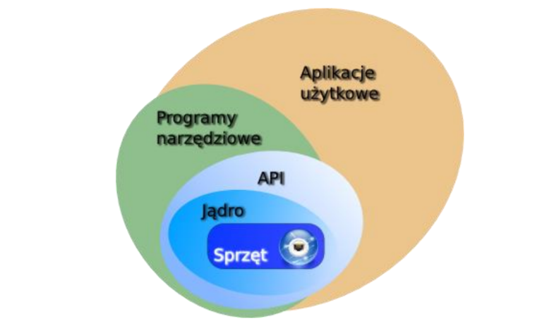

# Systemy operacyjne
[`back to README.md`](../README.md)
## 23. Wielowarstwowa organizacja systemów komputerowych.

> Według wykładu profesora Łojewskiego, [wy2 2020/2021](https://drive.google.com/drive/folders/1l-LHcaOcwQoiGkw8m59UWU9ySmLEs_vf)

1. Sprzęt — procesor, pamięć, urządzenia wejścia/wyjścia
2. Jądro systemu — obsługuje sprzęt, ma w sobie sterowniki, które umożliwiają komunikację z urządzeniami, komunikuje się ze sprzętem w sposób bezpośredni
3. API — interfejs programowania aplikacji, umożliwia komunikację z jądrem systemu operacyjnego za pomocą funkcji jądra, w tym **powłoce** (shell)
4. Programy narzędziowe (systemowe) — w tym powłoka, są pierwszymi programami, które są uruchamiane po starcie systemu i umożliwiają komunikację z użytkownikiem (tutaj też jest interpreter poleceń, chyba)
5. Programy użytkowe — oprogramowanie, które jest używane przez użytkownika: gry, edytory, przeglądarki, itp.

Na przykładzie systemu Android:
* Linux Kernel Layer – warstwa jądra systemu operacyjnego oparta na Linuxie
* Native Libraries Layer – natywne biblioteki systemu Android
* Application Framework Layer – warstwa, z którą bezpośrednio komunikują się aplikacje min. zarządzanie oknami, zasobami itp.
*  Application Layer – warstwa aplikacji, z którą w interakcję wchodzą użytkownicy, aby np. wykonać połączenie telefoniczne

**Najogólniej to system jest podzielony na jądro oraz programy systemowe (interpreter poleceń, powłoka, itp.).** Programy użytkowe są uruchamiane przez użytkownika, a programy systemowe są uruchamiane przez jądro systemu operacyjnego.

> Według wikipedii [system komputerowy](https://www.wikiwand.com/pl/System_komputerowy) i [system operacyjny](https://www.wikiwand.com/pl/System_operacyjny) 

Na początek dwa obrazki z wikipedii:

Tutaj mamy podział na warstwy logiczne, które są zależne od siebie. System operacyjny pośredniczy między sprzętem a aplikacjami, które są używane przez użytkownika.

Tutaj mamy schemat, gdzie jądro zawiera w sobie sterowniki, które umożliwiają komunikację z urządzeniami. Jądro jest częścią systemu operacyjnego, a system operacyjny jest częścią systemu komputerowego. Powłoka umożliwia użytkownikowi komunikację z jądrem.

Wikipedia wyszczególnia 5 warstw systemu komputerowego:
1. Sprzęt — procesor, pamięć, urządzenia wejścia/wyjścia, sa to podstawowe zasoby systemu komputerowego
2. Oprogramowanie systemowe — kontroluje i kordynuje sprzęt, 
3. Oprogramowanie narzędziowe — interfejsy zapewniejące dostęp do zasobów systemu 
4. Oprogramowanie użytokowe — oprogramowanie, które jest używane przez użytkownika: gry, edytory, przeglądarki, itp.
5. Użytkownik — człowiek, który używa systemu komputerowego, ale również inny system czy maszyna

## 24. System operacyjny – charakterystyka, zadania, klasyfikacja.
## 25. Procesy i wątki – charakterystyka i problemy.
## 26. Zarządzanie pamięcią operacyjną w systemie operacyjnym.
## 27. Organizacja systemu plików i pamięci zewnętrznej. 

