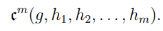
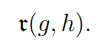
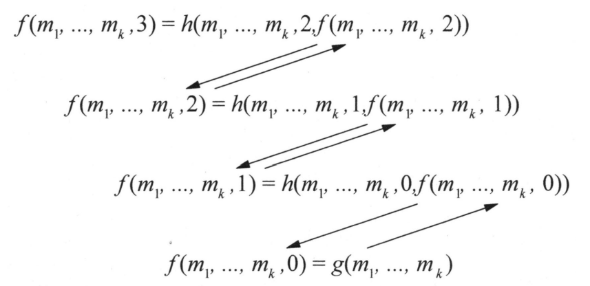
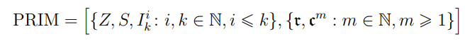

# Wstęp do teorii obliczalności

[`back to README.md`](../README.md)

## 44. Definicja funkcji obliczalnej (częściowo rekurencyjnej).

### Funkcje obliczalna

**Funkcja obliczalna** – funkcja, która może być obliczona przez maszynę Turinga. Czyli takie które można obliczyć używając urządzenia maszynowego (Maszyne Turinga, URM), mając nieskończenie wiele czasu i pamięci.

Następujące modele obliczeń są równoważne:

* Maszyna Turinga
* URM
* Lambda rachunek
* Funkcje częściowo rekurencyjne

## Funkcje pierwotnie rekurencyjne

Zbiór intuicyjnie obliczalnych funkcji opartych na teorii liczb, znanych jako **funkcje pierwotnie rekurencyjne** uzyskuje się z funkcji podstawowych i operatorów.

## Określenie funkcji pierwotnie rekurencyjnych

Funkcje pierwotnie rekurencyjne są uzyskiwane (definiowane) z trzech funkcji podstawowych i dwóch operatorów.

### Funkcja zerowania

$$
Z: \mathbb{N} \rightarrow \mathbb{N} \\
Z(n) = 0
$$

### Funkcja następnika

$$
S: \mathbb{N} \rightarrow \mathbb{N} \\
S(n) = n+1
$$

### Funkcja rzutowania (projekcji)

$$
I_k^i: \mathbb{N}^k \rightarrow \mathbb{N} \\
I_k^i(n_1, n_2, ..., n_i, ..., n_k) = n_i
$$

### Złożenie (operator złożenia)

Niech będą dane funkcje

$$
g: \mathbb{N}^m \rightarrow \mathbb{N} \\
h_1, h_2, ..., h_m : \mathbb{N}^k \rightarrow \mathbb{N}
$$

Funkcję

$$
f: g: \mathbb{N}^k \rightarrow \mathbb{N}
$$

nazywamy **złożeniem (operatorem złożenia) $g$** oraz $h_1, h_2, ..., h_m$ wtedy i tylko wtedy, gdy dla każdych $n_1, n_2, ... n_k \in \mathbb{N}$ zachodzi:

$$
f(n_1, n_2, ..., n_k) = g(h_1(n_1, n_2, ..., n_k), ..., h_m(n_1, n_2, ..., n_k))
$$

### Operator złożenia oznaczamy przez



Funkcja $f$ jest zdefiniowana jako złożenie $m$-argumentowej funkcji $g$ z $k$-argumentowymi funkcjami $h_1, h_2, ..., h_m$. Jeśli każda z funkcji składowych jest obliczalna to wtedy wartość $f(n_1, n_2, ..., n_k)$ można otrzymać z $g$ oraz $h_1(n_1, n_2,..., n_k),...,h_m(n_1,n_2,...,n_k)$

### Rekursja prosta (operator rekursji prostej)

Niech będą dane funkcje 

$$
g: \mathbb{N}^k \rightarrow \mathbb{N} \\
h : \mathbb{N}^{k+2} \rightarrow \mathbb{N}
$$

Funkcję

$$
f : \mathbb{N}^{k+1} \rightarrow \mathbb{N}
$$

nazywamy **wynikiem rekursji prostej (operatorem rekursji prostej)** na $g$ i $h$ wtedy i tylko wtedy, gdy dla każdych $m_1, m_2, ..., m_k \in \mathbb{N}$ zachodzi:

$$
\begin {cases}
f(m_1, m_2,..., m_k, 0) = g(m_1, m_2, ..., m_k) \\
f (m_1, m_2, ..., m_k, n+1) = h(m_1, m_2, ..., m_k, n, f(m_1, m_2, ..., m_k, n))
\end {cases}
$$

**Operator rekursji prostej oznaczamy przez:**



Wartość $f(m_1, m_2,..., m_i, ..., m_k , n+1)$ uzyskuje się z rekursji prostej przez ciąg obliczeń:

$$
f(m_1, m_2, ..., m_k, 0) = g(m_1, m_2, ..., m_k) \\
f(m_1, m_2, ..., m_k, 1) = h(m_1, m_2, ..., m_k, 0, f(m_1, m_2, ..., m_k, 0)) \\
f(m_1, m_2, ..., m_k, 2) = h(m_1, m_2, ..., m_k, 0, f(m_1, m_2, ..., m_k, 1)) \\
.\\
.\\
.\\
f(m_1, m_2, ..., m_k, n+1) = h(m_1, m_2, ..., m_k, 0, f(m_1, m_2, ..., m_k, n)) \\
$$

$m_i$ są nazywane parametrami w definicji rekursji prostej. Zmienna $n$ jest zmienną rekurencyjną,

Wartość $f(m_1, m_2, ..., m_k, n+1)$  uzyskuje się z hunkcji $h$ wykorzystując:

1. Parametry $m$
2. Poprzednią wartość zmiennej rekurencyjnej $n$
3. Poprzednią wartość funkcji $f(m_1, m_2, ..., m_k, n)$



### Zbiór funkcji pierwotnie rekurencyjnych.

Zbiorem funkcji pierwotnie rekurencyjnych nazywamy domknięcie indukcyjne określone przez:

$$
PRIM = [ \{ Z, S, I_k^i: i,k \in \mathbb{N}, i \le k \}, \{  \} ]
$$



Symbol PRIM pochodzi od angielskiego Primitive recursive function.

Trzy funkcje podstawowe to:

1. Funkcja zerowania
2. Funkcja następnika
3. Funkcja rzutowania (projekcji)

Dwa operatory to:

1. Operator złożenia
2. Operator rekursji prostej

### Funkcje częściowo rekurencyjne

Dodając do zbioru funkcji pierwotnie rekurencyjnych funkcje minimalizacji otrzymujemy zbiór funkcji częściowo rekurencyjnych.

#### Funkcja minimalizacji

Dla funkcji $f: \mathbb{N}^{n+1} \rightarrow \mathbb{N}$, definiujemy funkcję $h: \mathbb{N}^n \rightarrow \mathbb{N}$, w taki sposób, żę wartość $h(m_1, m_2, ..., m_n)$ jest minimalne $y$ takie, że $f(m_1, m_2, ..., m_n, y) = 0$.

Ponieważ nie dla wszystkich $m_1, m_2, ..., m_n$ istnieje takie $y$, że $f(m_1, m_2, ..., m_n, y) = 0$, to funkcje częściowe rekurencyjne mogą być częściowe.

## 45. Maszyna Turinga jako model procesów obliczalnych.

## Jednotaśmowa maszyna Turinga

**Maszyna Turinga M** jest to siódemka uporządkowana

$$
M = (Q, \Sigma, \Gamma, \delta, q_0, \bigtriangledown, F)
$$

gdzie:

1. $Q$ jest skończonym **zbiorem stanów** sterowania skończonego.
2. $\Sigma$ jest skończonym **zbiorem symboli wejściowych (alfabetem)**, mamy $\Sigma \subset \Gamma$.
3. $\Gamma$ jest skończonym **zbiorem dopuszczalnych symboli taśmy**, mamy $\Gamma = \Sigma \ \cup \ \bigtriangledown$
4. Funkcja $\delta$ jest dana przez $\delta: Q \times \Gamma \rightarrow Q \times \Gamma \times D$, gdzie D jest zbiorem możliwych kierunków głowicy.
Możemy zapisać
    
    $$
    \delta (p, x) = (q,y,d)
    $$
    
    gdzie: 
    
    - stany $p,g \in Q$
    - $x,y$ - symbol odczytywany i zapisywany do komórki
    - $d \in D$ - kierunek głowicy
    
    W podstawowej wersji maszyny Turinga, podanej przez Hopcrofta i Ullmana, głowica może przesuwać się w lewo lub w prawo, co oznaczamy przez ← i →, czyli $D =\{\leftarrow,\rightarrow\}$.
    W innej wersji maszyny Turinga głowica dodatkowo może stać w miejscu, 
    co oznaczamy przez —, czyli zbiór $D = \{\leftarrow, -, \rightarrow\}$.
    Jeśli funkcja przejścia nie jest zdefiniowana na bieżącym stanie i bieżącym symbolu taśmy, to maszyna zatrzymuje się.
    
5. $q_0$ jest to **stan początkowy**, czyli stan, w którym znajduje się sterowanie skończone na starcie
6. $\bigtriangledown$ jest to **symbol pusty (blank).** Symbol pusty znajduje się we wszystkich komórkach taśmy poza skończoną ilością komórek, które zawierają symbole wejściowe.
7. $F$ jest to zbiór **stanów akceptujących** i jest nazywany też zbioerm **stanów końcowych** $F \subset Q$

### Definicja maszyny Turinga podana przez J.Myckę

(J. Mycka) **Maszyna Turinga M** jest to siódemka uporządkowana

$$
M = (Q, \Sigma, \Gamma, \delta, q_0, q_A, q_R)
$$

gdzie:

1. $Q$ jest skończonym **zbiorem stanów** sterowania skończonego.
2. $\Sigma$ jest skończonym **zbiorem symboli wejściowych (alfabetem)**, mamy $\Sigma \subset \Gamma$.
3. $\Gamma$ jest skończonym **zbiorem dopuszczalnych symboli taśmy**, mamy $\Gamma = \Sigma \ \cup \ \bigtriangledown$
4. Funkcja $\delta$ jest dana przez $\delta: Q \times \Gamma \rightarrow Q \times \Gamma \times D$, gdzie D jest zbiorem możliwych kierunków głowicy.
Możemy zapisać
    
    $$
    \delta (p, x) = (q,y,d)
    $$
    
    gdzie: 
    
    - stany $p,g \in Q$
    - $x,y$ - symbol odczytywany i zapisywany do komórki
    - $d \in D$ - kierunek głowicy
    
    W podstawowej wersji maszyny Turinga, podanej przez Hopcrofta i Ullmana, głowica może przesuwać się w lewo lub w prawo, co oznaczamy przez ← i →, czyli $D =\{\leftarrow,\rightarrow\}$.
    W innej wersji maszyny Turinga głowica dodatkowo może stać w miejscu, 
    co oznaczamy przez —, czyli zbiór $D = \{\leftarrow, -, \rightarrow\}$.
    Jeśli funkcja przejścia nie jest zdefiniowana na bieżącym stanie i bieżącym symbolu taśmy, to maszyna zatrzymuje się.
    
5. $q_0$ jest to **stan początkowy**, czyli stan, w którym znajduje się sterowanie skończone na starcie
6. $q_A$ jest to **stan akceptujący**
7. $q_R$ jest to **stan odrzucający**
## 46. Zagadnienia nierostrzygalne w kontekście obliczalności.

### Problem nierozstrzygalny

**Problem nierozstrzygalny** – problem, dla którego nie istnieje algorytm, który po skończonej liczbie kroków dałby odpowiedź na pytanie, czy dana instancja problemu ma rozwiązanie.

> Definicja z skryptu dr. Mycki:
>
> *Mówimy, że problem decyzyjny dla zbioru S jest rozstrzygalny jeżeli S jest zbiorem rekurencyjnym. Problem decyzyjny jest nierozstrzygalny jeżeli nie jest rozstrzygalny*

#### Problem stopu

**Problem stopu** – problem, czy dany program zatrzyma się dla dowolnych danych wejściowych.
> *Nie istnieje maszyna Turinga rozstrzygająca w skończonej liczbie kroków, czy dowolna maszyna Turinga zakończy pracę.*

##### Dowód:

Załóżmy, że następujący program rozstrzyga problem stopu:

```
procedura stop(program, dane):
   jeżeli program(dane) zatrzymuje się, to
      zwróć tak,
   w przeciwnym przypadku
      zwróć nie.
```

czyli jeżeli `program` zatrzymuje się dla danych wejściowych, to zwracamy `tak`, w przeciwnym przypadku zwracamy `nie`.

Załóżmy że `stop` jest rozstrzygalny, czyli istnieje maszyna Turinga `M`, która go rozstrzyga.

Teraz rozważmy następujący program:

```
procedura test(program): 
   jeżeli stop(program, program) = tak, to
      zapętl się
```

Pytanie: czy `test(test)` zatrzymuje się?


* Jeżeli `test(test)` nie zatrzymuje się, to `stop(test, test) = nie`, czyli `test(test)` zatrzymuje się.
* Jeżeli `test(test)` zatrzymuje się, to `stop(test, test) = tak`, czyli `test(test)` nie zatrzymuje się.

Przeczy to założeniu, że `stop` jest rozstrzygalny, więc `stop` nie jest rozstrzygalny.

#### Inne problemy nierozstrzygalne

* Nierozstrzygalność Entscheidungsproblem — *Nie istnieje algorytm rozstrzygający w skończonej liczbie kroków, czy dana formuła jest dowodliwa w wybranym systemie aksjomatycznym*
* Istnienie rozwiązania równania diofantycznego
* Problem domina — Czy można pokryć płaszczyznę zestawem kafelków, zachowując kolory na styku

## 47. Definicja i klasy złożoności obliczeniowej – czasowej i pamięciowej

> Zdefiniowane przy algorytmach, dokładnie: [*Złożoność obliczeniowa*](algorytmy.md#złożoność-obliczeniowa)
